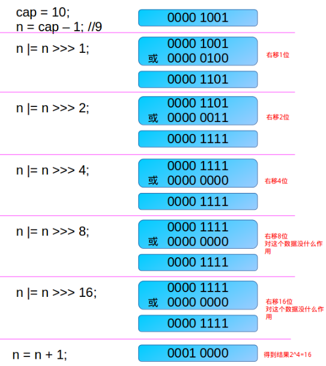
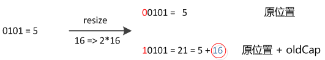
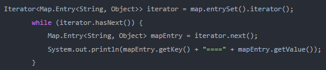
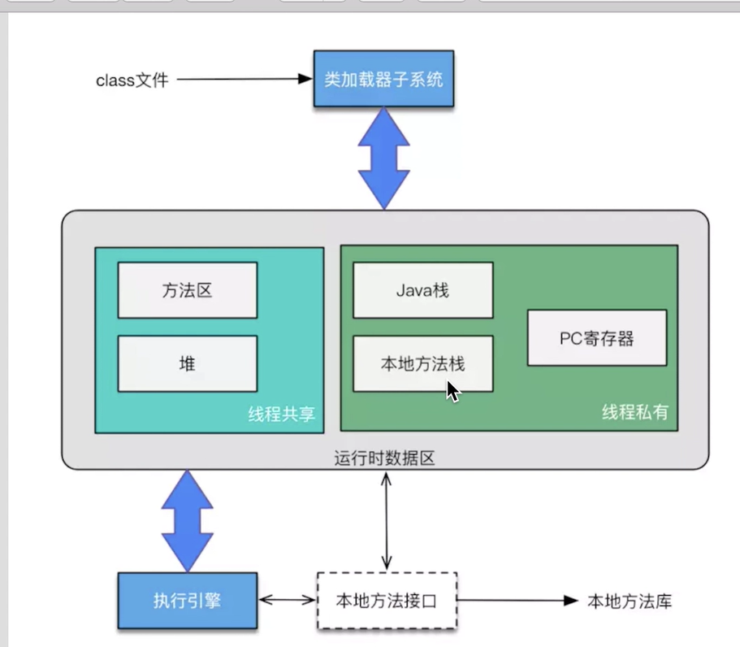
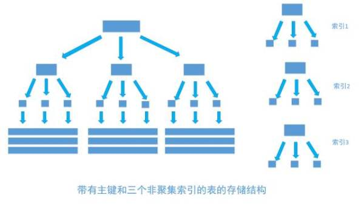
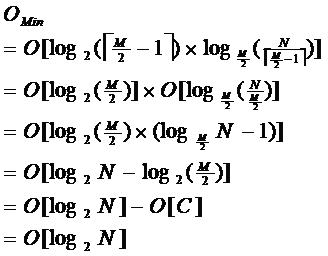

# 任务

搞java需要掌握：web了解、java编程能力、linux、数据库sql、中间件

代码中会运用redis、zk、MongoDB等各种中间件

如果自制力比较强：可以先实习，实习中报个加强班。实习结束后转正可以根据个人能力要高工资。或者跳槽。


框架会灵活的运用，从前端到后端我们可以独立的去完成一个大型项目的开发，然后就是做项目的逻辑和思路都比较清晰。

大数据它是以java为底层的，也是需要先学java，学完Java再学Hadoop spark fink这些框架


牛客网


计算时间复杂度

Linux运维

Java IO流编程，Java网络基础知识（如：IP , 端口，协议）

io、nio

多线程、并发包

springMVC

spring基础知识

复习数据结构和算法

xshell

## 复习

JVM中juc、

线程池

https://blog.csdn.net/mu_wind/article/details/113806680

自己查询jdk官方文档写动态代理


#  自学计划


==面试高频：代理模式、工厂模式、单例模式、动态代理、反射==

https://www.bilibili.com/video/BV1nJ41127VP/?spm_id_from=333.788.recommend_more_video.3


## ==面试中的问题==

https://www.bilibili.com/video/BV1ut41177aN/?spm_id_from=333.788.recommend_more_video.2

面试题

https://blog.csdn.net/fangchao2011/article/details/89203535


http://www.itheima.com/course/javaeetext.html

## 不好的培训机构

https://www.bilibili.com/video/BV1Q541177xn/?spm_id_from=333.788.recommend_more_video.3

**含有structs、webservice、jsp**

## 学习资料

https://github.com/CleverFan/awesome-java-datum


java，算法，数据结构

搞小项目，简历自圆其说，整点新鲜进去


==**不主张学习新潮的技术，夯实java基础即可**==，==**校招前小半年学习即可**==

## 学习误区

**==基础概念、基础路线==**


- ==JDK JVM JRE JavaSE JavaEE JavaME概念==
- ==熟记代码设计模式，而不是代码（数据结构除外）==
- ==规划学习路线，不要东找一点、西找一点==
- ==克服容易忘，多用，总结、提炼、回顾、思考、写笔记==

## java大学期间总的学习计划

https://sharember.blog.csdn.net/article/details/68948883


## 快速掌握一门技术

https://www.bilibili.com/video/BV1Rt411M7oX/?spm_id_from=333.788.recommend_more_video.-1


阶段一：认知了解阶段（第一印象很重要）
            1.该技术的概念和方向
            2.该技术解决了什么问题
            3.同类技术有哪些
            4.该技术的主要组成部分
            5.该技术为什么出现

阶段二：学习语法，用法
途径进阶1.视频教程（效率低）
                2.快速上手视频
                3.入门博客
                4.权威书籍，官方文档
阶段三：局部练习，小型实战，搭建环境（记录总结，写博客写博客写博客！！！）

阶段四：上手实际项目或开源项目（先打牢基础）

阶段五：（终极目标）造轮子，撸源码

### 基础都包括什么呢？

- ==面向对象的思想。==
- ==java常用类。==
- ==集合框架。==
- ==io==
- ==nio==
- ==多线程并发==
- ==设计模式==
- ==算法==
- ==jvm==
- ==计算机网络==
- ==spring==
- ==orm框架==
- ==**不主张学习新潮的技术，夯实java基础即可**==

https://mp.weixin.qq.com/s/rAoamIey7cARMES7kfIaLw


### 测试自学水平的网站

https://www.nowcoder.com/contestRoom


# 重新认识java

https://sharember.blog.csdn.net/

## 1、java数据类型与传值调用、引用调用

https://www.cnblogs.com/zhangyu317/p/11226105.html

> ### 一、java数据类型
>
> **Java中的数据类型分为两大类，基本数据类型和引用数据类型。**
>
> #### 1、基本数据类型
>
> 基本数据类型只有8种，可按照如下分类
> ①整数类型：long、int、short、byte
> ②浮点类型：float、double
> ③字符类型：char
> ④布尔类型：boolean
>
> #### 2、引用数据类型
>
> 引用数据类型非常多，大致包括：
> ==类、 接口类型、 数组类型、 枚举类型、== 注解类型、 字符串型（这个比较特殊）
>
>**简单来说，所有的非基本数据类型都是引用数据类型。**
> 
>## 二、基本数据类型和引用数据类型的区别
> 
>### 1、存储位置
> 
>#### 基本变量类型
> 
>- 在方法中定义的非全局基本==数据类型变量的具体内容是存储在栈中的==
> 
>#### 引用变量类型
> 
>- 只要是引用数据类型变量，其==具体内容都是存放在堆中的==，而==栈中存放的是其具体内容所在内存的地址==
>   *ps:通过变量地址可以找到变量的具体内容，就如同通过房间号可以找到房间一般*
> 
>## 三.结论
> 
>结合上面的分析，关于值传递和引用传递可以得出这样的结论：
> 
>*（1）基本数据类型传值，对形参的修改==不会==影响实参；*
> *（2）引用类型传引用，形参和实参指向同一个内存地址（同一个对象），所以对参数的修改==会影响==到实际的对象；*
> *（3）String, Integer, Double等immutable的类型特殊处理，可以理解为传值，最后的操作不会修改实参对象。*


## ==2、java中类与类之间的关系==

https://sharember.blog.csdn.net/article/details/54645220

类之间的关系大体上存在五种—继承(实现)、依赖、关联、聚合、组合。


### 依赖

这种使用关系是具有==偶然性的、临时性的、非常弱的==，但是B类的变化会影响到A。

~~~java
public class Pen {
    public void write(){
        System.out.println("use pen to write");
    }
}

public class Me {
    public void write(Pen pen){//这里，pen作为Me类方法的参数
        pen.write();
    }
}
~~~


### 关联

关联体现的是两个类、或者类与接口之间语义级别的一种强依赖关系。

这种关系比依赖更强、不存在依赖关系的偶然性、关系也不是临时性的，==一般是长期性的，而且双方的关系一般是平等的==、关联可以是单向、双向的。

~~~java
// pen 还是上面的pen
public class You {
    private Pen pen; // 让pen成为you的类属性 

    public You(Pen p){
        this.pen = p;
    }

    public void write(){
        pen.write();
    }
}
~~~

### 聚合

聚合是关联关系的一种特例，他体现的是==整体与部分、拥有的关系==，即**has-a**的关系

~~~java
public class Family {
    private List<Child> children; //一个家庭里有许多孩子

    // ...
}
~~~

### ==组合==

组合也是关联关系的一种特例，他体现的是一种contains-a的关系，这种关系比聚合更强，也称为强聚合。

==组合同样体现整体与部分间的关系，但此时整体与部分是不可分的，整体的生命周期结束也就意味着部分的生命周期结束。==

~~~java
public class Nose {
    private Eye eye = new Eye();  //一个人有鼻子有眼睛
    private Nose nose = new Nose();

    // .... 
}
~~~

### **继承还是组合？**

很多人都知道面向对象中有一个比较重要的原则『==多用组合、少用继承==』。组合确实比继承更加灵活，也更有助于代码维护。

所以，建议在同样可行的情况下，优先使用组合而不是继承。==因为组合更安全，更简单，更灵活，更高效==。

注意，并不是说继承就一点用都没有了，前面说的是【在同样可行的情况下】。有一些场景还是需要使用继承的，或者是更适合使用继承。

继承要慎用，其使用场合仅限于你确信使用该技术有效的情况。一个判断方法是，问一问自己==是否需要从新类向基类进行向上转型==。如果是必须的，则继承是必要的。反之则应该好好考虑是否需要继承。

只有当子类真正是超类的子类型时，才适合用继承。换句话说，对于两个类A和B，只有当两者之间确实存在 is-a 关系的时候，类B才应该继承类A。


## 3、多态（向上转型与向下转型）

https://sharember.blog.csdn.net/article/details/54746235

#### **转型过程中需要注意的问题**

- 向上转型时，子类单独定义的方法会丢失。比如上面Dog类中定义的run方法，当animal引用指向Dog类实例时是访问不到run方法的，**animal.run()**会报错。
- 子类引用不能指向父类对象。**Cat c = (Cat)new Animal()**这样是不行的。


## 4、stastic关键字

**静态导入、静态变量、静态方法、静态代码段、静态内部类、**

https://sharember.blog.csdn.net/article/details/54767522

### 静态导入

一般我们导入一个类都用 import com.....ClassName;而静态导入是这样：import static com.....ClassName.* ;这里的多了个static，还有就是类名ClassName后面多了个  * ，意思是导入这个类里的静态方法。当然，也可以只导入某个静态方法，只要把 * 换成静态方法名就行了。然后在这个类中，==就可以直接用方法名调用静态方法，而不必用ClassName.方法名 的方式来调用。== 

### 静态代码块

### 代码块

1. 普通代码块
2. 同步代码块
3. 静态代码块
4. 构造代码块

**执行顺序**

> 先执行静态内容(先父类后子类)，然后执行父类非静态，最后执行子类非静态。（非静态包括构造代码块和构造函数，构造代码块先执行）


#### 静态内部类

==被static修饰的内部类，它可以不依赖于外部类实例对象而被实例化，而通常的内部类需要在外部类实例化后才能实例化==。静态内部类不能与外部类有相同的名字，不能访问外部类的普通成员变量，只能访问内部类中的静态成员和静态方法（包括私有类型）。


## 5、抽象类与接口


https://sharember.blog.csdn.net/article/details/54972723

### 抽象类与接口对比

~~~java
//抽象类
public abstract class AbstractTest {  
    abstract void method1();      
    void method2(){  
        //实现  
    }
}

//接口
interface InterfaceTest {  
    void method1();  
    default void test(){
        System.out.println("java8 新特性");
    }
}    
~~~


| 参数               | 抽象类                                                       | 接口                                                         |
| ------------------ | ------------------------------------------------------------ | ------------------------------------------------------------ |
| 方法实现           | 不完全实现所有的方法                                         | 接口完全是抽象的。它根本不存在方法的实现。但是==可以定义默认方法== |
| 实现               | 子类使用extends关键字来继承抽象类。如果子类不是抽象类的话，它需要提供抽象类中所有声明的方法的实现。 | 子类使用关键字implements来实现接口。它需要提供接口中所有声明的方法的实现 |
| 构造器             | 抽象类可以有构造器                                           | 接口不能有构造器                                             |
| 与正常Java类的区别 | 除了你不能实例化抽象类之外，它和普通Java类没有任何区别       | 接口是完全不同的类型                                         |
| 访问修饰符         | 抽象方法可以有public、protected和default这些修饰符           | 接口方法默认修饰符是public。你不可以使用其它修饰符。         |
| main方法           | 抽象类可以有main方法并且我们可以运行它                       | 接口没有main方法，因此我们不能运行它。                       |
| 多继承             | 抽象方法可以继承一个类和实现多个接口                         | 接口只可以继承一个或多个其它接口                             |

- 从实践的角度来看，如果依赖于抽象类来定义行为，往往导致过于复杂的继承关系，而通过接口定义行为能够更有效地分离行为与实现，为代码的维护和修改带来方便。

### 接口编写原则

> 比如说，有一个普普通通的门，实现了Door接口，或者继承了Door抽象类，它只需要开门和关门的行为，但是当你像上面一样修改了接口或者抽象类以后，那么这个【普通门】也不得不具备了【报警】的功能，这显然是不合理的。
>
> **ISP（Interface Segregation Principle）**：面向对象的一个核心原则。它表明使用多个专门的接口比使用单一的总接口要好。
> 一个类对另外一个类的依赖性应当是建立在最小的接口上的。
> ==一个接口代表一个角色，不应当将不同的角色都交给一个接口。==没有关系的接口合并在一起，形成一个臃肿的大接口，这是对角色和接口的污染。

### 接口与抽象类设计理念

如果选择第二种都是接口来定义，那么就反映了两个问题：

> - 我们可能没有理解清楚问题域，AlarmDoor在概念本质上到底是门还报警器。
>
>   
>
> - 如果我们对问题域的理解没有问题，比如我们在分析时确定了AlarmDoor在本质上概念是一致的，那么我们在设计时就没有正确的反映出我们的设计意图。因为你使用了两个接口来进行定义，他们概念的定义并不能够反映上述含义。

第三种，如果我们对问题域的理解是这样的：

> - AlarmDoor本质上Door，但同时它也拥有报警的行为功能，这个时候我们使用第三种方案恰好可以阐述我们的设计意图。
>
>   
>
> - AlarmDoor本质是门，所以对于这个概念我们使用抽象类来定义，同时AlarmDoor具备报警功能，说明它能够完成报警概念中定义的行为功能，所以alarm可以使用接口来进行定义。如下：

### 总结

抽象类是为了把相同的东西提取出来, 是为了重用; 而接口的作用是提供程序里面固化的契约, 是为了降低偶合。

==**抽象类表示的是，这个对象是什么。接口表示的是，这个对象能做什么。**==


## ==6、内部类==

https://sharember.blog.csdn.net/article/details/54988623

### 普通内部类的要点：

> - 内部类可以访问外部类变量，包括私有变量
>
>   
>
> - 在外部类中使用内部类的方法需要new一个内部类的对象。
>
>   
>
> - 在外部类中可以访问到内部类的任何变量，包括私有变量。
>
>   
>
> - 在其他类中创建内部类对象需要使用这样的形式：
>   OuterClassName.InnerClassName name = new OuterClassName().new InnerClassName()。
>
>   
>
> - 在其他类中定义的内部类对象不能访问内部类中的私有变量。

### 静态内部类

> - 要创建嵌套类的对象，并不需要其外围类的对象。
> - 静态内部类中不能访问非静态的外部类变量，但是尅访问外部类的静态变量。


除此之外，由于普通内部类的字段与方法，只能放在类的外部层次上，==所以普通的内部类不能有static方法和static变量，也不能在普通内部类中再包含静态内部类。但是静态内部类可以包含所有这些东西：==

### 静态内部类的要点：

> - 在静态内部类中可以存在静态成员
>
>   
>
> - 静态内部类只能访问外围类的静态成员变量和方法，不能访问外围类的非静态成员变量和方法
>
>   
>
> - 静态内部类中的静态方法可以通过【外部类.内部类.方法名】直接调用
>
>   
>
> - 静态内部类在其他类中不能new出来。(new Outer().new StaClass()这样是不行的)
>
>   
>
> - 但是在外部类中，可以new一个静态内部类的对象。
>
>   
>
> - 静态内部类中不能使用【.this】


> ## 匿名类
>
> https://www.runoob.com/java/java-anonymous-class.html
>
> 匿名类可以创建接口、抽象类、与普通类的对象。
>
> 使用方法直接new就行
>
> 
>
> ==注意最后面一定要有“；”==
>
> #### 匿名类继承一个父类
>
> ```java
> class Polygon {
>    public void display() {
>       System.out.println("在 Polygon 类内部");
>    }
> }
> 
> class AnonymousDemo {
>    public void createClass() {
>       // 创建的匿名类继承了 Polygon 类
>       Polygon p1 = new Polygon() {
>          public void display() {
>             System.out.println("在匿名类内部。");
>          }
>       };
>       p1.display();
>    }
> }
> 
> class Main {
>    public static void main(String[] args) {
>        AnonymousDemo an = new AnonymousDemo();
>        an.createClass();
>    }
> }
> ```
>
> #### 匿名类实现一个接口
>
> ~~~java
> interface Polygon {
>    public void display();
> }
> 
> class AnonymousDemo {
>    public void createClass() {
> 
>       // 匿名类实现一个接口
>       Polygon p1 = new Polygon() {
>          public void display() {
>             System.out.println("在匿名类内部。");
>          }
>       };
>       p1.display();
>    }
> }
> 
> class Main {
>    public static void main(String[] args) {
>       AnonymousDemo an = new AnonymousDemo();
>       an.createClass();
>    }
> }
> ~~~
>
> 

### 匿名内部类（可以被java8的lambda表达式代替）

> - 匿名内部类是没有访问修饰符的。
>
>   匿名内部类中不能存在任何的静态成员变量和静态方法。
>
>   
>
> - new 匿名内部类，这个类首先是要存在的。如果我们将那个InnerClass接口注释掉，就会出现编译出错。
>
>   
>
> - 当所在方法的形参需要被匿名内部类使用，那么这个形参就必须为final。
>
>   
>
> - 匿名内部类创建一个接口的引用时是没有构造方法的。但是可以通过构造代码块来模拟构造器
>
> #### 实现匿名类的另一种方式
>
> https://sharember.blog.csdn.net/article/details/54988623
>
> （第6.2部分）
>
> ```java
>     public Inner getInner(final String name, String city) { 
>         return new Inner(name, city) { 
>             private String nameStr = name; 
> 
>             public String getName() { 
>                 return nameStr; 
>             } 
>         }; 
>     } 
> } 
> ```
>
> 

### 内部类可以实现多重继承

~~~java
//父亲
public class Father {
    public int strong(){
        return 9;
    }
}
//母亲
public class Mother {
    public int kind(){
        return 8;
    }
}
//儿子
public class Son {

    /**
     * 内部类继承Father类
     */
    class Father_1 extends Father{
        public int strong(){
            return super.strong() + 1;
        }
    }

    class Mother_1 extends  Mother{
        public int kind(){
            return super.kind() - 2;
        }
    }

    public int getStrong(){
        return new Father_1().strong();
    }

    public int getKind(){
        return new Mother_1().kind();
    }
}

public class Test1 {

    public static void main(String[] args) {
        Son son = new Son();
        System.out.println("Son 的Strong：" + son.getStrong());
        System.out.println("Son 的kind：" + son.getKind());
    }

}

//输出
//Son 的Strong：10
//Son 的kind：6
~~~


## 7、枚举类

https://sharember.blog.csdn.net/article/details/55049192

- 可以创建一个enum类，把它看做一个普通的类。除了它不能继承其他类了。(java是单继承，它已经继承了Enum),可以添加其他方法，覆盖它本身的方法

  

- switch()参数可以使用enum

  

- values()方法是编译器插入到enum定义中的static方法，所以，当你将enum实例向上转型为父类Enum是，values()就不可访问了。解决办法：在Class中有一个getEnumConstants()方法，所以即便Enum接口中没有values()方法，我们仍然可以通过Class对象取得所有的enum实例

  

- 无法从enum继承子类，如果需要扩展enum中的元素，在一个接口的内部，创建实现该接口的枚举，以此将元素进行分组。达到将枚举元素进行分组。

  

- enum允许程序员为eunm实例编写方法。所以可以为每个enum实例赋予各自不同的行为。

### 可以赋多个值

```
public enum Weekday {
    MON(1,"mon"),TUS(2,"tus"),WED(3,"wed"),THU(4,"thu"),FRI(5,"fri"),SAT(6,"sat"),SUN(0,"sun");

    private int value;
    private String label;

    private Weekday(int value,String label){
        this.value = value;
        this.label = label;
    }
}
```


### 使用switch

```java
enum Signal {
    GREEN, YELLOW, RED
}

public class TrafficLight {
    Signal color = Signal.RED;

    public void change() {
        switch (color) {
        case RED:
            color = Signal.GREEN;
            break;
        case YELLOW:
            color = Signal.RED;
            break;
        case GREEN:
            color = Signal.YELLOW;
            break;
        }
    }
}
```


## 8、java中的数组

https://sharember.blog.csdn.net/article/details/60882588

### **数组的遍历**

- 方式一：for循环

```java
      for (int i = 0; i < myList.length; i++) {
          System.out.println(myList[i] + " ");
      }123
```

- 方式二：foreach循环

```java
      for (int element: myList) {
         System.out.println(element);
      } 
```


### **数组元素不为基本数据类型**

数组是可以存放任意类型的数据的，不一定非得是基本数据类型。数组元素不为基本原生数据类型时，存放的是引用类型，而不是对象本身。当生成对象之后，引用才指向对象，否则引用为null。

```java
        Person[] p = new Person[3];

        //未生成对象时，引用类型均为空
        System.out.println(p[0]);


        //生成对象之后，引用指向对象
        p[0] = new Person(10);
        p[1] = new Person(20);
        p[2] = new Person(30);

        for(int i = 0; i < p.length; i++){
            System.out.println(p[i].age);
        }
```


### **数组作为方法的参数**

```java
public void printArray(int[] array) {
  for (int i = 0; i < array.length; i++) {
    System.out.print(array[i] + " ");
  }
}
```

### **数组作为方法的返回值**

```java
public int[] reverse(int[] list) {
  int[] result = new int[list.length];

  for (int i = 0, j = result.length - 1; i < list.length; i++, j--) {
   	result[j] = list[i];
  }
  return result;
}
```


### **变长的二维数组**

二维数组的每个元素都是一个一维数组，这些数组不一定都是等长的。

声明二维数组的时候可以只指定第一维大小，空缺出第二维大小，之后再指定不同长度的数组。但是注意，第一维大小不能空缺（不能只指定列数不指定行数）。

```java
public class ArrayTest4{
    public static void main(String[] args){
        //二维变长数组
        int[][] a = new int[3][];
        a[0] = new int[2];
        a[1] = new int[3];
        a[2] = new int[1];

        //Error: 不能空缺第一维大小
        //int[][] b = new int[][3];
    }
}
```

### **可变参数**

有的时候，你需要一个方法，但是你在调用它之前不知道要传递几个参数给他，这个时候你就需要可变参数了。

```java
public static void main(String [] args){
    System.out.println(add(2,3));
    System.out.println(add(2,3,5));
}
public static int add(int x,int ...args){
    int sum=x;
    for(int i=0;i<args.length;i++){
        sum+=args[i];
    }
    return sum;
}
```

> 注意：
>
> 可变参数必须位于最后一项。当可变参数个数多余一个时，必将有一个不是最后一项，==所以只支持有一个可变参数==。因为参数个数不定，所以当其后边还有相同类型参数时，java无法区分传入的参数属于前一个可变参数还是后边的参数，所以==只能让可变参数位于最后一项==。


## ==9、反射==**

https://sharember.blog.csdn.net/article/details/52192033

视频讲解

https://www.bilibili.com/video/BV1C4411373T?from=search&seid=13993817958109344758

### java代码经历的三个阶段


1. Class.forName("全类名")：将字节码文件加载进内存，返回Class对象
   * ==多用于配置文件====，将类名定义在配置文件中。读取文件，加载类==
2. 类名.class：通过类名的属性class获取
   * ==多用于参数的传递==
3. 对象.getClass( )：getClass()方法在Object类中定义着。
   * ==多用于对象的获取字节码的方式==

https://www.bilibili.com/video/BV1p4411P7V3?p=5

### 反射原理


### 反射功能

**Java反射机制主要提供了以下功能**：

- 在运行时判断任意一个对象所属的类；
- 在运行时构造任意一个类的对象；
- 在运行时判断任意一个类所具有的成员变量和方法；
- 在运行时调用任意一个对象的方法；
- ==生成动态代理（AOP)。==

### 创建Class对象

* 获取Class对象的方式：
	1. Class.forName("全类名")：将字节码文件加载进内存，返回Class对象
		* ==多用于配置文件====，将类名定义在配置文件中。读取文件，加载类==
	2. 类名.class：通过类名的属性class获取
		* ==多用于参数的传递==
	3. 对象.getClass( )：getClass()方法在Object类中定义着。
		* ==多用于对象的获取字节码的方式==

	* 结论：
		同一个字节码文件(*.class)在一次程序运行过程中，只会被加载一次，不论通过哪一种方式获取的Class对象都是同一个。

~~~java
//测试class类的创建方式有哪些
public class Test03 {
	public static void main(String[] args) throws classNotFoundException {
		Person person = new Student();
		system.out.println("这个人是:"+person.name) ;
		//方式一:通过对象获得
		Class c1 = person.getclass();
		Class c1=new Student().getClass();
        
		//方式二 : forname获得(需要抛异常)
		Class c2 = Class.forName ( "com.kuang.reflection.student");
		
        //方式三﹔通过类名.class获得
		Class c3 = Student.class;
		
        
}

~~~


> 在java中，所有类的对象其实都是Class的实例。
>
> Class 类的实例表示正在运行的 Java 应用程序中的==类和接口==。==枚举==是一种类，==注释==是一种接口。每个==数组==属于被映射为 Class 对象的一个类，所有<u>**具有相同元素类型和维数的数组都共享该 Class 对象**</u>(是一个Class对象）。==基本的 Java 类型==（boolean、byte、char、short、int、long、float 和 double）和==关键字 void== 也表示为 Class 对象。
>
> Class 没有公共构造方法。Class 对象是在加载类时由 Java 虚拟机以及通过调用类加载器中的 defineClass 方法自动构造的。


### 获取成员变量

#### java.lang.reflect. Field

Field 用于获取成员变量

#### Field 成员变量的介绍

> 在获取一个类的属性时由两种方式：
>
> 1.得到实现的接口或父类中的==公共属性==：public Field[ ] getFields( )
>
> 2.得到本类中的==全部属性==：public Field[ ] getDeclaredFields( )

每个成员变量有**类型**和**值**。

**java.lang.reflect.Field** 为我们提供了获取当前对象的成员变量的类型，和重新设值的方法。

* Field：成员变量
	* > 操作：
		> 1. 设置值
		> 	* void set(Object obj, Object value)  
		> 2. 获取值
		> 	* get(Object obj) 
>
		> 3. 忽略访问权限修饰符的安全检查
		> 	* setAccessible(true):暴力反射


#### 例子

```java
public static void main(String[] args) throws Exception {

        //0.获取Person的Class对象
        Class personClass = Person.class;
        /*
            1. 获取成员变量们
                * Field[] getFields() ：获取所有public修饰的成员变量
                * Field getField(String name)   获取指定名称的 public修饰的成员变量

                * Field[] getDeclaredFields()  获取所有的成员变量，不考虑修饰符
                * Field getDeclaredField(String name)  

         */
        //1.Field[] getFields()获取所有public修饰的成员变量
        Field[] fields = personClass.getFields();
        for (Field field : fields) {
            System.out.println(field);
        }

        System.out.println("------------");
        //2.Field getField(String name)
        Field a = personClass.getField("a");
        //获取成员变量a 的值
        Person p = new Person();
        Object value = a.get(p);
        System.out.println(value);
        //设置a的值
        a.set(p,"张三");
        System.out.println(p);

        System.out.println("===================");

        //Field[] getDeclaredFields()：获取所有的成员变量，不考虑修饰符
        Field[] declaredFields = personClass.getDeclaredFields();
        for (Field declaredField : declaredFields) {
            System.out.println(declaredField);
        }
        //Field getDeclaredField(String name)
        Field d = personClass.getDeclaredField("d");
        //忽略访问权限修饰符的安全检查
        d.setAccessible(true);//暴力反射
        Object value2 = d.get(p);
        System.out.println(value2);

    }
```


### 获取构造方法

 Constructor:==构造方法==
> 	* 创建对象：
> 													
> 		* T newInstance(Object... initargs)  
> 													
> 		（==即 constructor.newInstance("张三", 23);==  ）
>
> ​	* 如果使用空参数构造方法创建对象，操作可以简化：Class对象的newInstance方法

```java
public static void main(String[] args) throws Exception {

        //0.获取Person的Class对象
        Class personClass = Person.class;
        /*
            2. 获取构造方法们
                 * Constructor<?>[] getConstructors()
                 * Constructor<T> getConstructor(类<?>... parameterTypes)

                 * Constructor<T> getDeclaredConstructor(类<?>... parameterTypes)
                 * Constructor<?>[] getDeclaredConstructors()
         */


        //Constructor<T> getConstructor(类<?>... parameterTypes)
        Constructor constructor = personClass.getConstructor(String.class, int.class);
        System.out.println(constructor);
        //创建对象
        Object person = constructor.newInstance("张三", 23);
        System.out.println(person);

        System.out.println("----------");


        Constructor constructor1 = personClass.getConstructor();
        System.out.println(constructor1);
        //创建对象
        Object person1 = constructor1.newInstance();
        System.out.println(person1);

        Object o = personClass.newInstance();
        System.out.println(o);


        //constructor1.setAccessible(true);
    }

```

### 获取方法对象

**Method**：方法对象

> * 执行方法：
> 	
> * Object invoke(Object obj, Object... args)  
> 	
> 	  
> 	
> * 获取方法名称：
>
>   String getName:获取方法名


**调用方法**

> 用Method类的对象去调用invoke（）方法
>
> invoke第一个为类名，后面为可变参数（参数为调用函数的参数）


```java
public static void main(String[] args) throws Exception {

    //0.获取Person的Class对象
    Class personClass = Person.class;
    /*
      3. 获取成员方法们：
         * Method[] getMethods()
         * Method getMethod(String name, 类<?>... parameterTypes)//第一个参数为方法名，第二个以后为参数类型

         * Method[] getDeclaredMethods()
         * Method getDeclaredMethod(String name, 类<?>... parameterTypes)
     */
    //获取指定名称的方法
    Method eat_method = personClass.getMethod("eat");
    Person p = new Person();
    //执行方法
    eat_method.invoke(p);


    Method eat_method2 = personClass.getMethod("eat", String.class);
    //执行方法
    eat_method2.invoke(p,"饭");

    System.out.println("-----------------");

    //获取所有public修饰的方法
    Method[] methods = personClass.getMethods();
    for (Method method : methods) {
        System.out.println(method);
        String name = method.getName();
        System.out.println(name);
        //method.setAccessible(true);
    }

    //获取类名
    String className = personClass.getName();
    System.out.println(className);//cn.itcast.domain.Person

}
```


### 利用反射读取配置文件

#### 案例

* > 需求：写一个"框架"，不能改变该类的任何代码的前提下，可以帮我们创建任意类的对象，并且执行其中任意方法
	> * 实现：
	> 	1. 配置文件
	> 	2. 反射
	> * 步骤：
	> 	1. 将需要创建的对象的全类名和需要执行的方法定义在配置文件中
	> 	2. 在程序中加载读取配置文件
	> 	3. 使用反射技术来加载类文件进内存
	> 	4. 创建对象
	> 	5. 执行方法


```java
/**
 * 框架类
 */
public class ReflectTest {
    public static void main(String[] args) throws Exception {
        //可以创建任意类的对象，可以执行任意方法

        /*
            前提：不能改变该类的任何代码。可以创建任意类的对象，可以执行任意方法
         */
      /*  Person p = new Person();
        p.eat();*/
/*
        Student stu = new Student();
        stu.sleep();*/

        //1.加载配置文件
        //1.1创建Properties对象
        Properties pro = new Properties();
        //1.2加载配置文件，转换为一个集合
        //1.2.1获取class目录下的配置文件
        ClassLoader classLoader = ReflectTest.class.getClassLoader();
        InputStream is = classLoader.getResourceAsStream("pro.properties");
        pro.load(is);

        //2.获取配置文件中定义的数据
        String className = pro.getProperty("className");
        String methodName = pro.getProperty("methodName");


        //3.加载该类进内存
        Class cls = Class.forName(className);
        //4.创建对象
        Object obj = cls.newInstance();
        //5.获取方法对象
        Method method = cls.getMethod(methodName);
        //6.执行方法
        method.invoke(obj);


    }
}
```

配置文件

```
className=com.reflect.Student
methodName=sleep
```

## ==10、注解==**？？？可以做什么

https://www.bilibili.com/video/BV1p4411P7V3?p=4

### 常见注解


### 注解的语法


==重点掌握：@target、@Retention==

```java
/定义一个注解
//Target表示我们的注解可以用在哪些地方·
@Target(value = {ElementType.METHOD,ElementType.TYPE})

// Retention表示我们的注解在什么地方还有效.
// runtime>class>sources
@Retention(value = RetentionPolicy.RUNTIME)
    
// Documented 表示是否将我们的注解生成在JAVAdoc中
@Documented
//Inherited子类可以继承父类的注解
@Inherited
@interface MyAnnotation{
}
```


### 自定义注解


==如果设置参数名为value且只有一个参数，则可以不用写参数名，直接写参数值==


@Target()中ElementType的

​		TYPE表示类、接口、枚举

​		FIELD表示属性


```java
/自定义注解
public class Test03 {
/注解可以显示赋值,如果没有默认值,我们就必须给注解赋值
    @MyAnnotation2(age = 18,name ="秦疆")
	public void test(){}
}

@Target({ElementType.TYPE,ElementType.METHOD})//TYPE表示类中可用，  METHOD表示方法中可用
@Retention(RetentionPolicy.RUNTIME)
@interface MyAnnotation2{
/注解的参数∶参数类型+参数名（);string name() default "";
int age();
int id() default -1;//如果默认值为-1,代表不存在.
    
String[] schools() default{"西部开源","清华大学"};
}
```


# java8新功能


**函数式接口+lambda表达式+方法引用+optional类，对比java7和java8的编程方式**

https://blog.csdn.net/Thousa_Ho/article/details/79852743

## 函数式接口

https://www.runoob.com/java/java8-functional-interfaces.html

函数式接口(Functional Interface)就是==一个有且仅有一个抽象方法，但是可以有多个非抽象方法的接口。==

函数式接口可以被隐式转换为 lambda 表达式。


### 四大接口示例


##### 1、 Consumer<T> : 消费型接口，void accept(T t);

代码示例：


```csharp
@Test
    public void test() {
        happy(10000,(m) -> System.out.println("大保健花了："+m));
    }
    public void happy(double  money,Consumer<Double> con) {
        con.accept(money);
    }
```

##### 2、 Supplier<T> : 供给型接口，T get();

示例代码：


```csharp
@Test
    public void test1() {
        List<Integer> numList = getNumList(10, ()->(int)(Math.random()*100 ));
        for (Integer integer : numList) {
            System.out.println(integer);
        }
    }
    
    
    //需求：产生指定个数的整数，并放入集合中
    public List<Integer> getNumList(int num,Supplier<Integer> sup){
            List<Integer> list = new ArrayList<>();
            for(int i=0;i<num;i++) {
                Integer n = sup.get();
                list.add(n);   
            }
            return list;
    }
```

##### 3、Function<T, R> : 函数型接口，R apply(T t);

示例代码：


```kotlin
@Test
    public void  test2() {
        String trimStr=strHandler("\t\t  你好，world！   ",(str) -> str.trim());
        System.out.println(trimStr);
        
        
        String sumString=strHandler("Helloworld!",(str)->str.substring(2, 4));
        System.out.println(sumString);
    }
    //需求：用于处理字符串
    public  String strHandler(String str,Function<String,String> fun) {
        return fun.apply(str);
    }
    
```

##### 4、 Predicate<T> : 断言型接口，boolean test(T t);

示例代码：


```dart
    @Test
    public void test3() {
        List<String> list=Arrays.asList("Hello","world","hi","o","123");
        List<String> filterStr = filterStr(list, (str)->str.length()>1);
        for (String string : filterStr) {
            System.out.println(string);
        }
    }
    
    //需求：将满足条件的字符串，放入集合中
        public List<String> filterStr(List<String> list, Predicate<String> pre){
            List<String> list2=new ArrayList<>();

            for (String str : list) {
                if(pre.test(str)){//此处使用test方法
                    list2.add(str);
                }
            }
            
            return list2;
        }
```


## lambda表达式

Lambda 表达式，也可称为闭包，它是推动 Java 8 发布的最重要新特性。

==Lambda 允许把函数作为一个方法的参数（函数作为参数传递进方法中）。==

使用 Lambda 表达式可以使代码变的更加简洁紧凑。

lambda 表达式只能引用标记了 final 的外层局部变量，这就是说==不能在lambda 内部修改定义在域外的局部变量，否则会编译错误。==

### 语法

lambda 表达式的语法格式如下：

(parameters) -> expression 或 (parameters) ->{ statements; }

以下是lambda表达式的重要特征:

- **可选类型声明：**不需要声明参数类型，编译器可以统一识别参数值。
- **可选的参数圆括号：**一个参数无需定义圆括号，但多个参数需要定义圆括号。
- **可选的大括号：**如果主体包含了一个语句，就不需要使用大括号。
- **可选的返回关键字：**如果主体只有一个表达式返回值则编译器会自动返回值，大括号需要指定明表达式返回了一个数值。

> #### 匿名类语法
>
> 匿名类可以创建接口、抽象类、与普通类的对象。
>
> 使用方法直接new就行
>
> 
>
> #### 匿名类和lambda表达式实现接口对比
>
> 


## 方法引用

https://www.cnblogs.com/wuhenzhidu/p/10727065.html

方法引用提供了非常有用的语法，==可以直接引用已有Java类或对象（实例）的方法或构造器==。与lambda联合使用，方法引用可以使语言的构造更紧凑简洁，减少冗余代码。


### 1、方法引用的使用场景

　　我们用Lambda表达式来实现匿名方法。但有些情况下，我们用Lambda表达式**==仅仅是调用一些已经存在的方法，除了调用动作外，没有其他任何多余的动作，==**在这种情况下，我们倾向于通过方法名来调用它，而Lambda表达式可以帮助我们实现这一要求，它使得Lambda在调用那些已经拥有方法名的方法的代码更简洁、更容易理解。方法引用可以理解为Lambda表达式的另外一种表现形式。

### 2、方法引用的分类

| 类型         | 语法               | 对应的Lambda表达式                   |
| ------------ | ------------------ | ------------------------------------ |
| 静态方法引用 | 类名::staticMethod | (args) -> 类名.staticMethod(args)    |
| 实例方法引用 | inst::instMethod   | (args) -> inst.instMethod(args)      |
| 对象方法引用 | 类名::instMethod   | (inst,args) -> 类名.instMethod(args) |
| 构建方法引用 | 类名::new          | (args) -> new 类名(args)             |


## ==stream流==

https://blog.csdn.net/mu_wind/article/details/109516995


### Stream的创建

Stream可以通过==集合数组==创建。

1、通过 java.util.Collection.stream() 方法用集合创建流

```java
//将返回的列表更改为“写入数组”
List<String> list = Arrays.asList("a", "b", "c");

// 创建一个顺序流
Stream<String> stream = list.stream();
// 创建一个并行流
Stream<String> parallelStream = list.parallelStream();
```

> 【1. 要点】
>
>  ==该方法是将数组转化成List集合的方法。==
>
>  List<String> list = Arrays.asList("a","b","c");
>
> 注意：
>
> （1）该方法适用于对象型数据的数组（String、Integer...）
>
> （2）该方法不建议使用于基本数据类型的数组（byte,short,int,long,float,double,boolean）
>
> （3）该方法将数组与List列表链接起来：当更新其一个时，另一个自动更新
>
> （4）不支持add()、remove()、clear()等方法
>
>  【2.Arrays.asList()是个坑】
>
> ==用此方法得到的List的长度是不可改变的，==

2、使用java.util.Arrays.stream(T[ ] array)方法用数组创建流

```java
int[] array={1,3,5,6,8};
IntStream stream = Arrays.stream(array);
```


3、使用Stream的静态方法：of()、iterate()、generate()

```java
Stream<Integer> stream = Stream.of(1, 2, 3, 4, 5, 6);

Stream<Integer> stream2 = Stream.iterate(0, (x) -> x + 3).limit(4);
stream2.forEach(System.out::println);

Stream<Double> stream3 = Stream.generate(Math::random).limit(3);
stream3.forEach(System.out::println);
```


### Stream的使用

在使用stream之前，先理解一个概念：Optional 。

> Optional类是一个可以为null的容器对象。如果值存在则isPresent()方法会返回true，调用get()方法会返回该对象。

#### 遍历/匹配（foreach/find/match）

==Stream 提供了新的方法 'forEach' 来迭代流中的每个数据==。以下代码片段使用 forEach 输出了10个随机数：

```java
Random random = new Random(); 
random.ints().limit(10).forEach(System.out::println);
```


```java
public class StreamTest {
	public static void main(String[] args) {
        List<Integer> list = Arrays.asList(7, 6, 9, 3, 8, 2, 1);

        // 遍历输出符合条件的元素
        list.stream().filter(x -> x > 6).forEach(System.out::println);
        
        // 匹配第一个
        Optional<Integer> findFirst = list.stream().filter(x -> x > 6).findFirst();
        
        // 匹配任意（适用于并行流）
        Optional<Integer> findAny = list.parallelStream().filter(x -> x > 6).findAny();
        
        // 是否包含符合特定条件的元素
        boolean anyMatch = list.stream().anyMatch(x -> x < 6);
        System.out.println("匹配第一个值：" + findFirst.get());
        System.out.println("匹配任意一个值：" + findAny.get());
        System.out.println("是否存在大于6的值：" + anyMatch);
    }
}

```


------

#### 聚合（max/min/count)

`max`、`min`、`count`这些字眼你一定不陌生，没错，在mysql中我们常用它们进行数据统计。Java stream中也引入了这些概念和用法，极大地方便了我们对集合、数组的数据统计工作。


**获取`String`集合中最长的元素。**

```java
public class StreamTest {
	public static void main(String[] args) {
		List<String> list = Arrays.asList("adnm", "admmt", "pot", "xbangd", "weoujgsd");

		Optional<String> max = list.stream().max(Comparator.comparing(String::length));
		System.out.println("最长的字符串：" + max.get());
	}
}

```

**获取`Integer`集合中的最大值。**

```java
public class StreamTest {
	public static void main(String[] args) {
		List<Integer> list = Arrays.asList(7, 6, 9, 4, 11, 6);

		// 自然排序
		Optional<Integer> max = list.stream().max(Integer::compareTo);
		// 自定义排序
		Optional<Integer> max2 = list.stream().max(new Comparator<Integer>() {
			@Override
			public int compare(Integer o1, Integer o2) {
				return o1.compareTo(o2);
			}
		});
		System.out.println("自然排序的最大值：" + max.get());
		System.out.println("自定义排序的最大值：" + max2.get());
	}
}
 
```

**获取员工工资最高的人。**

```java
public class StreamTest {
	public static void main(String[] args) {
		List<Person> personList = new ArrayList<Person>();
		personList.add(new Person("Tom", 8900, 23, "male", "New York"));
		personList.add(new Person("Jack", 7000, 25, "male", "Washington"));
		personList.add(new Person("Lily", 7800, 21, "female", "Washington"));
		personList.add(new Person("Anni", 8200, 24, "female", "New York"));
		personList.add(new Person("Owen", 9500, 25, "male", "New York"));
		personList.add(new Person("Alisa", 7900, 26, "female", "New York"));

		Optional<Person> max = personList.stream().max(Comparator.comparingInt(Person::getSalary));
		System.out.println("员工工资最大值：" + max.get().getSalary());
	}
}

```

**计算`Integer`集合中大于6的元素的个数。**

```java
import java.util.Arrays;
import java.util.List;

public class StreamTest {
	public static void main(String[] args) {
		List<Integer> list = Arrays.asList(7, 6, 4, 8, 2, 11, 9);

		long count = list.stream().filter(x -> x > 6).count();
		System.out.println("list中大于6的元素个数：" + count);
	}
}

```


#### map

map 方法用于==映射每个元素到对应的结果==，以下代码片段使用 map 输出了元素对应的平方数：


```java
List<Integer> numbers = Arrays.asList(3, 2, 2, 3, 7, 3, 5); // 获取对应的平方数 
List<Integer> squaresList = numbers.stream().map( i -> i*i).distinct().collect(Collectors.toList());
```


------

#### filter

filter 方法用于==将结果为false的元素过滤掉==。以下代码片段使用 filter 方法过滤出空字符串：

```java
List<String>strings = Arrays.asList("abc", "", "bc", "efg", "abcd","", "jkl"); // 获取空字符串的数量 
long count = strings.stream().filter(string -> string.isEmpty()).count();
```


------

#### 提取/组合

流也可以进行==合并、去重、限制、跳过==等操作。

```java
public class StreamTest {
	public static void main(String[] args) {
		String[] arr1 = { "a", "b", "c", "d" };
		String[] arr2 = { "d", "e", "f", "g" };

		Stream<String> stream1 = Stream.of(arr1);
		Stream<String> stream2 = Stream.of(arr2);
		
        // concat:合并两个流 distinct：去重
		List<String> newList = Stream.concat(stream1, stream2).distinct().collect(Collectors.toList());
		
        // limit：限制从流中获得前n个数据
		List<Integer> collect = Stream.iterate(1, x -> x + 2).limit(10).collect(Collectors.toList());
		
        // skip：跳过前n个数据
		List<Integer> collect2 = Stream.iterate(1, x -> x + 2).skip(1).limit(5).collect(Collectors.toList());

		System.out.println("流合并：" + newList);
		System.out.println("limit：" + collect);
		System.out.println("skip：" + collect2);
	}
}

```


------

#### 排序(sorted)

sorted，中间操作。有两种排序：

- sorted()：自然排序，流中元素需实现Comparable接口
- sorted(Comparator com)：Comparator排序器自定义排序

**案例：将员工按工资由高到低（工资一样则按年龄由大到小）排序**

```java
public class StreamTest {
	public static void main(String[] args) {
		List<Person> personList = new ArrayList<Person>();

		personList.add(new Person("Sherry", 9000, 24, "female", "New York"));
		personList.add(new Person("Tom", 8900, 22, "male", "Washington"));
		personList.add(new Person("Jack", 9000, 25, "male", "Washington"));
		personList.add(new Person("Lily", 8800, 26, "male", "New York"));
		personList.add(new Person("Alisa", 9000, 26, "female", "New York"));

		// 按工资升序排序（自然排序）
		List<String> newList = personList.stream().sorted(Comparator.comparing(Person::getSalary)).map(Person::getName)
				.collect(Collectors.toList());
		// 按工资倒序排序
		List<String> newList2 = personList.stream().sorted(Comparator.comparing(Person::getSalary).reversed())
				.map(Person::getName).collect(Collectors.toList());
		// 先按工资再按年龄升序排序
		List<String> newList3 = personList.stream()
				.sorted(Comparator.comparing(Person::getSalary).thenComparing(Person::getAge)).map(Person::getName)
				.collect(Collectors.toList());
		// 先按工资再按年龄自定义排序（降序）
		List<String> newList4 = personList.stream().sorted((p1, p2) -> {
			if (p1.getSalary() == p2.getSalary()) {
				return p2.getAge() - p1.getAge();
			} else {
				return p2.getSalary() - p1.getSalary();
			}
		}).map(Person::getName).collect(Collectors.toList());

		System.out.println("按工资升序排序：" + newList);
		System.out.println("按工资降序排序：" + newList2);
		System.out.println("先按工资再按年龄升序排序：" + newList3);
		System.out.println("先按工资再按年龄自定义降序排序：" + newList4);
	}
}

```


------

#### Collectors


Collectors 类实现了很多归约操作，例如将流转换成集合和聚合元素。Collectors 可用于返回列表或字符串：

```java
List<String>strings = Arrays.asList("abc", "", "bc", "efg", "abcd","", "jkl");
List<String> filtered = strings.stream().filter(string -> !string.isEmpty()).collect(Collectors.toList());
 
System.out.println("筛选列表: " + filtered);
String mergedString = strings.stream().filter(string -> !string.isEmpty()).collect(Collectors.joining(", "));
System.out.println("合并字符串: " + mergedString);
```

##### 归集(toList/toSet/toMap)

因为流不存储数据，那么在流中的数据完成处理后，需要==将流中的数据重新归集到新的集合==里。`toList`、`toSet`和`toMap`比较常用，另外还有`toCollection`、`toConcurrentMap`等复杂一些的用法。

```java
public class StreamTest {
	public static void main(String[] args) {
		List<Integer> list = Arrays.asList(1, 6, 3, 4, 6, 7, 9, 6, 20);
		List<Integer> listNew = list.stream().filter(x -> x % 2 == 0).collect(Collectors.toList());
		Set<Integer> set = list.stream().filter(x -> x % 2 == 0).collect(Collectors.toSet());

		List<Person> personList = new ArrayList<Person>();
		personList.add(new Person("Tom", 8900, 23, "male", "New York"));
		personList.add(new Person("Jack", 7000, 25, "male", "Washington"));
		personList.add(new Person("Lily", 7800, 21, "female", "Washington"));
		personList.add(new Person("Anni", 8200, 24, "female", "New York"));
		
		Map<?, Person> map = personList.stream().filter(p -> p.getSalary() > 8000)
				.collect(Collectors.toMap(Person::getName, p -> p));
		System.out.println("toList:" + listNew);
		System.out.println("toSet:" + set);
		System.out.println("toMap:" + map);
	}
}

```

------

#### 统计(count/averaging)

Collectors提供了一系列用于==数据统计的静态方法：==

计数：count
平均值：averagingInt、averagingLong、averagingDouble
最值：maxBy、minBy
求和：summingInt、summingLong、summingDouble
统计以上所有：summarizingInt、summarizingLong、summarizingDouble

```java
public class StreamTest {
	public static void main(String[] args) {
		List<Person> personList = new ArrayList<Person>();
		personList.add(new Person("Tom", 8900, 23, "male", "New York"));
		personList.add(new Person("Jack", 7000, 25, "male", "Washington"));
		personList.add(new Person("Lily", 7800, 21, "female", "Washington"));

		// 求总数
		Long count = personList.stream().collect(Collectors.counting());
		// 求平均工资
		Double average = personList.stream().collect(Collectors.averagingDouble(Person::getSalary));
		// 求最高工资
		Optional<Integer> max = personList.stream().map(Person::getSalary).collect(Collectors.maxBy(Integer::compare));
		// 求工资之和
		Integer sum = personList.stream().collect(Collectors.summingInt(Person::getSalary));
		// 一次性统计所有信息
		DoubleSummaryStatistics collect = personList.stream().collect(Collectors.summarizingDouble(Person::getSalary));

		System.out.println("员工总数：" + count);
		System.out.println("员工平均工资：" + average);
		System.out.println("员工工资总和：" + sum);
		System.out.println("员工工资所有统计：" + collect);
	}
}

```


## ==Optional 类==

https://www.runoob.com/java/java8-optional-class.html

视频讲解

https://www.bilibili.com/video/BV1KJ411q7DS?p=9

 

==Optional 类是一个可以为null的容器对象==。如果值存在则isPresent()方法会返回true，调用get()方法会返回该对象。

Optional 是个容器：它可以保存类型T的值，或者仅仅保存null。==Optional提供很多有用的方法，这样我们就不用显式进行空值检测。==

==Optional **类的引入很好的解决空指针异常**。==

### 常用方法介绍

| 序号 | 方法 & 描述                                                  |
| :--- | :----------------------------------------------------------- |
| 1    | **static <T> Optional<T> empty()**<br />返回空的 Optional 实例。 |
| 2    | **boolean equals(Object obj)**<br />判断其他对象是否等于 Optional。 |
| 3*   | **Optional<T> ==filter==(Predicate<? super <T> predicate)**<br />如果值存在，并且这个值匹配给定的 predicate，返回一个Optional用以描述这个值，否则返回一个空的Optional。 |
| 4    | **<U> Optional<U> flatMap(Function<? super T,Optional<U>> mapper)**<br />如果值存在，返回基于Optional包含的映射方法的值，否则返回一个空的Optional |
| 5*   | ==**T get()**==<br />如果在这个Optional中包含这个值，返回值，否则抛出异常：NoSuchElementException |
| 6    | **int hashCode()**<br />返回存在值的哈希码，如果值不存在 返回 0。 |
| 7*   | **void ==ifPresent==(Consumer<? super T> consumer)**<br />如果值存在则使用该值调用 consumer , 否则不做任何事情。 |
| 8*   | **boolean ==isPresent()==**<br />如果值存在则方法会返回true，否则返回 false。 |
| 9*   | <U>Optional<U> ==**map**==(Function<? super T,? extends U> mapper)<br />如果有值，则对其==执行调用映射函数得到返回值==。如果返回值==不为 null==，则创建包==含映射返回值的Optional==作为map方法返回值，==否则返回空Optional==。 |
| 10*  | **static <T> Optional<T> ==of==(T value)**<br />返回一个指定==非null值==的Optional。 |
| 11*  | **static <T> Optional<T> ==ofNullable==(T value)**<br />如果为非空，返回 Optional 描述的指定值，否则返回空的 Optional。 |
| 12*  | **T ==orElse==(T other)**<br />如果存在该值，返回值， 否则返回 other。 |
| 13*  | **T ==orElseGet==(Supplier<? extends T> other)**<br />如果存在该值，返回值， 否则触发 other，并返回 other 调用的结果**（参数可以使用lambda表达式）**。 |
| 14   | **<X extends Throwable> T orElseThrow(Supplier<? extends X> exceptionSupplier)**<br />如果存在该值，返回包含的值，否则抛出由 Supplier 继承的异常 |
| 15   | **String toString()**<br />返回一个Optional的非空字符串，用来调试 |

### 案例

#### **of、ofNullable、orElse、isPresent**

```java
import java.util.Optional;
 
public class Java8Tester {
   public static void main(String args[]){
   
      Java8Tester java8Tester = new Java8Tester();
      Integer value1 = null;
      Integer value2 = new Integer(10);
        
      // Optional.ofNullable - 允许传递为 null 参数
      Optional<Integer> a = Optional.ofNullable(value1);
        
      // Optional.of - 如果传递的参数是 null，抛出异常 NullPointerException
      Optional<Integer> b = Optional.of(value2);
      System.out.println(java8Tester.sum(a,b));
   }
    
   public Integer sum(Optional<Integer> a, Optional<Integer> b){
    
      // Optional.isPresent - 判断值是否存在
        
      System.out.println("第一个参数值存在: " + a.isPresent());
      System.out.println("第二个参数值存在: " + b.isPresent());
        
      // Optional.orElse - 如果值存在，返回它，否则返回默认值
      Integer value1 = a.orElse(new Integer(0));
        
      //Optional.get - 获取值，值需要存在（如果连续使用这样不推荐！！！）
      Integer value2 = b.get();
      return value1 + value2;
   }
    
    
    
    
}
```


#### **map的使用**

如果有值，则对其==执行调用映射函数得到返回值==。如果返回值==不为 null==，则创建包==含映射返回值的Optional==作为map方法返回值，==否则返回空Optional==。


**Collections.emptyList()**

> 作用：返回一个空的List（使用前提是不会再对返回的list进行增加和删除操作）；
> 好处：
>
> 1. new ArrayList()创建时有初始大小，占用内存，emptyList()不用创建一个新的对象，可以减少内存开销；
> 2. 方法返回一个emptyList()时，==不会报空指针异常==，如果直接返回Null，没有进行非空判断就会报空指针异常；

**案例**

> 假设教师类里有一个地址的字段。地址类有城市字段。

```java
//使用map
Optional<String> s1 = Optional.ofNullable(teacher1).map(tempTeacher -> tempTeacher.getAddress()).map(tempAddress -> tempAddress.getCity());
//或者简写为下面代码
 Optional<String> s1 = Optional.ofNullable(teacher1).map(Teacher1::getAddress).map(Address::getCity);

//使用flatMap
//报错
Optional.ofNullable(teacher1).flatMap(Teacher1::getAddress);
//正确写法
Optional<String> s2 = Optional.ofNullable(teacher1).flatMap(tempTeacher -> Optional.ofNullable(tempTeacher.getAddress())).flatMap(tempAddress -> Optional.ofNullable(tempAddress.getCity()));


```


---

**map的相比以前代码好处**

```css
return user.map(u -> u.getUsername())
           .map(name -> name.toUpperCase())
           .orElse(null);
```

```kotlin
User user = .....
if(user != null) {
  String name = user.getUsername();
  if(name != null) {
    return name.toUpperCase();
  } else {
    return null;
  }
} else {
  return null;
}
```

---

#### **不为空就取值(ifPresent)**

```java
//判断值如果存在就获取
    @Test
         public void test2(){
            Optional<String> optional = Optional.of("str2");
            optional.ifPresent(s-> System.out.println(s));
            }
```


### null的处理

我们现在就来对比一下下面四种常见的null处理中，Java 8的Lambda+Optional和传统Java两者之间对于null的处理差异。

情况一 - 存在则开干


情况二 - 存在则返回，无则返回NULL


情况三 - 存在则返回，无则由函数产生


情况四 - 夺命连环null检查


由上述四种情况可以清楚地看到，`Optional<T>+Lambda`可以让我们少写很多ifElse块。尤其是对于情况四那种夺命连环null检查，传统java的写法显得冗长难懂，而新的`Optional<T>+Lambda`则清新脱俗，清楚简洁。

# java基础知识整理、狂神、黑马


## 基础概念


### ==JDK JVM JRE== **

> ## 1、JRE（Java Runtime Environment  java运行环境）
>
> 包括JAVA虚拟机和JAVA程序所需的核心类库，如果想要运行一个开发好的JAVA程序，计算机中只要安装JRE即可
>
> ## 2、JDK（Java Development  toolKit  java开发工具包）
>
> JDK是提供给JAVA开发人员使用的，其中包含了JAVA的开发工具，也包括了JRE。所以安装了JDK，就不用再单独安装JRE了
>
> ## 3、JVM(java Virtual Machine Java虚拟机)
>
> Java号称是一次编写，到处运行。也就是说，Java程序可以实现跨平台，在Windows上写好的Java程序，可以运行在Linux或者其它平台上面，而不用修改源代码。而C或者C++就不行了，他是跟平台相关的。==Java只所以能够跨平台，是因为Java程序不是直接运行在操作系统上的，而是运行在JVM上的==。而JVM根据不同的操作系统，有不同的版本，比如有Linux版本的，Windows版本的等。我们在安装JRE或者JDK的时候，需要根据操作系统来下载不同的版本，而JDK和JRE里面已经包括了JVM，上面也说过了。所以，Java程序才能够实现跨平台！
>
> 

### JavaSE JavaEE JavaME

> ## JAVA语言的三种结构
>
> ### 1、J2EE(Java 2 Platform Enterprise Edition)企业版  javaee
>
> 比如：EJB、servlet、JSP、XML、事务控制。是为==开发企业环境下==的应用程序提供的一套解决方案。 该技术体系中包含的技术如 Servlet Jsp等，主要针对于Web应用程序开发。可以使用一些现有的框架来快速的做企业网站的开始，比如SSH框架
>
> ### 2、J2SE（Java 2 Platform Standard Edition）标准版javase
>
> 比如：==数据库连接、接口定义、输入/输出、网络编程。==是为==开发普通桌面和商务应用程序提供的==解决方案。 该技术体系是其他两者的基础，==可以完成一些桌面应用程序的开发==。 比如Java版的扫雷。它是学习J2EE或J2ME的基础，主要包括了Java的基本语法规范，面向对象等内容。
>
> ### 3、J2ME(Java 2 Platform Micro Edition)小型版
>
> 是为==开发电子消费产品和嵌入式设备提供==的解决方案。 该技术体系主要应用于小型电子消费类产品，如==手机中的应用程序==等。
>
> Java5.0版本后，更名为 JAVAEE   JAVASE   JAVAME
>
> ##  JDK1.8与jdk8
>
> 是一个意识，之前开发的版本都是[jdk](https://www.baidu.com/s?wd=jdk&tn=SE_PcZhidaonwhc_ngpagmjz&rsv_dl=gh_pc_zhidao)1 [jdk](https://www.baidu.com/s?wd=jdk&tn=SE_PcZhidaonwhc_ngpagmjz&rsv_dl=gh_pc_zhidao)2这样的
> 后来就改成[jdk](https://www.baidu.com/s?wd=jdk&tn=SE_PcZhidaonwhc_ngpagmjz&rsv_dl=gh_pc_zhidao)1.7,jdk1.8了，通常所说的jdk8和jdk1.8其实是一回事。


### javabean（pojo、实体类）

Java语言欠缺属性、事件、多重继承功能。所以，如果要在Java程序中实现一些面向对象编程的常见需求，只能手写大量胶水代码。Java Bean正是编写这套胶水代码的惯用模式或约定。这些约定包括==getXxx、setXxx、isXxx、addXxxListener、XxxEvent==等。遵守上述约定的类可以用于若干工具或库。


> 1、所有属性为private
> 2、提供默认构造方法
> 3、提供getter和setter
> 4、实现serializable接口


### ORM

#### 一、ORM简介 

​    对象关系映射（Object Relational Mapping，简称ORM）模式是一种**为了解决面向对象与关系数据库存在的==互不匹配的现象==的技术**。简单的说，ORM是通过**使用描述对象和数据库之间映射的元数据**，将程序中的对象自动持久化到关系数据库中。那么，到底如何实现持久化呢？一种简单的方案是采用硬编码方式，为每一种可能的数据库访问操作提供单独的方法。 
​    这种方案存在以下不足： 
​    1.持久化层缺乏弹性。一旦出现业务需求的变更，就必须修改持久化层的接口 
​    2.持久化层同时与域模型与关系数据库模型绑定，不管域模型还是关系数据库模型发生变化，毒药修改持久化曾的相关程序代码，增加了软件的维护难度。 

​    ORM提供了实现持久化层的另一种模式，它采用映射元数据来描述对象关系的映射，使得ORM中间件能在任何一个应用的业务逻辑层和数据库层之间充当桥梁。Java典型的ORM中间件有:Hibernate,ibatis,speedframework。 
​    ORM的方法论基于三个核心原则： 
　　· 简单：以最基本的形式建模数据。 
　　· 传达性：数据库结构被任何人都能理解的语言文档化。 
　　· 精确性：基于数据模型创建正确标准化了的结构。 

#### 二、ORM的概念 

​    让我们从O/R开始。字母O起源于"对象"(Object),而R则来自于"关系"(Relational)。几乎所有的程序里面，都存在对象和关系数据库。在业务逻辑层和用户界面层中，我们是面向对象的。当对象信息发生变化的时候，我们需要把对象的信息保存在关系数据库中。 
​    当你开发一个应用程序的时候(不使用O/R Mapping),你可能会写不少数据访问层的代码，用来从数据库保存，删除，读取对象信息，等等。你在DAL中写了很多的方法来读取对象数据，改变状态对象等等任务。而这些代码写起来总是重复的。 

​    ORM解决的主要问题是对象关系的映射。域模型和关系模型分别是建立在概念模型的基础上的。域模型是面向对象的，而关系模型是面向关系的。一般情况下，一个持久化类和一个表对应，类的每个实例对应表中的一条记录，类的每个属性对应表的每个字段。 
​    **==ORM技术特点：==** 
​    1.提高了开发效率。由于**ORM可以自动对Entity对象与数据库中的Table进行字段与属性的映射**，所以我们实际可能已经不需要一个专用的、庞大的数据访问层。 
​    2.ORM提供了对数据库的映射，不用sql直接编码，能够像操作对象一样从数据库获取数据。 

#### 三、ORM的优缺点 

​    ORM的缺点是会牺牲程序的执行效率和会固定思维模式。 
​    从系统结构上来看,采用ORM的系统一般都是多层系统，系统的层次多了，效率就会降低。ORM是一种完全的面向对象的做法，而面向对象的做法也会对性能产生一定的影响。 

​    在我们开发系统时，一般都有性能问题。性能问题主要产生在算法不正确和与数据库不正确的使用上。ORM所生成的代码一般不太可能写出很高效的算法，在数据库应用上更有可能会被误用，主要体现在对持久对象的提取和和数据的加工处理上，如果用上了ORM,程序员很有可能将全部的数据提取到内存对象中，然后再进行过滤和加工处理，这样就容易产生性能问题。 
​    在对对象做持久化时，ORM一般会持久化所有的属性，有时，这是不希望的。 
​    但ORM是一种工具，工具确实能解决一些重复，简单的劳动。这是不可否认的。但我们不能指望工具能一劳永逸的解决所有问题，有些问题还是需要特殊处理的，但需要特殊处理的部分对绝大多数的系统，应该是很少的。

#### 四、mybatis不是完整的orm框架？

JPA是orm框架标准，主流的orm框架都实现了这个标准。

MyBatis没有实现JPA，他和orm框架的设计思路完全不一样。
MyBatis是拥抱sql，而orm则更靠近面向对象，不建议写sql，实在要写推荐你写hql代替。

Mybatis是sql mapping框架而不是orm框架，当然orm和Mybatis都是持久层框架


### SSH和SSM

一、**SSH框架是Struct+Spring+Hibernate而SSM是指的Spring-MVC+Spring+MyBatis**,光从这两个缩写就可以看出来，如果比较两者的区别的话主要比较Struct和Spring-MVC以及Hibernate和MyBatis：

- ①Struct和Spring-MVC都是负责取转发的，但是两者针对request的请求上面区别很大，Struct是针对一个Action类来进行请求的，即一个Action类对应于一个请求，所以类拦截，请求的数据类共享。而Spring-MVC则是针对于方法级别的请求的，也就是一个方法对应于一个请求，属于方法拦截，请求的数据方法不共享。
- ②Spring-MVC的配置文件相对来说较为少，容易上手，可以加快软件开发的速度，亲身体验有效。
- ③Spring-MVC的入口是Servlet级别的而Struct的级别是Filter级别的。

------

二、针对Hibernate和MyBitas对持久化类进行操作，他们之间的区别可以整理如下：

- ①Hibernate是一种O/R关系型，即完成数据库表和持久化类之间的映射，而MyBitas是针对的SQL-Maping，个人理解是一种Hibernate把数据库给封装好以后，可以调用相应的数据库操作语句HQL，而MyBitas则是用的原始的数据库操作语句。
- ②基于1中的原因，则Hibernate优化起来相对MyBitas较难。
- ③MyBitas入门较快，而Hibernate掌握起来相对较难。
- ④针对高级查询，Mybatis需要手动编写SQL语句，以及ResultMap。而Hibernate有良好的映射机制，开发者无需关心SQL的生成与结果映射，可以更专注于业务流程。
- ⑤Hibernate数据库移植性很好，MyBatis的数据库移植性不好，不同的数据库需要写不同SQL。

------

#### 总结

SSH个人虽然感觉很笨重，但是对于理解MVC模型乃至IOC来说还是不错的，蛮适合练手的，但是SSM则是使用起来让人感觉飞快，无论面向OOP还是面向AOP编程，都给人一种通透的快感。

------

SpringMVC的Controller和Struts2的Action均是实现MVC模式的控制层。两者区别如下：

- SpringMVC可精确控制到方法上，Controller可以单例开发，Struts2的Action则是多例prototype开发，基于类进行拦截请求的。
- SpringMVC的速度一般比Struts2要快，主要是s标签的原因，所以建议使用jstl表达式。
- Struts2曾经爆出重大漏洞，就是ognl表达式URL注入的漏洞。目前springmvc还没有发现什么漏洞。
- SpringMVC的入口是Servlet，而Struts2是Filter。
- SpringMVC单线程，Controller与Servlet一样，只有一个实例，每次请求执行对应的方法；Struts2多线程，每次发一次请求都会实例一个Action，每个Action都会被注入属性。
- Struts2是类级别的拦截， 一个类对应一个request上下文；SpringMVC是方法级别的拦截，一个方法对应一个request上下文，而方法同时又跟一个url对应,所以说从架构本身上SpringMVC就容易实现restful url,而struts2的架构实现起来要费劲，因为Struts2中Action的一个方法可以对应一个url，而其类属性却被所有方法共享，这也就无法用注解或其他方式标识其所属方法。
- Struts2更加符合OOP的编程思想， SpringMVC就比较谨慎，在Servlet上扩展。
- Spring MVC和Spring是无缝的耦合，项目的管理和安全上也比Struts2高。
- SpringMVC开发效率和性能高于Struts2。
- SpringMVC可以认为已经100%零配置。


### 高内聚低耦合

在[软件设计](https://baike.baidu.com/item/软件设计/10170122)中通常用耦合度和内聚度作为衡量模块独立程度的标准。划分模块的一个准则是高内聚低耦合。从模块粒度来看，高内聚：尽可能类的每个成员方法只完成一件事（最大限度的聚合）； 低耦合：减少类内部，一个成员方法调用另一个成员方法。从类角度来看， 高内聚低耦合：减少类内部，对其他类的调用；从功能块来看 高内聚低耦合：减少模块之间的交互复杂度（接口数量，参数数据）即横向：类与类之间、模块与模块之间；纵向：层次之间；尽可能，内容内聚，数据耦合。

**降低耦合度的方法**

1、少使用类的继承，多用接口隐藏实现的细节。 Java面向对象编程引入接口除了支持多态外， 隐藏实现细节也是其中一个目的。

2、模块的功能化分尽可能的单一，道理也很简单，功能单一的模块供其它模块调用的机会就少。（其实这是高内聚的一种说法，高内聚低耦合一般同时出现）。

3、遵循一个定义只在一个地方出现。

4、少使用全局变量。

5、类属性和方法的声明少用public，多用private关键字。

6、多用设计模式，比如采用MVC的设计模式就可以降低界面与业务逻辑的耦合度。

7、尽量不用“硬编码”的方式写程序，同时也尽量避免直接用SQL语句操作数据库。

8、最后当然就是避免直接操作或调用其它模块或类（内容耦合）；如果模块间必须存在耦合，原则上尽量使用数据耦合，少用控制耦合，限制公共耦合的范围，避免使用内容耦合。

**增强内聚度方法**

1、模块只对外暴露最小限度的接口，==形成最低的依赖关系==。

2、只要对外接口不变，==模块内部的修改，就不得影响其他模块==。

3、删除一个模块，应当==只影响有依赖关系的其他模块，而不应该影响其他无关部分==。


### 回调函数

https://www.zhihu.com/question/19801131

当程序跑起来时，一般情况下，应用程序（application program）会时常通过API调用库里所预先备好的函数。但是有些库函数（library function）却要求应用先传给它一个函数，好在合适的时候调用，以完成目标任务。这个**被传入的、后又被调用的函数**就称为**回调函数**（callback function）。

下面函数取两数的最大值，就要传进来 a, b。这个很好理解。

```cpp
int max(int a, int b); 
```

而下面函数用于排序，最后一个参数就是回调函数，定义某种行为，使得 qsort 内部向外拉取信息。

```cpp
void qsort(void *, size_t, size_t, int (*)(const void *, const void *));
```


### 元数据

**元数据**（**Metadata**），又称**中介数据**、**中继数据**，为描述[数据](https://baike.baidu.com/item/数据/5947370)的数据（data about data），主要是描述数据[属性](https://baike.baidu.com/item/属性/1405051)（property）的[信息](https://baike.baidu.com/item/信息/111163)，用来支持如指示存储位置、[历史](https://baike.baidu.com/item/历史/360)数据、[资源](https://baike.baidu.com/item/资源/9089683)查找、文件记录等功能。元数据算是一种[电子](https://baike.baidu.com/item/电子)式目录，为了达到编制目录的目的，必须在描述并收藏数据的内容或特色，进而达成协助数据检索的目的。


### 序列化和反序列化

序列化是指把一个Java对象变成二进制内容，本质上就是一个byte[]数组。 为什么要把Java对象序列化呢？因为序列化后可以把byte[]保存到文件中，或者把byte[]通过网络传输到远程，这样，就相当于把Java对象存储到文件或者通过网络传输出去了。 有序列化，就有反序列化，即把一个二进制内容（也就是byte[]数组）变回Java对象。有了反序列化，保存到文件中的byte[]数组又可以“变回”Java对象，或者从网络上读取byte[]并把它“变回”Java对象。


## 基础知识点

### ==接口作为方法的参数==

https://blog.csdn.net/maguoliang110/article/details/108663990

一’Java 接口作为方法参数好处：

1 可以很方便封装起来，供调用者使用；

2 参数为接口类型可以实现代码解耦；

3 对调用者而言， 无需关心内部构造逻辑 ， 只要实现调用相关方法 实现自己的下部逻辑即可，做到开箱即用的效果；


可以将接口类型的参数作为方法参数，在==实际是使用时==可以将实现了接口的类传递给方法后，==方法或按照重写的原则执行==，实际调用的是实现类中的方法代码体，这样便根据传进入的参数的不同而实现不同的功能。


【Java接口作为参数传递详解】

https://blog.csdn.net/qq_31384551/article/details/89084808

**==方法定义时，如果接口作为函数的参数，那么在方法被调用时则必须实现接口（可以用匿名类、lambda表达式）==**


---


### for-each（增强for循环）

for-each循环是Java相比C语言中的for循环拓展而来的一种新的遍历数组的循环方式，其相对于一般的for循环更方便，而且更易查找数组内的变量，他与我们常见的for循环不同的是，for循环是通过循环控制变量，访问数组中的不同位置处的元素进行遍历，

而for-each循环是通过应该与数组内元素类型相同的变量进行遍历，==直接得到数组内从下标为0的位置至最后一个位置的元素的元素值，便于数组内元素的查找==，比如在数组内我==只需要找到是否有某个元素，而不用返回元素对应的数组下标是==，for-each循环是一个不错的选择。

```java
		boolean found = false;
		for ( int k : data ) {
			if ( k==x ) {
				found = true;
				break;
			}
		}

```


```java
	  String [] names ={"James", "Larry", "Tom", "Lacy"};
      for( String name : names ) {
         System.out.print( name );
         System.out.print(",");
      }
```


### Iterable.forEach()

==Stream 提供了新的方法 'forEach' 来迭代流中的每个数据==。

http://www.voidcn.com/article/p-xshrctxl-bsg.html

Java 8：


```
joins.forEach(join -> mIrc.join(mSession, join));
```

Java 7：


```
for (String join : joins) {
    mIrc.join(mSession, join);
}
```


---


### 类名.class

类名.class是获得这个类所对应的Class实例。
从面向对象的角度上来看，类也是对象，它们是类这个类对象，听起来有些抽象，但是在java中的实现就是所有的加载进来的类在虚拟机中都是一个java.lang.Class类的对象，而“类名.class”就是获得这个类的对象(在同一个ClassLoader中，类对象都是单例的)


---


### 关键字this

Java提供了一个this关键字，==this关键字总是指向调用该方法的对象==。根据this出现的位置的不同，

打个比方，人是类，张三是人的实例对象，人的类里，有个方法，叫 whoAmI()，返回 this，那这里张三就返回张三这个对象，如果是李四，就返回李四这个对象。


#### 在方法中引用调用该方法的对象 

this关键字最大的作用就是让==类中一个方法，访问该类里的另一个方法或者实例变量==。**假设定义了一个Person类，这个Person对象的eat()方法需要调用它的move()方法，则如何做呢？是否应该定义如下的Person类呢**？


运行结果为：

正在执行move()方法
正在执行eat()方法

> 以上这种方式确实能够做到在eat()方法里调用move()方法，但从main()方法里的程序中可以看出，一共创建了两个对象：main()方法里创建一个对象；eat()方法里创建一个对象。可是真的需要创建两个对象吗？答案是否定的！因为当程序调用eat()方法时一定会提供一个Person对象，==而不需要重新创建一个Person对象了。==
>
> 因此需要在eat()方法中获得调用该方法的对象，通过this关键字就可以满足这个需求。
>
> this可以代表任何对象，当this出现在某个方法体中时，它所代表的对象是不确定的，但它的类型是确定的，==它所代表的类型只能是当前类====：只有当这个方法被调用时，它所代表的对象才被确定下来：谁在调用这个方法，this就代表谁。==

将上面的Person类中的eat()方法改为一下这种方式更合适：


上述程序中eat()方法需要依赖于move()方法，现实中这种依赖情形非常常见，例如写字方法需要拿笔的方法，这种依赖都是同一个对象两个方法之间的依赖。因此，==Java允许对象的的一个成员直接调用另一成员，可以省略this前缀==。也就是说，上面的程序可以改为如下形式：


**1、当成员变量和局部变量重名，可以用关键字this区分**

与普通方法类似的是，==大部分时候，在构造器中访问其它成员变量和方法时都可以省略this前缀，但如果构造器中有一个与成员变量同名的局部变量，又必须在构造器中访问这个被覆盖的成员变量，则必须使用this前缀。==


**2、this关键字也可以用于在构造函数中调用其他构造函数**。*但是==，只能定义在构造函数的第一行，因为初始化动作要先执行==。*如：

```java
class Person
{
	private String name;
	private int age;
	Person()
	{
		name = "baby";
		age = 1;
		System.out.println("Person run");
	}
	Person(String name)
	{
		//成员变量和局部变量重名，可以用关键字this区分
		this.name = name;
	}
	Person(String name,int age)
	{
		//调用其他构造函数时，只能定义在构造函数的第一行，因为初始化动作要先执行
		this();
		this.name = name;
		this.age = age;
	}
	public void speak()
	{
		System.out.println(this.name+"："+this.age);
	}

}

class ThisDemo 
{
	public static void main(String[] args) 
	{
		Person p = new Person("小强",10);
		p.speak();
	}
}
```


#### this作为返回值

就是对象本身。

打个比方，人是类，张三是人的实例对象，人的类里，有个方法，叫 whoAmI()，返回 this，那这里张三就返回张三这个对象，如果是李四，就返回李四这个对象。

目的是为了连续的操作 例如 .
xxx.setLength(5).setWidth(12).setWeight(18)

这样几个set方法都返回this，就可以连续用了，否则需要写三个语句。

```
返回的就是xxx。
这就相当于 
xxx.setLength(5);
xxx.setWidth(12);
xxx.setWeithg(18);
这样要写3句。而上面一句就搞定了。
```


### ArrayList数据结构分析


#### 问：既然ArrayList本质是数组，那为啥它的长度可以改变？

答：首先，数组的确长度不能改变。不过，ArrayList内部有一系列骚操作，大概就是它每次觉得长度不够就会 创建一个新数组，这个新数组的容量比原来多出50%，把原来的数组copy过来，然后把以前的数组销毁掉。


------

##### 问：为啥一次性就要增加50%这么多，一次增加一个不好吗？

答：如果每次只增加一个，逻辑方面是没什么毛病。但是只增加一个，随便add一个新元素它又满了，然后它又得重复新建数组，copy，销毁原数组……不停的开辟空间，非常麻烦。

然后它也不能一次性开辟太多空间，免得放在那一直没用，浪费空间。所以它就想了个折中的方法，每次增加50%

------

##### 问：为什么说ArrayList查询修改比较快，而增删速度比较慢？

- 查询修改比较快

> 是因为ArrayList通过索引就能直接找到对应值，然后按照索引直接就修改了，并没有什么麻烦的操作。这个‘快’是相对于其它数据结构而言的。

- 增删速度比较慢

添加元素：把对应的值，通过前一个值覆盖后一个值的方式，依次往后移动，把要插入的值覆盖到制定的位置

比如，如下图，一个数组原本长这样


假设我们想在 角标为2的地方添加一个元素"1" 那么ArrayList会进行如下操作：

> 将4里面的e放到5里面，
> 把3里面的d放到4里面，
> 把2里面的c放到3里面。
> 然后把我们想要添加的新元素“1”放到2里面

这个过程非常麻烦，如果我们的数组长度为100，而我们想要在第一个位置添加一个新元素，那么其余99个元素都会操作一遍，这非常浪费时间

add操作是这样，delete操作也差不多。因此我们说ArrayList增删速度比较慢

### HashMap数据结构

https://blog.csdn.net/weixin_41582192/article/details/81171692

HashMap是一个用于存储Key-Value键值对的集合，每一个键值对也叫做Entry。这些个键值对（Entry）分散存储在一个数组当中，这个数组就是HashMap的主干。

顺序储存：在内存中按照顺序分配内存空间

链式储存：在内存中无序存放，但是一个Node中存储着下一个Node内存地址

而哈希表利用了这两种结构的特性，其主干为**数组**。

比如我们要新增或者查找某个元素的时候，我们通过函数映射将该关键字映射到数组的某个位置，通过该关键字即可实现一次定位，一次查找就可完成操作。

​               **储存位置 = f（关键字）**

其中函数“f”一般称为哈希函数，哈希函数设计的好坏直接影响哈希表性能的优劣。


**哈希冲突**

当我们的关键字通过哈希函数计算后得到结果相同时，即发生了哈希冲突。我们不能保证哈希冲突一定不会发生，越是优秀的哈希函数，越能够计算简单并且散列地址均匀。而面对哈希冲突，有多种解决方案：开放定址法，再散列法，链地址法，而Java中的HashMap则使用的是链地址法。

------

**二、实现原理(在JDK1.8中，其结构已经变为链表+红黑树)**

HashMap主干为一个Entry数组，而每个Entry存放着一个键值对和同时指向另一个Entry的引用，如果发生哈希冲突，该引用即指向另一个Entry。

下面我们用一段代码来显示内部结构。

```java
static class Entry<K,V> implements Map.Entry<K,V> {
        final K key;
        V value;
        Entry<K,V> next;//存储指向下一个Entry的引用，单链表结构
        int hash;//对key的hashcode值进行hash运算后得到的值，存储在Entry，避免重复计算
 
        /**
         * Creates new entry.
         */
        Entry(int h, K k, V v, Entry<K,V> n) {
            value = v;
            next = n;
            key = k;
            hash = h;
        }
```

 

用图来表示整体结构如上图。（转自csdn，侵删）

有图可知，HashMap是由**数组+链表**结构组成，数组是HashMap主体，链表则是为了解决哈希冲突而存在，如果对于Entry不含链表的位置，对其操作的时间复杂度为O(1)，如果定位到具有链表的位置，则时间复杂度为O(n)。

**HashMap中重要字段**

- **transient int \**size\**  实际储存的KEY-VALUE对个数**
- **int threshold     阀值，当表为空的时候，该值初始容量为16，后期扩容使用**
- **final float loadFactor  负载因子，代表表的填充度，默认为0.75**
- **transient int modCount 用于快速失败，迭代时抛出异常**

在JDK1.8中 HashMap底层改为链表+数组+红黑树的形式，当Hash冲突多次在同一个位置发生的时候，（确切的说是该位置链表长度大于8时），在此位置将用红黑树来储存数据提高读取效率.

**最终储存位置流程图**

 

****

------

**三、重写equals方法和hashCode方法**

首先我们来说一下，原生的equals方法和hashCode方法代表什么。

原生的hashCode方法是通过对象地址经过哈希函数计算所得出的一个值。而equals方法是通过比较是否为同一个对象。

重写equals方法，尽量保证我们每个对象都能在table中均匀散列，能够有效提高HashMap的性能，而根据不同业务我们需要重写不同的hashCode。

举个例子，如果有一个新的对象A，一个旧的对象B，逻辑上我们希望他们是相同的，所以我们重写了euqals方法，此时就要求我们A .euqals（B）=true，如果不重写hashCode方法，则A.hashCode != B.hashCode,所以在散列的时候，会在Map中储存两个值一样的数据。

当向集合中插入对象时，如何判别在集合中是否已经存在该对象了？（注意：集合中不允许重复的元素存在）

大多数人都会想到调用equals方法来逐个进行比较，这个方法确实可行。但是如果集合中已经存在一万条数据或者更多的数据，如果采用equals方法去逐一比较，效率必然是一个问题。此时hashCode方法的作用就体现出来了，当集合要添加新的对象时，先调用这个对象的hashCode方法，得到对应的hashcode值，实际上在HashMap的具体实现中会用一个table保存已经存进去的对象的hashcode值，==如果table中没有该hashcode值，它就可以直接存进去，不用再进行任何比较了；如果存在该hashcode值， 就调用它的equals方法与新元素进行比较，==相同的话就不存了，不相同就散列其它的地址，所以这里存在一个冲突解决的问题，这样一来实际调用equals方法的次数就大大降低了，说通俗一点：Java中的hashCode方法就是根据一定的规则将与对象相关的信息（比如对象的存储地址，对象的字段等）映射成一个数值，这个数值称作为散列值。

可以直接根据hashcode值判断两个对象是否相等吗？肯定是不可以的，因为不同的对象可能会生成相同的hashcode值。虽然不能根据hashcode值判断两个对象是否相等，但是可以直接根据hashcode值判断两个对象不等，如果两个对象的hashcode值不等，则必定是两个不同的对象。如果要判断两个对象是否真正相等，必须通过equals方法。

## 泛型

### ==泛型语法==

https://blog.csdn.net/weixin_41953137/article/details/106584887

> ### 一、泛型类
>
> 1.把泛型定义在类上。
>
> 2.格式：public class 类名<泛型类型1.....>。
>
> 3.泛型类型必须是引用类型。
>
> 代码示例：
>
> ```
> public class Student<T>{
> 
>  private T name;
> 
>  public T getName() {
>      return name;
>  }
> 
>  public void setName(T name) {
>      this.name = name;
>  }
> }
> ```
>
> 
>
> ### 二、泛型方法
>
> 1.把泛型定义在方法上。
>
> 2.格式：public <泛型类型> 返回类型 方法名(泛型类型)。
>
> 代码示例：
>
> ==方法1==（**如果类已经声明过泛型了，方法可以不用声明了**）
>
> ```
> public class Student<T>{
> 
>  private T name;
> 
>  public T getName() {
>      return name;
>  }
> 
>  public void setName(T name) {
>      this.name = name;
>  }
> }   
> ```
>
> ==方法2（==**使用方法内声明的类型：自定义泛型类型需要在方法修饰符后使用<T>声明**）
>
> ```java
> public class TypeParam {
> 
>  public static <T> void sMethod(T a) {
>      System.out.println("自定义泛型类型需要在方法修饰符后使用<T>声明");
>  }
> 
>  public <T> T soMethod(T a) {
>      System.out.println("自定义泛型类型需要在方法修饰符后使用<T>声明");
>      return a;
>  }
> 
>  /*
>  public void oMethod(T a) {
>      System.out.println("自定义泛型类型需要在方法修饰符后使用<T>声明，如没有，则会报错'Cannot resolve symbol 'T''");
>  }
>  */
> }
> ```
>
> **注意**：==**静态方法上的泛型：静态方法无法访问类上定义的泛型。如果静态方法操作的引用数据类型不确定的时候，必须要将泛型定义在方法上。**==
>
>   public static<Q> void function(Q t) {
>
> ​    System.out.println("function:"+t);
>
>   }
>
> ### 三、泛型接口
>
> 1.把泛型定义在接口上。
>
> 2.格式：public interface 接口名<泛型类型.....>
>
> 代码示例：
>
> ```
> public interface StudentService<T> {
>  void show(T t);
> }
> ```
>
> ### 四、泛型通配符
>
> 泛型通配符<?>
>
> 任意类型，如果没有明确，那么就是Object以及任意的Java类。
>
> ? extends E
>
> 向下限定，E及其子类。
>
> ? super E
>
> 向上限定，E及其父类。
>
> ### 五、最常用的类型参数名称为
>
> - E  ：元素（Element，常用在java Collection里。如：List<E>,Iterator<E>,Set<E>）
> - K  ：键（Key，Value中的Key代表Map的键 Map<K,V>）
> - V  ：值（Key，Value中的Value代表Map的值 Map<K,V>）
> - N  ：数字（Number）
> - T  ：类型（Type，Java 类 TypeParam<T>）
> - S，U等  ：第二，第三类型

### 元组类库

https://blog.csdn.net/caihuangshi/article/details/51278793

什么是元组类库，怎么用？为什么使用元组tuple？

> 元组和列表list一样，都可能用于数据存储，包含多个数据；但是和列表不同的是：列表只能存储相同的数据类型，而==元组不一样，它可以存储不同的数据类型==，比如同时存储int、string、list等，==并且可以根据需求无限扩展==。
>
> 比如说在web应用中，经常会遇到一个问题就是数据分页问题，查询分页需要包含几点信息：当前页数、页大小；查询结果返回数据为：当前页的数据记录，但是如果需要在前台显示当前页、页大小、总页数等信息的时候，就必须有另外一个信息就是：数据记录总数，然后根据上面的信息进行计算得到总页数等信息。这个时候查询某一页信息的时候需要返回两个数据类型，一个是list（当前也的数据记录），一个是int（记录总数）。当然，完全可以在两个方法、两次数据库连接中得到这两个值。事实上在查询list的时候，已经通过sql查询得到总计录数，如果再开一个方法，再做一次数据库连接来查询总计录数，不免有点多此一举、浪费时间、浪费代码、浪费生命。言重了~在这种情况下，我们就可以利用二元组，在一次数据库连接中，得到总计录数、当前页记录，并存储到其中，简单明了！

```java

package Generics;
 
import java.util.Date;
 
class TwoTuple<A,B>{
	public final A first;
	public final B second;
 
	public TwoTuple(A a,B b){ //这里是括号，不是中括号
		first = a;
		second = b;
	}
	public String toString(){
		return "(" + first + "," + second + ")";
	}
}
 
class ThreeTuple<A,B,C> extends TwoTuple<A,B>{
	private final C three;
	public ThreeTuple(A a,B b,C c){
		super(a,b);
		three = c;
	}
	public String toString(){
		return "(" + first + "," + second + "," + three + ")";
	}
}
public class TupleTest {
	public static void main(String[] args) {
		TwoTuple<Integer,String> twoT = new TwoTuple<Integer,String>(99,"掌上洪城");
		System.out.println(twoT);
		System.out.println("======扩展元组类库后======");
		ThreeTuple<Integer,String,Date> threeT= new ThreeTuple<Integer,String,Date>(99,"掌上洪城",new Date());
		System.out.println(threeT);
	}
}
/*输出结果为：
 * (99,掌上洪城)
======扩展元组类库后======
(99,掌上洪城,Thu Apr 28 17:59:30 CST 2016)
 * */
```


### 可变参数与泛型方法

泛型方法与可变参数列表能很好地共存

```java
package Generics;
 
import java.util.ArrayList;
import java.util.List;
 
public class GenericVarargs {
	public static <T> List<T> makeList(T... args){
		List<T> result = new ArrayList<T>();
		for(T item:args)
			result.add(item);
		return result;		 
	}
	public static void main(String[] args) {
		List ls = makeList("A");
		System.out.println(ls);
		ls = makeList("A","B","C");
		System.out.println(ls);
		ls = makeList("ABCDEFGHIJKLMNOPQRSTUVWXYZ".split(""));
		System.out.println(ls);
	}
}
/*
[A]
[A, B, C]
[A, B, C, D, E, F, G, H, I, J, K, L, M, N, O, P, Q, R, S, T, U, V, W, X, Y, Z]
*/
```

==**静态方法上的泛型：静态方法无法访问类上定义的泛型。如果静态方法操作的引用数据类型不确定的时候，必须要将泛型定义在方法上。**==

  public static<Q> void function(Q t) {

​    System.out.println("function:"+t);

  }

### 常见问题

------


#### 可以创建泛型数组吗？相应的应用场景怎么处理？


正如你在下面示例Erased.java中所见，==不能创建泛型数组==。一般的解决方案是任何想要创建泛型数组的地方都使用ArrayList:


```java
package generics;
 
public class Erased<T> {
	private final int SIZE = 100;
 
	public static void f(Object arg) {
		if (arg instanceof T) {
		} // Cannot make a static reference to the non-static type T
		T var = new T(); // Error
		T[] array = new T[SIZE]; // Error
		T[] array = (T) new Object[SIZE]; // Unchecked warning
	}
} /// :~
```

使用ArrayList示例

```java
package generics;
 
import java.util.*;
 
public class ListOfGenerics<T> {
	private List<T> array = new ArrayList<T>();
 
	public void add(T item) {
		array.add(item);
	}
 
	public T get(int index) {
		return array.get(index);
	}
} 
```

#### 可以将基本类型作为泛型参数吗？

泛型的类型参数只能是类类型（包括自定义类），不能是简单类型（基本数据类型）。

#### Java类库中的泛型有那些？

所有的标准集合接口都是泛型化的—— Collection<V>、List<V>、Set<V> 和 Map<K,V>。类似地，集合接口的实现都是用相同类型参数泛型化的，所以HashMap<K,V> 实现 Map<K,V> 等。

------


## ==集合&集合框架**==

### 容器类


 


上图是JAVA常见的各个容器的继承关系


https://www.runoob.com/java/java-collections.html

### ==Iterable 接口==

- Java中的Iterator功能比较简单，并且只能**单向移动**：
  　　(1) 使用方法iterator()要求容器返回一个Iterator。第一次调用Iterator的next()方法时，它返回序列的第一个元素。注意：iterator()方法是java.lang.Iterable接口,被Collection继承。
    　　(2) 使用next()获得序列中的下一个元素。
    　　(3) 使用hasNext()检查序列中是否还有元素。
    　　(4) 使用remove()将迭代器新返回的元素删除。
- Iterator是Java迭代器最简单的实现，为List设计的ListIterator具有更多的功能，它可以从**两个方向**遍历List，也可以从List中插入和删除元素。
  　　举一个例子来说明迭代器的用法：

```java
public static void main(String args[]) {
		List<String> l = new ArrayList<String>();
		l.add("aa");
		l.add("bb");
		l.add("cc");
		Iterator iter = l.iterator();
		while(iter.hasNext()){
			System.out.println((String)iter.next());
		}
//	for循环的版本
//		for(Iterator<String> iter=l.iterator();iter.hasNext();){
//			String str = (String)iter.next();
//			System.out.println(str);
//		}  			
	}
```

#### ListIterator接口

ListIterator接口继承Iterator接口，==提供了专门操作List的方法==。ListIterator接口在Iterator接口的基础上==增加了以下几个方法==：

　　♦ boolean hasPrevious()：判断集合里是否存在上一个元素。如果有，该方法返回 true。
　　♦ Object previous()：返回集合里上一个元素。
　　♦ void add(Object o)：在指定位置插入一个元素。

　　以上两个接口相比较，不难发现，==ListIterator增加了向前迭代的功能==（Iterator只能向后迭代），==ListIterator还可以通过add()方法向List集合中添加元素==（Iterator只能删除元素）。

### Collection 接口

我们直接打开API文档进行查看
 


文档中写道，JDK 不提供此接口的任何直接 实现：它提供更具体的子接口（如 Set 和 List）实现。==也就是一般不会直接使用Collection，而是会使用它的子类，如List或Set。==

在图中我标注了4点，不同的Collection子类对于**有序性、重复性、null、线程同步**都有不同的策略。基于此，Collection的介绍就这样，下面就其具体的子类来进行介绍。

---

### Set和List的区别

- 1. Set 接口实例存储的是无序的，不重复的数据。List 接口实例存储的是有序的，可以重复的元素。
- 2. Set检索效率低下，删除和插入效率高，插入和删除不会引起元素位置改变 **<实现类有HashSet,TreeSet>**。
- 3. List和数组类似，可以动态增长，根据实际存储的数据的长度自动增长List的长度。查找元素效率高，插入删除效率低，因为会引起其他元素位置改变 **<实现类有ArrayList,LinkedList,Vector>** 。

------

### ==List 接口==

- List是**有序**的 collection（也称为序列）。此接口的用户可以对列表中每个元素的插入位置进行精确地控制。用户可以根据元素的整数索引（在列表中的位置）访问元素，并搜索列表中的元素。
- 用户插入的顺序或者指定的位置就是元素插入的位置。它与Set不同，List**允许插入重复的值**。
- List 接口提供了特殊的迭代器，称为 **ListIterator**，除了允许 Iterator 接口提供的正常操作外，该迭代器还允许**元素插入**和**替换**，以及双向访问。还提供了一个方法(如下)来获取从列表中指定位置开始的列表迭代器。

> ListIterator <E> listIterator(int index)
> 返回列表中元素的列表迭代器（按适当顺序），从列表的指定位置开始

- List 接口提供了两种搜索指定对象的方法。从性能的观点来看，应该小心使用这些方法。在很多实现中，它们将执行高开销的线性搜索。

- List 接口提供了两种在列表的任意位置高效插入和移除多个元素的方法。

- ### List的子类

  - List最流行的实现类有Vector、ArrayList、LinkedList。三者的区别将在下文提及。

  - ##### 1.1） ==ArrayList （类）==

  1. ArrayLis是基于==数组实现的List类==，它封装了一个*动态的、增长的、允许再分配的*Object[ ]数组.它允许对元素进行快速随机访问
  2. 当从ArrayList的中间位置插入或者删除元素时，需要对数组进行复制、移动、代价比较高。因此，它==**适合随机查找和遍历**==，不适合插入和删除。

  

  - ##### 1.2）Vector （类）

  1. Vector与ArrayList一样，也是通过数组实现的，不同的是它==支持线程的同步==

     ，即某一时刻只有一个线程能够写Vector，避免多线程同时写而引起的不一致性，但实现同步需要很高的花费，因此，==访问它比访问ArrayList慢==所以现在已经不太常用了

     ##### 1.2.1)Stack （类）

     Stack是Vector提供的一个子类，用于==模拟"栈"这种数据结构(LIFO后进先出)==

  - ##### 1.3）LinkedList （类）
  
1. LinkedList是用**链表结构**存储数据的，很适合数据的**动态插入和删除**，==随机访问和遍历速度比较慢。==
  2. 另外，它还实现了Deque接口，专门用于操作表头和表尾元素，可以当作堆栈、队列和**双向队列**使用。

  关于ArrayList和Vector的区别，再次回顾一下：

| 名称      | 扩容方式（默认）                                             | 线程安全   | 速度                                                         | 有效个数的属性 |
| --------- | ------------------------------------------------------------ | ---------- | ------------------------------------------------------------ | -------------- |
| ArrayList | 增长50%                                                      | 线程不安全 | 快                                                           | size           |
| Vector    | 增长一倍                                                     | 线程安全   | 慢                                                           | elementCount   |
| 共同点    | 如果新增的有效元素个数超过数组本身的长度，都会导致数组进行扩容 | -          | remove,add(index,obj)方法都会导致内部数组进行数据拷贝的操作，这样在大数据量时，可能会影响效率 | -              |

写在后面：List接口的排序可以通过Collections.sort()来进行**定制排序**。
只需要**继承Comparable接口**后，重写**compareTo**()****方法**。
代码如下：

```java
	public class Student extends Thread implements Comparable {	
   private int age;
   private String name;
   private String tel;
   private int height;

   public Student( String name,int age, String tel, int height) {
   	this.age = age;
   	this.name = name;
   	this.tel = tel;
   	this.height = height;
   }

   public static void main(String args[]) throws InterruptedException{
   	Student stu1 = new Student("张三",21,"156482",172);
   	Student stu2 = new Student("李四",18,"561618",168);
   	Student stu3 = new Student("王五",19,"841681",170);
   	Student stu4 = new Student("赵七",20,"562595",180);
   	
   	List<Student> list = new ArrayList<Student>();
   	//乱序插入
   	list.add(stu3);
   	list.add(stu1);
   	list.add(stu4);
   	list.add(stu2);
     //也可以这样写
    list.add(new Student("李四",18,"561618",168));
   	
   	System.out.println("-----------排序前----------");
   	Iterator<Student> it = list.iterator();
   	while(it.hasNext()){
   		System.out.println(it.next());
   	}
   	/*
   	 * 使用Collections的sort方法让集合排序，使用其方法必须要重写
   	 * Comparable接口的compareTo()方法
   	 * */
   	Collections.sort(list);
   	System.out.println("-----------按照年龄排序后----------");
   	for(int i=0;i<list.size();i++){
   		System.out.println(list.get(i).toString());
   	}
   }

   //重写compareTo方法，用age来比较。也可以用别的来比较
   @Override
   public int compareTo(Object o) {
   	//使用当前对象的年龄和其他对象的年龄比较，如果<0返回负数，>0返回正数，=0返回0
   	int z = this.age - ((Student)o).getAge();
   	if(z<0) 
   		return -1;  // 返回其他负数也行
   	else if(z == 0) 
   		return 0;
   	else 
   		return 1;  //返回其他正数也行
   }
   
   //重写toString，便于输出
   @Override
   public String toString(){
   	return name+","+age+","+tel+","+height;
   }


```

输出结果如下：


------

------

### Set接口

- Set，顾名思义，集合的意思。java的集合和数学的集合一样，满足集合的**无序性，确定性，单一性**。所以可以很好的理解，Set是无序、不可重复的。同时，如果有多个null，则不满足单一性了，所以Set只能有一个null。

- Set类似于一个罐子，丢进Set的元素**没有先后的差别**。

- Set判断两个对象相同不是使用"=="运算符，而是

  根据equals方法

  。也就是说，我们在加入一个新元素的时候，如果这个新元素对象和Set中已有对象进行注意equals比较都返回false，则Set就会接受这个新元素对象，否则拒绝。

  ——因为Set的这个制约，在使用Set集合的时候，应该注意两点：

  1. 为Set集合里的元素的实现类实现一个有效的equals(Object)方法；
  2. 对Set的构造函数，传入的Collection参数不能包含重复的元素。

- ### Set的子类

  - Set最流行的实现类有HashSet、TreeSet、LinkedHashSet（从HashSet继承而来）。

    

  - ##### 1.1） HashSet （类）

  1. HashSet是Set接口的典型实现，HashSet==使用HASH算法来存储集合中的元素==，因此具有良好的存取和查找性能。当向HashSet集合中存入一个元素时，HashSet会==调用该对象的 hashCode()方法来得到该对象的hashCode值==，然后根据该==HashCode值决定该对象在HashSet中的存储位置==。

  2. 值得主要的是，HashSet集合判断两个元素相等的==标准是==两个对象通过==equals()方法比较相等==，==并且两个对象的hashCode()方法的返回值相等==。

     ##### 1.1.1）LinkedHashSet（类）

     1. LinkedHashSet集合也是根据元素的hashCode值来决定元素的存储位置，但和HashSet不同的是，**它同时使用链表维护元素的次序**，这样使得元素看起来是以插入的顺序保存的。
     2. 当遍历LinkedHashSet集合里的元素时，LinkedHashSet将会按元素的添加顺序来访问集合里的元素。
     3. LinkedHashSet需要维护元素的插入顺序，因此性能略低于HashSet的性能，但在迭代访问Set里的全部元素时(遍历)将有很好的性能(链表很适合进行遍历)LinkedHashSet需要维护元素的插入顺序，因此性能略低于HashSet的性能，但在迭代访问Set里的全部元素时(遍历)将有很好的性能(链表很适合进行遍历)

  - ##### 1.2） SortedSet （接口）:

    此接口主要用于==排序==操作，实现了此接口的子类都属于排序的子类

    ##### 	1.2.1）TreeSet（类）

    ​	TreeSet是SortedSet接口的实现类，TreeSet可以确保集合元素处于排序状态

    ​	它采用红黑树的数据结构来存储集合元素。TreeSet支持两种排序方法：自然排序和定制排序，默认采用自然排序。

    

    > TreeSet会调用集合元素的==compareTo(Object obj)==方法来比较元素的大小关系，然后将元素按照升序排列，这就是自然排序。如果试图将一个对象添加到TreeSet集合中，则该对象必须实现Comparable接口，否则会抛出异常。当一个对象调用方法与另一个对象比较时，例如obj1.compareTo(obj2)，如果该方法返回0，则两个对象相等；如果返回一个正数，则obj1大于obj2；如果返回一个负数，则obj1小于obj2。

  - ##### 1.3） EnumSet （类）

    EnumSet是一个专门为**枚举类**设计的集合类，EnumSet中所有元素都必须是**指定枚举类型**的枚举值，该枚举类型在创建EnumSet时显式、或隐式地指定。EnumSet的集合元素也是有序的，

------

------

### Queue 接口

此接口用于==模拟“队列”数据结构（FIFO）==。新插入的元素放在队尾，队头存放着保存时间最长的元素。

- ### Queue的子类、子接口

  - ##### 1.1） PriorityQueue—— 优先队列（类）

  - 其实它并没有按照插入的顺序来存放元素，而是**按照队列中某个属性的大小**来排列的。故而叫优先队列。

    

  - ##### 1.2） Deque——双端队列（接口）

    - ##### 1.2.1）ArrayDeque（类）

      基于数组的双端队列，类似于ArrayList有一个Object[] 数组。

    - ##### 1.2.2）LinkedList （类）（上文已有，略）

  简单回顾一下上述三个接口的区别

| 容器名 | 是否有序     | 是否可重复 | null的个数         |
| ------ | ------------ | ---------- | ------------------ |
| List   | 有序         | 可重复     | 允许多个null       |
| Set    | 无序         | 不可重复   | 只允许一个null     |
| Queue  | 有序（FIFO） | 可重复     | 通常不允许插入null |

------

------

### ==Map 接口==

- Map不是collection的子接口或者实现类。==Map是一个接口==。

- Map用于保存具有==“映射关系”的数据==。每个Entry都持有键-值两个对象。其中，Value可能重复，但是**Key不允许重复**（和Set类似）。

- ==Map可以有多个Value为null，但是只能有一个Key为null==。

  

  

  #### Map的子类、子接口

- ##### 1） ==HashMap （类）==

- https://blog.csdn.net/weixin_43263961/article/details/86427533

  和HashSet集合不能保证元素的顺序一样，HashMap也不能保证key-value对的顺序。并且类似于HashSet判断两个key是否相等的标准一样: 两个key通过==**equals**()方法==比较返回true、 同时**==两个key的hashCode值也必须相等==**

  **1.1) LinkedHashMap （类）**

- LinkedHashMap也使用**双向链表**来维护key-value对的次序，该链表负责维护Map的迭代顺序，与key-value对的插入顺序一致(注意和TreeMap对所有的key-value进行排序区分）。

- ##### 2） HashTable （类）

  是一个古老的Map实现类。

  - ###### 2.1) Properties（类）

  - Properties对象在处理**属性文件**时特别方便（windows平台的.ini文件）。Properties类可以把**Map对象和属性文件**关联，从而把Map对象的key - value对写入到属性文件中，也可把属性文件中的“属性名-属性值”加载进Map对象中。

    

- ##### 3） SortedMap（接口）

  如同Set->SortedSet->TreeSet一样，Map也有Map->SortedMap->TreeMap的继承关系。

  - ###### 3.1) TreeMap（类）

  - TreeMap是一个红黑树结构，每个键值对都作为红黑树的一个节点。TreeMap存储键值对时，需要根据**key**对节点进行排序，TreeMap可以保证所有的key-value对处于有序状态。 同时，TreeMap也有两种排序方式：**自然排序、定制排序**（类似于上面List的重写CompareTo()方法）。

- ##### 4） WeakHashMap（类）

  - 看名字就能发现，这是Weak后的HashMap。但是二者大体差别不大。
  - 区别在于，HashMap的key保留了对实际对象的强引用，这意味着只要该HashMap对象不被销毁，该HashMap所引用的对象就不会被垃圾回收。
  - 但WeakHashMap的key只保留了对实际对象的弱引用，这意味着如果WeakHashMap对象的key所引用的对象没有被其他强引用变量所引用，则这些key所引用的对象可能被垃圾回收，当垃圾**回收了**该key所对应的实际对象之后，**WeakHashMap也可能自动删除这些key所对应的key-value对**。

- ##### 5） IdentityHashMap（类）

  - 这个类也和HashMap类似（怎么那么多类似的hhhh），区别在于，在IdentityHashMap中，当且仅当两个key严格相等(key1==key2)时，IdentityHashMap才认为两个key相等

- ##### 6） EnumMap（类）

  - EnumMap是一个与枚举类一起使用的Map实现，EnumMap中的所有key都必须是单个枚举类的枚举值。创建EnumMap时必须显式或隐式指定它对应的枚举类。EnumMap根据key的自然顺序存储。


### 迭代器

#### 如何使用迭代器

通常情况下，你会希望遍历一个集合中的元素。例如，显示集合中的每个元素。

一般遍历数组都是采用for循环或者增强for，这两个方法也可以用在集合框架，但是还有一种方法是采用迭代器遍历集合框架，它是一个对象，实现了[Iterator](https://www.runoob.com/java/java-iterator.html) 接口或 ListIterator接口。

迭代器，使你能够通过循环来得到或删除集合的元素。ListIterator 继承了 Iterator，以允许双向遍历列表和修改元素。


## 设计模式

https://www.runoob.com/design-pattern/design-pattern-intro.html

视频版

https://www.bilibili.com/video/BV1mc411h719?p=1

### 单例模式(一共五种)

https://www.runoob.com/design-pattern/singleton-pattern.html


> ==**意图：**保证一个类仅有一个实例，并提供一个访问它的全局访问点。==
>
> ==**主要解决：**一个全局使用的类频繁地创建与销毁。==
>
> **何时使用：**当您想控制实例数目，节省系统资源的时候。
>
> ==**如何解决：**判断系统是否已经有这个单例，如果有则返回，如果没有则创建。==
>
> ==**关键代码：**构造函数是私有的。==
>
> **应用实例：**
>
> - 1、一个班级只有一个班主任。
> - 2、Windows 是多进程多线程的，在操作一个文件的时候，就不可避免地出现多个进程或线程同时操作一个文件的现象，所以所有文件的处理必须通过唯一的实例来进行。
> - 3、一些设备管理器常常设计为单例模式，比如一个电脑有两台打印机，在输出的时候就要处理不能两台打印机打印同一个文件。

#### 1.懒汉式

**是否 Lazy 初始化：**是

**是否多线程安全：**是

**实现难度：**易

**描述：**这种方式具备很好的 lazy loading，能够在多线程中很好的工作，但是，效率很低，99% 情况下不需要同步。
优点：第一次调用才初始化，避免内存浪费。
缺点：==必须加锁 synchronized 才能保证单例，但加锁会影响效率。==
getInstance() 的性能对应用程序不是很关键（该方法使用不太频繁）。

**对 INSTANCE 使用 volatile 修饰即可，可以禁用指令重排**

```java
//同步方法
public class Singleton {  
    private static volatile Singleton instance;  
    private Singleton (){}  
    public static synchronized Singleton getInstance() {  
    if (instance == null) {  
        instance = new Singleton();  
    }  
    return instance;  
    }  
}
```

或者

```java
//同步代码块
class Singleton {
	private Singleton() {} 
	private static volatile Singleton s = null; 
	private static Singleton getInstance() {
		if (s == null) {   //如果!=null，就不用进入共享代码块了，效率更高
			synchronized (Singleton.class) {
				if (s == null) {
					s = new Singleton();
				}
			}
		}
		return s;
	}

```

> **为什么双重判断为null？**
>
> ==外面的判断是要不要获取锁，里面的判断是放在获取锁时被其他线程创建了==
>
> 如果不加外层判断，每次判断都需要获取锁，影响性能


#### 2.==饿汉式(推荐使用)==

**是否 Lazy 初始化：**否

**是否多线程安全：**是

**实现难度：**易

**描述：**==这种方式比较常用，但容易产生垃圾对象。==
优点：没有加锁，执行效率会提高。
缺点：类加载时就初始化，浪费内存。
它基于 classloader 机制避免了多线程的同步问题，不过，instance 在类装载时就实例化，虽然导致类装载的原因有很多种，在单例模式中大多数都是调用 getInstance 方法， 但是也不能确定有其他的方式（或者其他的静态方法）导致类装载，这时候初始化 instance 显然没有达到 lazy loading 的效果。


~~~java
public class Singleton {      
    private static Singleton instance = new Singleton();      
    private Singleton (){}      
    public static Singleton getInstance() {      
        return instance;      
    }   
}
~~~

#### 3.双检锁/双重校验锁

（DCL，即 double-checked locking）

**JDK 版本：**JDK1.5 起

**是否 Lazy 初始化：**是

**是否多线程安全：**是

**实现难度：**较复杂

**描述：**这种方式采用双锁机制，==安全且在多线程情况下能保持高性能==。
getInstance() 的性能对应用程序很关键。


~~~java
public class Singleton {  
    private volatile static Singleton singleton;  
    private Singleton (){}  
    public static Singleton getSingleton() {  
    if (singleton == null) {  
        synchronized (Singleton.class) {  
        if (singleton == null) {  
            singleton = new Singleton();  
        }  
        }  
    }  
    return singleton;  
    }  
}
~~~


#### 4.==登记式/静态内部类==

==只有在要明确实现 lazy loading 效果时==

**是否 Lazy 初始化：**是

**是否多线程安全：**是

**实现难度：**一般

**描述：**这种方式能达到双检锁方式一样的功效，但实现更简单。对静态域使用延迟初始化，应使用这种方式而不是双检锁方式。==这种方式只适用于静态域的情况，双检锁方式可在实例域需要延迟初始化时使用。==
这种方式同样利用了 classloader 机制来保证初始化 instance 时只有一个线程，它跟第 3 种方式不同的是：饿汉式只要 Singleton 类被装载了，那么 instance 就会被实例化（没有达到 lazy loading 效果），而==这种方式是 Singleton 类被装载了，instance 不一定被初始化==。因为 SingletonHolder 类没有被主动使用，==只有通过显式调用 getInstance 方法时，才会显式装载 SingletonHolder 类==，从而实例化 instance。想象一下，如果实例化 instance 很消耗资源，所以想让它延迟加载，另外一方面，又不希望在 Singleton 类加载时就实例化，因为不能确保 Singleton 类还可能在其他的地方被主动使用从而被加载，那么这个时候实例化 instance 显然是不合适的。这个时候，这种方式相比饿汉式就显得很合理。


~~~java
public class Singleton {  
    private static class SingletonHolder {  
    private static final Singleton INSTANCE = new Singleton();  
    }  
    private Singleton (){}  
    public static final Singleton getInstance() {  
    return SingletonHolder.INSTANCE;  
    }  
}
~~~


#### 5.枚举式


### 工厂模式

https://www.runoob.com/design-pattern/factory-pattern.html

#### 介绍

> **意图：**定义一个创建对象的接口，让其子类自己决定实例化哪一个工厂类，工厂模式使其创建过程延迟到子类进行。
>
> **主要解决：**主要解决接口选择的问题。
>
> **何时使用：**我们明确地计划不同条件下创建不同实例时。
>
> **如何解决：**让其子类实现工厂接口，返回的也是一个抽象的产品。
>
> **关键代码：**==创建过程在其子类执行。==
>
> **应用实例：** 1、您需要一辆汽车，可以直接从工厂里面提货，而不用去管这辆汽车是怎么做出来的，以及这个汽车里面的具体实现。 2、Hibernate 换数据库只需换方言和驱动就可以。
>
> **优点：** 1、一个调用者想创建一个对象，只要知道其名称就可以了。
>
> ​			 2、扩展性高，如果想增加一个产品，只要扩展一个工厂类就可以。
>
> ​			 3、屏蔽产品的具体实现，调用者只关心产品的接口。
>
> **缺点：**每次增加一个产品时，都需要增加一个具体类和对象实现工厂，使得系统中类的个数成倍增加，在一定程度上增加了系统的复杂度，同时也增加了系统具体类的依赖。这并不是什么好事。
>
> **使用场景：** 1、日志记录器：记录可能记录到本地硬盘、系统事件、远程服务器等，用户可以选择记录日志到什么地方。 
>
> ​					2、数据库访问，当用户不知道最后系统采用哪一类数据库，以及数据库可能有变化时。 
>
> ​					3、设计一个连接服务器的框架，需要三个协议，"POP3"、"IMAP"、"HTTP"，可以把这三个作为产品类，共同实现一个接口。
>
> **注意事项：**作为一种创建类模式，在任何需要生成复杂对象的地方，都可以使用工厂方法模式。有一点需要注意的地方就是复杂对象适合使用工厂模式，而简单对象，特别是只需要通过 new 就可以完成创建的对象，无需使用工厂模式。如果使用工厂模式，就需要引入一个工厂类，会增加系统的复杂度。

#### 实现

我们将创建一个 *Shape* 接口和实现 *Shape* 接口的实体类。下一步是定义工厂类 *ShapeFactory*。

*FactoryPatternDemo* 类使用 *ShapeFactory* 来获取 *Shape* 对象。它将向 *ShapeFactory* 传递信息（*CIRCLE / RECTANGLE / SQUARE*），以便获取它所需对象的类型。

(图中箭头是调用的过程)


> ### 步骤 1
>
> 创建一个接口:
>
> ## Shape.java
>
> ```java 
> public interface Shape {   void draw(); }
> ```
>
> 
>
> ### 步骤 2
>
> 创建实现接口的实体类。
>
> ## Rectangle.java
>
> ```java
> public class Rectangle implements Shape {
>  
>    @Override
>    public void draw() {
>       System.out.println("Inside Rectangle::draw() method.");
>    }
> }
> ```
>
> 
>
> ## Square.java
>
> ```java
> public class Square implements Shape {
>  
>    @Override
>    public void draw() {
>       System.out.println("Inside Square::draw() method.");
>    }
> }
> ```
>
> 
>
> ## Circle.java
>
> ```java
> public class Circle implements Shape {
>  
>    @Override
>    public void draw() {
>       System.out.println("Inside Circle::draw() method.");
>    }
> }
> ```
>
> 
>
> ### 步骤 3
>
> 创建一个工厂，生成基于给定信息的实体类的对象。
>
> ## ShapeFactory.java
>
> ```java
> public class ShapeFactory {
>     
>    //使用 getShape 方法获取形状类型的对象
>    public Shape getShape(String shapeType){
>       if(shapeType == null){
>          return null;
>       }        
>       if(shapeType.equalsIgnoreCase("CIRCLE")){
>          return new Circle();
>       } else if(shapeType.equalsIgnoreCase("RECTANGLE")){
>          return new Rectangle();
>       } else if(shapeType.equalsIgnoreCase("SQUARE")){
>          return new Square();
>       }
>       return null;
>    }
> }
> ```
>
> 
>
> ### 步骤 4
>
> 使用该工厂，通过传递类型信息来获取实体类的对象。
>
> ## FactoryPatternDemo.java
>
> ```java
> public class FactoryPatternDemo {
>  
>    public static void main(String[] args) {
>       ShapeFactory shapeFactory = new ShapeFactory();
>  
>       //获取 Circle 的对象，并调用它的 draw 方法
>       Shape shape1 = shapeFactory.getShape("CIRCLE");
>  
>       //调用 Circle 的 draw 方法
>       shape1.draw();
>  
>       //获取 Rectangle 的对象，并调用它的 draw 方法
>       Shape shape2 = shapeFactory.getShape("RECTANGLE");
>  
>       //调用 Rectangle 的 draw 方法
>       shape2.draw();
>  
>       //获取 Square 的对象，并调用它的 draw 方法
>       Shape shape3 = shapeFactory.getShape("SQUARE");
>  
>       //调用 Square 的 draw 方法
>       shape3.draw();
>    }
> }
> ```
>
> 
>
> ### 步骤 5
>
> 执行程序，输出结果：
>
> ```
> Inside Circle::draw() method.
> Inside Rectangle::draw() method.
> Inside Square::draw() method.
> ```

### 抽象工厂模式

https://blog.csdn.net/zyhlwzy/article/details/80707488

工厂方法模式引入工厂等级结构，解决了简单工厂模式中工厂类职责过重的问题，但由于工厂方法模式中每个工厂只创建一类具体类的对象，这将会导致系统当中的工厂类过多，这势必会增加系统的开销。此时，==我们可以考虑将一些相关的具体类组成一个“具体类族”，由同一个工厂来统一生产，这就是我们本文要说的“抽象工厂模式”的基本思想。==

接着来看我们抽象方法模式一文中我们说的例子，我们现在有这么一个场景；现在用户的需求变多了，除了要求不同的形状之外，我们还要求创建不同颜色的形状，比如圆形，我们要求红色的圆形、赤橙黄绿青蓝紫等各种各样颜色的圆形。按照我们抽象方法模式的设计方案，那么我们就需要实现各种颜色的形状并实现这些颜色的形状对应的工厂类，这样一来我们系统中会增多非常多的工厂类。（比如，3种颜色*3种形状=9种方案）


那么我们有没有办法对当前的设计方案进行优化，减少一些工厂类的产生呢？我们下面对当前的系统做进一步抽象。以形状为类的级别、颜色为族来对当前系统作进一步改善。


首先我们要以形状为等级、颜色为族来对系统进行进一步抽象。

#### **等级抽象**

进行等级抽象我们需要将不同的形状声明为抽象类（等级划分）并实现公共的抽象接口（Shape），然后具体的实现类继承自对应的抽象类；

```java
//形状公共接口
public interface Shape {
    void draw();
}
//圆形抽象类Circle
public abstract class Circle implements Shape {
    public abstract void draw();
}
//长方形抽象类Rectange
public abstract class Rectange implements Shape {
    public abstract void draw();
}
//其他图形抽象类... ...
```


具体的实现类继承自对应的抽象类，继承自不同的抽象类就相当于将类划分为不同的等级，如：

```java
//具体颜色的Circle实现
public class BlueCircle extends Circle {
    @Override
    public void draw() {
        System.out.println("绘制蓝色的圆");
    }
}
public class RedCircle extends Circle {
    @Override
    public void draw() {
        System.out.println("绘制红色的圆");
    }
}

//具体颜色的Rectange实现
public class RedRectange extends Rectange{
    @Override
    public void draw() {
        System.out.println("绘制红色长方形");
    }
}
public class BlueRectange extends Rectange {
    @Override
    public void draw() {
        System.out.println("绘制蓝色长方形");
    }
}
```

#### **具体类族抽象**

具体类族的划分我们以颜色为基础，不同类族的对象我们通过对应的具体工厂来创建。所以首先我们需要定义一个抽象工厂，具体工厂（族）实现抽象工厂的方法来生成一组具体对象。

==抽象工厂ShapeFactory 定义了形状，用不同的颜色分别去实现ShapeFactory== 

```java
//抽象工厂ShapeFactory 
public interface ShapeFactory {
    Shape getCircle();
    Shape getRectange();
}

//RedShapeFactory（他所代表的是红色形状这一族）
public class RedShapeFactory implements ShapeFactory {
    @Override
    public Shape getCircle() {
        return new RedCircle();
    }

    @Override
    public Shape getRectange() {
        return new RedRectange();
    }
}

//BlueShapeFactory（他所代表的是兰色形状这一族）
public class BlueShapeFactory implements ShapeFactory {
    @Override
    public Shape getCircle() {
        return new BlueCircle();
    }

    @Override
    public Shape getRectange() {
        return new BlueRectange();
    }
}

//...其他族...
```

等级以及族类划分完成之后，我么的客户端在使用时只需要知道抽象工厂（ShapeFactory ）以及具体工厂（如BlueShapeFactory ）就可以获得指定族的所有形状。

==因为设计时，划分颜色为等级、形状为族，所以先确定颜色、再确定形状==

```java
public class TestDemo {
    public static void main(String[] args) {
        
        ShapeFactory redShapeFactory = new RedShapeFactory();
        Shape circle = redShapeFactory.getCircle();
        circle.draw();
        Shape rectangle = redShapeFactory.getRectange();
        rectangle.draw();

        ShapeFactory greenShapeFactory = new GreenShapeFactory();
        Shape greenCircle = greenShapeFactory.getCircle();
        greenCircle.draw();
    }
}
```

从上面的例子我们就可以知道，抽象工厂模式为创建一组对象提供了一种解决方案。 与工厂方法模式相比， 抽象工厂模式中的具体工厂不只是创建一种具体对象， 它负责创建一组（族）具体对象。


#### **抽象工厂模式定义**

**（Abstract Factory Pattern）**

提供一个创建一系列相关或者相互依赖对象的接口，而无需知道他们的具体类，抽象工厂模式也称Kit模式，它属于类创建型模式。

在抽象工厂模式中，每个具体工厂都提供了多个工厂方法用于创建多种不同类型的具体对象，这些被创建的对象就构成一个族。


#### **抽象工厂模式包含的角色**

- 抽象工厂：声明一组用于创建一族产品的方法，每个方法对应一种对象；在抽象工厂中声明了多个工厂方法， 用于创建不同类型的对象， 抽象工厂可以是接口， 也可以是抽象类或者具体类，具体实现可参考上例中的ShapeFactory；
- 具体工厂：具体工厂实现了抽象工厂，每个工厂方法返回一个具体对象，一个具体工厂所创建的具体对象构成一个族。具体实现可参考上例中的RedShapeFactory；
- 抽象类接口：提供一组所有类都具有的业务方法。
- 抽象类：用于实现抽象接口所定义的业务方法，但是该角色对于抽象接口定义的方法只做抽象实现，即所有实现都被定义为抽象方法，最终的具体实现全部交给具体类实现。引入该角色主要是为了根据声明不同的抽象类，将类区分为不同的等级结构。
- 具体类：该角色继承抽象类，主要用于实现抽象类中声明的抽象方法，完成不同等级结构，不同族的业务方法的具体实现。


根据我们上面对抽象工厂模式的描述，我们大致能够明白，如果我们在上例的基础上想要增加绿色或者其他颜色的图形时，我们只需要增加一个绿色产品工厂（GreenShapeFactory），同时继承不同的图形抽象类实现不同颜色的图形具体类即可，看起来如下：

```java
//GreenShapeFactory
public class GreenShapeFactory implements ShapeFactory {
    @Override
    public Shape getCircle() {
        return new GreenCircle();
    }

    @Override
    public Shape getRectange() {
        return new GreenRectange();
    }

}

//GreenRectange 
public class GreenRectange extends Rectange {
    @Override
    public void draw() {
        System.out.println("绘制绿色长方形");
    }
}

//GreenCircle
public class GreenCircle extends Circle{
    @Override
    public void draw() {
        System.out.println("绘制绿色圆");
    }
}
```

我们增加这些拓展，并不会影响到原来的代码，这看起来是符合“开闭原则”的；但是我们再深入思考一下，如果我们现在想增加一个新的图形，比如说三角形（Triangle）。而对于我们目前所做的设计来讲，我们将三角形（Triangle）放到任何一个等级机构（即继承自任何一个图形抽象类，如Circle）都显得有些格格不入。但是我们如果在系统之中增加一个三角形（Triangle）的抽象类并实现不同颜色的三角形（Triangle）类之后我们会发现，我们需要修改所有的抽象工厂，这并不符合“开闭原则”。即在抽象工厂模式中，我们只能够对族进行拓展，在对族进行拓展的情况下，时符合“开闭原则”的，如上例中增加不同颜色的指定图形；但是对类的等级结构做拓展，是不符合“开闭原则”的；

==因此使用抽象工厂模式要求设计人员在设计之初就能够全面考虑， 不会在设计完成之后向系统中增加新的等级结构， 也不会删除已有的等级结构， 否则将会导致系统出现较大的修改， 为后续维护工作带来诸多麻烦。==

#### **小结**

抽象工厂模式是工厂方法模式的进一步延伸， 由于它提供了功能更为强大的工厂类并且具备较好的可扩展性， 在软件开发中得以广泛应用， 尤其是在一些框架和API类库的设计中， 例如在Java语言的AWT（ 抽象窗口工具包） 中就使用了抽象工厂模式， 它使用抽象工厂模式来实现在不同的操作系统中应用程序呈现与所在操作系统一致的外观界面。 抽象工厂模式也是在软件开发中最常用的设计模式之一。

*优点*

- 抽象工厂模式隔离了具体类的生成， 使得客户并不需要知道什么被创建。 由于这种隔离，更换一个具体工厂就变得相对容易， 所有的具体工厂都实现了抽象工厂中定义的那些公共接口， 因此只需改变具体工厂的实例， 就可以在某种程度上改变整个软件系统的行为。
- 当一个族中的多个对象被设计成一起工作时， 它能够保证客户端始终只使用同一个族中的对象。
- 增加新的族很方便， 无须修改已有系统， 符合“开闭原则”。

*缺点*

- 增加新的等级结构麻烦， 需要对原有系统进行较大的修改， 甚至需要修改抽象层代码，这显然会带来较大的不便， 违背了“开闭原则”。

*使用场景*

- 一个系统不应当依赖于具体类实例如何被创建、 组合和表达的细节， 这对于所有类型的工厂模式都是很重要的， 用户无须关心对象的创建过程， 将对象的创建和使用解耦；
- 系统中有多于一个的族， 而每次只使用其中某一族。 可以通过配置文件等方式来使得用户可以动态改变族， 也可以很方便地增加新的族。
- 属于同一个族的对象将在一起使用， 这一约束必须在系统的设计中体现出来。 同一个族中的对象可以是没有任何关系的对象， 但是它们都具有一些共同的约束， 如同一操作系统下的按钮和文本框， 按钮与文本框之间没有直接关系， 但它们都是属于某一操作系统的， 此时具有一个共同的约束条件： 操作系统的类型。
- 等级结构稳定， 设计完成之后， 不会向系统中增加新的等级结构或者删除已有的等级结构。


### ==代理模式==***


代理模式是23种设计模式的一种，他是指一个对象A通过持有另一个对象B，可以具有B同样的行为的模式。为了对外开放协议，B往往实现了一个接口，A也会去实现接口。但是B是“真正”实现类，A则比较“虚”，他借用了B的方法去实现接口的方法。A虽然是“伪军”，但它可以增强B，在调用B的方法前后都做些其他的事情。Spring AOP就是使用了动态代理完成了代码的动态“织入”。

使用代理好处还不止这些，**一个工程如果依赖另一个工程给的接口，但是另一个工程的接口不稳定，经常变更协议，就可以使用一个代理，接口变更时，只需要修改代理，不需要一一修改业务代码**。从这个意义上说，所有调外界的接口，**我们都可以这么做，不让外界的代码对我们的代码有侵入，这叫防御式编程**。代理其他的应用可能还有很多。

上述例子中，类A写死持有B，就是B的静态代理。如果A代理的对象是不确定的，就是动态代理。


spring AOP


#### 静态代理

https://www.jianshu.com/p/9bcac608c714

创建一个接口，然后创建被代理的类实现该接口并且实现该接口中的抽象方法。之后再创建一个代理类，同时使其也实现这个接口。在代理类中持有一个被代理对象的引用，而后在代理类方法中调用该对象的方法。

接口：


```csharp
public interface HelloInterface {
    void sayHello();
}
```

被代理类：


```java
public class Hello implements HelloInterface{
    @Override
    public void sayHello() {
        System.out.println("Hello zhanghao!");
    }
}
```

代理类：


```java
public class HelloProxy implements HelloInterface{
    private HelloInterface helloInterface = new Hello();
    @Override
    public void sayHello() {
        System.out.println("Before invoke sayHello" );
        helloInterface.sayHello();
        System.out.println("After invoke sayHello");
    }
}
```

代理类调用：
 被代理类被传递给了代理类HelloProxy，代理类在执行具体方法时通过所持用的被代理类完成调用。


```java
    public static void main(String[] args) {
        HelloProxy helloProxy = new HelloProxy();
        helloProxy.sayHello();
    }
    
输出：
Before invoke sayHello
Hello zhanghao!
After invoke sayHello
```

使用静态代理很容易就完成了对一个类的代理操作。但是静态代理的缺点也暴露了出来：由于代理只能为一个类服务，如果需要代理的类很多，那么就需要编写大量的代理类，比较繁琐。

#### ==动态代理==

基于接口的动态代理（JDK动态代理），基于类的动态代理（Cglib动态代理）

##### JDK动态代理

https://www.cnblogs.com/wobuchifanqie/p/9991342.html

**==设计思路==**

1. 创建一个接口

2. 创建一个被代理类实现接口

3. 代理类：

   3.1==包括一个被代理类==作为成员变量，写一个==返回代理对象的方法==Proxy.newProxyInstance（）

   3.2不继承==实现/继承InvocationHandler接口==，==使用匿名类实现==：该方法第三个参数为InvocationHandler接口的匿名类，==匿名类中实现==Object invoke(Object proxy, Method method, Object[] args)方法

   3.2==实现/继承InvocationHandler接口==：该方法第三个参数为this，==任意位置实现==Object invoke(Object proxy, Method method, Object[] args)方法

   4.测试：代理类->获取被代理类对象->调用方法


**Proxy.newProxyInstance()方法**

使用Proxy.newProxyInstance(ClassLoader loader, Class<?>[ ] interfaces, InvocationHandler h)**==返回某个对象的代理对象==**

  	1.ClassLoader loader:Java类加载器; 可以通过这个类型的加载器，在程序运行时，==将生成的**代理类**加载到JVM==即Java虚拟机中，以便运行时需要！
  	  2.Class<?>[ ] interfaces:==**被**代理类==的所有==接口==信息; 便于生成的代理类可以具有代理类接口中的所有方法
  	  3.InvocationHandler h:调用处理器; 调用实现了InvocationHandler 类的一个回调方法


**InvocationHandler接口**==**（调用处理程序，并返回结果）**==

```java
public interface InvocationHandler {
    /**
     * 调用处理
     * @param proxy 代理类对象
     * @param methon 标识具体调用的是代理类的哪个方法
     * @param args 代理类方法的参数
     */
    public Object invoke(Object proxy, Method method, Object[] args)
        throws Throwable;
    
    //真正执行的方法
    //使用反射中的invoke实现方法调用
    //method.invoke(hg, args);
}
```


JDK中的动态代理是通过反射类Proxy以及InvocationHandler回调接口实现的;但是，JDK中所要进行动态代理的类必须要实现一个接口，也就是说==**只能对该类所实现接口中定义的方法进行代理**==，这在实际编程中具有一定的局限性，而且使用反射的效率也并不是很高。

**要生成某一个对象的代理对象，这个代理对象通常也要编写一个类来生成**，所以首先要编写用于生成代理对象的类。在java中如何用程序去生成一个对象的代理对象呢，java在JDK1.5之后提供了一个"**java.lang.reflect.Proxy**"类，通过"**Proxy**"类提供的一个**newProxyInstance**方法用来创建一个对象的代理对象，如下所示：

 

**示例业务逻辑：**

**1-娱乐明星都会唱歌、演习(interface Star)**

**2-有一个明星叫胡歌（class HuGe implements Star）**

**3-他有两个助理(分别对应两个代理类)(class HuGeProxy1、class HuGeProxy2)**

**4-如果要找胡歌唱歌、演戏，需要先找两个助理中的一个，然后助理去找胡歌唱歌、演戏（class ProxyTest）**


```java
//定义一个明细接口
public interface Star {

    void sing(String song);//唱歌
    
    String act(String teleplay);//表演
}
```


```java
//创建胡歌类-实现明细接口
public class HuGe implements Star{

    public void sing(String song) {
        System.out.println("胡歌演唱： " + song);
    }

    public String act(String teleplay) {
        System.out.println("胡歌决定出演电视剧： " + teleplay);
        return "胡歌答应出演电视剧： " + teleplay;
    }
}
```

###### 使用匿名类实现接口

```java
import java.lang.reflect.InvocationHandler;
import java.lang.reflect.Method;
import java.lang.reflect.Proxy;


//胡歌代理类1
//使用一个匿名内部类来实现该接口实现InvocationHandler接口,实现invoke方法
public class HuGeProxy1 {

    private Star hg = new HuGe();//实例化一个对象
    /*private Star hg;
    *也可以写一个set方法，把对象传过来
    */
    public Star getProcxy(){
        //使用Proxy.newProxyInstance(ClassLoader loader, Class<?>[] interfaces, InvocationHandler h)返回某个对象的代理对象
        /**
         * ClassLoader loader:Java类加载器; 可以通过这个类型的加载器，在程序运行时，将生成的代理类加载到JVM即Java虚拟机中，以便运行时需要！
         * Class<?>[] interfaces:被代理类的所有接口信息; 便于生成的代理类可以具有代理类接口中的所有方法
         * InvocationHandler h:调用处理器; 调用实现了InvocationHandler 类的一个回调方法
         * */
        return (Star)Proxy.newProxyInstance(
                getClass().getClassLoader(), 
                hg.getClass().getInterfaces(), 
                new InvocationHandler() {
                    /**
                      * InvocationHandler接口只定义了一个invoke方法，因此对于这样的接口，我们不用单独去定义一个类来实现该接口，
                      * 而是直接使用一个匿名内部类来实现该接口，new InvocationHandler() {}就是针对InvocationHandler接口的匿名实现类
                      */
                     /**
                      * 在invoke方法编码指定返回的代理对象干的工作
                      * proxy : 把代理对象自己传递进来 
                      * method：把代理对象当前调用的方法传递进来 
                      * args:把方法参数传递进来
                      * 
                      * 当调用代理对象的star.sing("逍遥叹");或者 star.act("琅琊榜")方法时，
                      * 实际上执行的都是invoke方法里面的代码，
                      * 因此我们可以在invoke方法中使用method.getName()就可以知道当前调用的是代理对象的哪个方法
                      */
                    public Object invoke(Object proxy, Method method, Object[] args) throws Throwable {
                        
                        if(method.getName().equals("sing")){
                            System.out.println("我是胡歌代理1，找胡歌唱歌找我");
                            return method.invoke(hg, args);
                        }
                        if(method.getName().equals("act")){
                            System.out.println("我是胡歌代理1，找胡歌演电视剧找我");
                            return method.invoke(hg, args);
                        }
                        
                        return null;
                    }
                });
    }

}
```

###### 使用子类实现接口

```java
import java.lang.reflect.InvocationHandler;
import java.lang.reflect.Method;
import java.lang.reflect.Proxy;

//胡歌代理类2
//实现InvocationHandler接口,实现invoke方法
public class HuGeProxy2 implements InvocationHandler{
	
    //被代理的接口
    private Star hg = new HuGe();
    /*private Star hg;
    *也可以写一个set方法，把对象传过来
    */
    
    
    //生成代理类
    public Star getProcxy(){
        return (Star)Proxy.newProxyInstance(
                getClass().getClassLoader(), 
                hg.getClass().getInterfaces(), 
                this);
    }
	
    //调用代理类并返回结果
    public Object invoke(Object proxy, Method method, Object[] args) throws Throwable {
        
        if(method.getName().equals("sing")){
            System.out.println("我是胡歌代理2，找胡歌唱歌找我");
            return method.invoke(hg, args);
        }
        if(method.getName().equals("act")){
            System.out.println("我是胡歌代理2，找胡歌演电视剧找我");
            return method.invoke(hg, args);
        }
        
        return null;
    }
    
    
    
}
```


```java
import org.junit.Test;

public class ProxyTest {
    //测试代理类1
    @Test
    public void testHuGeProxy1(){
        
        HuGeProxy1 proxy = new HuGeProxy1();//找到胡歌的助理
        Star hg = proxy.getProcxy();//助理和胡歌洽谈
        hg.sing("《逍遥叹》");//(胡歌答应后)唱歌
        String actResult = hg.act("《琅琊榜》");//(胡歌答应后)演习
        System.out.println("演出结果：" + actResult);
    }
    //测试代理类1
    @Test
    public void testHuGeProxy2(){
        
        HuGeProxy2 proxy = new HuGeProxy2();
        Star hg = proxy.getProcxy();
        hg.sing("《逍遥叹》");
        String actResult = hg.act("《琅琊榜》");
        System.out.println("演出结果：" + actResult);
    }
    
}
```


##### Cglib动态代理

###### cglib理解

https://blog.csdn.net/qq_41854763/article/details/111058947

**==设计思路==**

1. 写一个被代理类
2. 写一个代理工厂类（要继承MethodInterceptor类），包括要==代理的对象、创建代理对象的方法、实现拦截器方法==
3. 实例化代理的类->创建代理工厂->动态生成代理类（即调用创建代理对象的方法)->执行动态代理的方法 


实现==MethodInterceptor==的==intercept==方法（intercept意思是拦截）

==Object intercept(Object obj, Method method, Object[ ] args, MethodProxy proxy)==

四个参数：

> 1.Object o：代理对象本身
>
> ​	通过调用时传入this很容易看出。
>
> 2.Method method: ==被代理对象的方法==
>
> ​	通过CGLIB$say0 00Method的初始化过程我们可以知道，他实际就指向了被代理类（Human）中对应的方法（say()）。也就是说，你在代理对象上调用了方法fun，当进入到intercept函数时，method参数就是指向了被代理对象的fun方法。
>
> 3.Object[ ] objects：==函数调用的参数==
>
> ​	通过CGLIB$emptyArgs我们也可以很容易的猜出这个参数实际就是函数调用时要传递的参数列表。在本例中，由于say()不需要任何参数，所以传个空参即可。
>
> 4.MethodProxy methodProxy：==方法的代理==
>

###### **实例程序**

https://www.cnblogs.com/wobuchifanqie/p/9996978.html

###### 1-被代理类(没有实现任何接口)

```java
public class HuGe {

    public void sing(String song) {
        System.out.println("胡歌演唱： " + song);
    }

    public String act(String teleplay) {
        System.out.println("胡歌决定出演电视剧： " + teleplay);
        return "胡歌答应出演电视剧： " + teleplay;
    }
}
```


###### 2-代理工厂(即创建代理的通用写法)

```java
import java.lang.reflect.Method;

import net.sf.cglib.proxy.Enhancer;
import net.sf.cglib.proxy.MethodInterceptor;
import net.sf.cglib.proxy.MethodProxy;

public class ProxyFactory implements MethodInterceptor{
    //要代理的原始对象
    private Object object;
    
    //1-创建代理对象
    public Object createProcy(Object target){
        this.object = target;
        //1-Enhancer类是CGLib中的一个字节码增强器，它可以方便的对你想要处理的类进行扩展
        Enhancer enhancer=new Enhancer();  
        //2-将被代理类HuGe设置成父类
        enhancer.setSuperclass(this.object.getClass());  
        //3-设置拦截器
        enhancer.setCallback(this);  
        //4-动态生成一个代理类
        Object objProxy = enhancer.create();  
        
        return objProxy;
        
    }
    
    //2-实现MethodInterceptor的intercept方法
    public Object intercept(Object obj, Method method, Object[] args, MethodProxy proxy) throws Throwable {
        System.out.println("before: " + method);
        //调用proxy.invoke()方法，会报java.lang.StackOverflowError错误，原因是invoke()内部会一直被反复调用
        //Object object = proxy.invoke(obj, args);
        Object object = proxy.invokeSuper(obj, args);
        System.out.println("after: " + method);
        return object;
    }
}
```


###### 3-进行测试

```java
import org.junit.Test;

import net.sf.cglib.proxy.Enhancer;

public class cglibMethodInterceptorTest {

    @Test
    public void testProcyFactory(){
        //1-实例化需要被代理的类
        HuGe huGe = new HuGe();
        //2-实例化代理工厂
        ProxyFactory cglibProxy = new ProxyFactory();
        //3-动态生成一个代理类，并从Object强制转型成父类型HuGe
        HuGe hg =(HuGe)cglibProxy.createProcy(huGe);
        
        //4-执行动态代理类的方法
        hg.sing("逍遥叹");
        hg.act("琅琊榜");
        
    }
    
}
```


经测试，jdk创建对象的速度远大于cglib，这是由于cglib创建对象时需要操作字节码。cglib执行速度略大于jdk，所以比较适合单例模式。另外由于CGLIB的大部分类是直接对Java字节码进行操作，这样生成的类会在Java的永久堆中。如果动态代理操作过多，容易造成永久堆满，触发OutOfMemory异常。spring默认使用jdk动态代理，如果类没有接口，则使用cglib。

### MVC模式

https://www.runoob.com/design-pattern/mvc-pattern.html

#### 介绍

MVC 模式代表 Model-View-Controller（模型-视图-控制器） 模式。这种模式用于应用程序的分层开发。

- **Model（模型）** - ==模型代表一个存取数据的对象或 JAVA POJO==。它也可以带有逻辑，在数据变化时更新控制器。
- **View（视图）** - ==视图代表模型包含的数据的可视化==。
- **Controller（控制器）** - ==控制器作用于模型和视图上。它控制数据流向模型对象，并在数据变化时更新视图。它使视图与模型分离开==。


#### 实现

我们将创建一个作为模型的 *Student* 对象。*StudentView* 是一个把学生详细信息输出到控制台的视图类，*StudentController* 是负责存储数据到 *Student* 对象中的控制器类，并相应地更新视图 *StudentView*。

*MVCPatternDemo*，我们的演示类使用 *StudentController* 来演示 MVC 模式的用法。


> ## 步骤 1
>
> 创建模型。
>
> ## Student.java
>
> ```java
> public class Student {
>    private String rollNo;
>    private String name;
>    public String getRollNo() {
>       return rollNo;
>    }
>    public void setRollNo(String rollNo) {
>       this.rollNo = rollNo;
>    }
>    public String getName() {
>       return name;
>    }
>    public void setName(String name) {
>       this.name = name;
>    }
> }
> ```
>
> ## 步骤 2
>
> 创建视图。
>
> ## StudentView.java
>
> ```java
> public class StudentView {
>    public void printStudentDetails(String studentName, String studentRollNo){
>       System.out.println("Student: ");
>       System.out.println("Name: " + studentName);
>       System.out.println("Roll No: " + studentRollNo);
>    }
> }
> ```
>
> ## 步骤 3
>
> 创建控制器。
>
> ## StudentController.java
>
> ```java
> public class StudentController {
>    private Student model;
>    private StudentView view;
>  
>    public StudentController(Student model, StudentView view){
>       this.model = model;
>       this.view = view;
>    }
>  
>    public void setStudentName(String name){
>       model.setName(name);    
>    }
>  
>    public String getStudentName(){
>       return model.getName();    
>    }
>  
>    public void setStudentRollNo(String rollNo){
>       model.setRollNo(rollNo);      
>    }
>  
>    public String getStudentRollNo(){
>       return model.getRollNo();     
>    }
>  
>    public void updateView(){           
>       view.printStudentDetails(model.getName(), model.getRollNo());
>    }  
> }
> ```
>
> ## 步骤 4
>
> 使用 *StudentController* 方法来演示 MVC 设计模式的用法。
>
> ## MVCPatternDemo.java
>
> ```java
> public class MVCPatternDemo {
>    public static void main(String[] args) {
>  
>       //从数据库获取学生记录
>       Student model  = retrieveStudentFromDatabase();
>  
>       //创建一个视图：把学生详细信息输出到控制台
>       StudentView view = new StudentView();
>  
>       StudentController controller = new StudentController(model, view);
>  
>       controller.updateView();
>  
>       //更新模型数据
>       controller.setStudentName("John");
>  
>       controller.updateView();
>    }
>  
>    private static Student retrieveStudentFromDatabase(){
>       Student student = new Student();
>       student.setName("Robert");
>       student.setRollNo("10");
>       return student;
>    }
> }
> ```
>
> ## 步骤 5
>
> 执行程序，输出结果：
>
> ```
> Student: 
> Name: Robert
> Roll No: 10
> Student: 
> Name: John
> Roll No: 10
> ```


#### springMVC


## 三层开发架构

https://www.runoob.com/w3cnote/three-tier-architecture.html

### 什么是三层？

**UI(表现层):** 主要是指与用户交互的界面。用于接收用户输入的数据和显示处理后用户需要的数据。

**BLL:(业务逻辑层):** UI层和DAL层之间的桥梁。实现业务逻辑。业务逻辑具体包含：验证、计算、业务规则等等。

**DAL:(数据访问层):** 与数据库打交道。主要实现对数据的增、删、改、查。将存储在数据库中的数据提交给业务层，同时将业务层处理的数据保存到数据库。（当然这些操作都是基于UI层的。用户的需求反映给界面（UI），UI反映给BLL，BLL反映给DAL，DAL进行数据的操作，操作后再一一返回，直到将用户所需数据反馈给用户）


每一层都各负其责，那么该如何将三层联系起来呢？

1、单项引用（见下图）

2、这时候实体层（Entity）来了。（注：当然，实体层的作用不止这些）

**Entity(实体层)：**它不属于三层中的任何一层，但是它是必不可少的一层。


**Entity在三层架构中的作用：**

- 1、实现面向对象思想中的"封装";
- 2、贯穿于三层，在三层之间传递数据;（注：确切的说实体层贯穿于三层之间，来连接三层）
- 3、对于初学者来说，可以这样理解：==每张数据表对应一个实体，即每个数据表中的字段对应实体中的属性==（注：当然，事实上不是这样。为什么？1＞，可能我们需要的实体在数据表对应的实体中并不存在；2＞，我们完全可以将所有数据表中的所有字段都放在一个实体里）
- 4、==每一层（UI—>BLL—>DAL）之间的数据传递（单向）是靠变量或实体作为参数来传递的==，这样就构造了三层之间的联系，完成了功能的实现。

但是对于大量的数据来说，用变量做参数有些复杂，因为参数量太多，容易搞混。比如：我要把员工信息传递到下层，信息包括：员工号、姓名、年龄、性别、工资．．．．==用变量做参数的话，那么我们的方法中的参数就会很多，极有可能在使用时，将参数匹配搞混==。这时候==，如果用实体做参数，就会很方便，不用考虑参数匹配的问题，用到实体中哪个属性拿来直接用就可以，很方便。这样做也提高了效率。==


> （注：这里为什么说可以暂时理解为==每个数据表对应一个实体==？？答：大家都知道，我们做系统的目的，是为用户提供服务，用户可不关心你的系统后台是怎么工作的，用户只关心软件是不是好用，界面是不是符合自己心意。用户在界面上轻松的增、删、改、查，那么数据库中也要有相应的增、删、改、查，而增删改查具体操作对象就是数据库中的数据，说白了就是表中的字段。所以，将每个数据表作为一个实体类，实体类封装的属性对应到表中的字段，这样的话，实体在贯穿于三层之间时，就可以实现增删改查数据了）

**综上所述:三层及实体层之间的依赖关系:**


### MVC与三层的关系

https://blog.csdn.net/whitesun123/article/details/79687879

**三层**是从==整个应用程序架构的角度==来分的三层（如果程序需要，还可以分多层）。

　　三层是为了解决==整个应用程序中各个业务操作过程中不同阶段的代码封装的问题==，为了使程序员更加专注的处理某阶段的业务逻辑。

　　比如将数据库操作代码封装到一层中，提供一些方法根据参数直接返回用户需要的相应数据，这样在处理具体的业务逻辑的时候，就不用关心数据的存储问题了。

**MVC**是在应用程序==（BS结构）的视图层==划分出来的不同功能的几个模块。

　　MVC主要是为了==解决应用程序用户界面的样式替换问题==，==把展示数据的 HTML 页面尽可能的和业务代码分离==。MVC把纯净的界面展示逻辑（用户界面）独立到一些文件中（Views），把一些和用户交互的程序逻辑（Controller）单独放在一些文件中，在 Views 和 Controller 中传递数据使用一些专门封装数据的实体对象，这些对象，统称为Models。

之所以说MVC和三层毫无关系，是因为它们二者==使用范围不同==：三层可以应用于任何语言、任何技术的应用程序；而MVC只是为了解决BS应用程序视图层各部分的耦合关系。它们互不冲突，可以同时存在，也可根据情况使用其中一种。


## 多线程

https://www.cnblogs.com/java1024/archive/2019/11/28/11950129.html

https://blog.csdn.net/tongxuexie/article/details/80145663

### Java中线程实现的方式

在 Java 中实现多线程有两种手段，一种是继承 Thread 类，另一种就是实现 Runnable 接口。下面我们就分别来介绍这两种方式的使用。


#### **继承 Thread 类**

```java
class MyThread extends Thread{  // 继承Thread类，作为线程的实现类
    private String name ;       // 表示线程的名称
    public MyThread(String name){
        this.name = name ;      // 通过构造方法配置name属性
    }
    public void run(){  // 覆写run()方法，作为线程 的操作主体
        for(int i=0;i<10;i++){
            System.out.println(name + "运行，i = " + i) ;
        }
    }
};
public class ThreadDemo02{
    public static void main(String args[]){
        MyThread mt1 = new MyThread("线程A ") ;    // 实例化对象
        MyThread mt2 = new MyThread("线程B ") ;    // 实例化对象
        mt1.start() ;   // 调用线程主体
        mt2.start() ;   // 调用线程主体
    }
};
```

优点：实现简单，只需实例化继承类的实例，即可使用线程
缺点：扩展性不足，Java是单继承的语言，如果一个类已经继承了其他类，就无法通过这种方式实现自定义线程


#### **实现 Runnable 接口**

```java
class MyThread implements Runnable{ // 实现Runnable接口，作为线程的实现类
    private String name ;       // 表示线程的名称
    public MyThread(String name){
        this.name = name ;      // 通过构造方法配置name属性
    }
    public void run(){  // 覆写run()方法，作为线程 的操作主体
        for(int i=0;i<10;i++){
            System.out.println(name + "运行，i = " + i) ;
        }
    }
};
public class RunnableDemo01{
    public static void main(String args[]){
        MyThread mt1 = new MyThread("线程A ") ;    // 实例化对象
        MyThread mt2 = new MyThread("线程B ") ;    // 实例化对象
        Thread t1 = new Thread(mt1) ;       // 实例化Thread类对象
        Thread t2 = new Thread(mt2) ;       // 实例化Thread类对象
        t1.start() ;    // 启动多线程
        t2.start() ;    // 启动多线程
    }
};
```

优点：

- 扩展性好，可以在此基础上继承其他类，实现其他必需的功能
- 对于多线程共享资源的场景，具有天然的支持，适用于多线程处理一份资源的场景

缺点：构造线程实例的过程相对繁琐一点


#### ==实现callable接口方式：==

```java
public class MyCallable implements Callable<String> {
    @Override
    public String call() throws Exception {
        return "Hello, I am the defined thread created by implements Callable";
    }
    public static void main(String[] args){
        //线程执行目标
        MyCallable myCallable = new MyCallable();
        
        //包装线程执行目标，因为Thread的构造函数只能接受Runnable接口的实现类，而FutureTask类实现了Runnable接口
        FutureTask<String> futureTask = new FutureTask<>(myCallable);
        
        //传入线程执行目标，实例化线程对象
        Thread thread = new Thread(futureTask);
        
        //启动线程
        thread.start();
        String result = null;
        try {
            //获取线程执行结果
            result = futureTask.get();
        } catch (InterruptedException e) {
            e.printStackTrace();
        } catch (ExecutionException e) {
            e.printStackTrace();
        }
        System.out.println(result);
    }
}
```

优点：

- 扩展性好
- 支持多线程处理同一份资源
- ==具备返回值==以及==可以抛出==受检查异常

缺点：

- 相较于实现Runnable接口的方式，较为繁琐

### 多线程的状态

要想实现多线程，必须在主线程中创建新的线程对象。任何线程一般具有5种状态，即创建，就绪，运行，阻塞，终止。下面分别介绍一下这几种状态：

- 创建状态 

在程序中用构造方法==创建了一个线程对象后==，新的线程对象便处于新建状态，此时它已经有了相应的内存空间和其他资源，但还处于不可运行状态。新建一个线程对象可采用Thread 类的构造方法来实现，例如 “Thread thread=new Thread()”。

- 就绪状态 

新建线程对象后，==调用该线程的 start() 方法==就可以启动线程。当线程启动时，线程进入就绪状态。此时，线程将进入线程队列排队，等待 CPU 服务，这表明它已经具备了运行条件。

- 运行状态 

==当就绪状态被调用并获得处理器资源时==，线程就进入了运行状态。此时，自动调用该线程对象的 run() 方法。run() 方法定义该线程的操作和功能。

- 阻塞状态 

一个正在执行的线程在某些特殊情况下，如被人为挂起或需要执行耗时的输入/输出操作，会让 CPU 暂时中止自己的执行，进入阻塞状态。在可执行状态下，如果==调用sleep(),suspend(),wait()== 等方法，线程都将进入阻塞状态，发生阻塞时线程不能进入排队队列，只有当引起阻塞的原因被消除后，线程才可以转入就绪状态。

- 死亡状态 

==线程调用 stop() 方法时或 run() 方法执行结束后==，即处于死亡状态。处于死亡状态的线程不具有继续运行的能力。


**在此提出一个问题，Java 程序每次运行至少启动几个线程？**

回答：至少启动两个线程，每当使用 Java 命令执行一个类时，实际上都会启动一个 JVM，每一个JVM实际上就是在操作系统中启动一个线程，Java 本身具备了垃圾的收集机制。==所以在 Java 运行时至少会启动两个线程，一个是 main 线程，另外一个是垃圾收集线程。==


#### **取得和设置线程的名称**

##### **获取**

```java
//第一种
Thread.currentThread().getName()  
//第二种
t1.getName()  
```

##### **设置**

```java
//第一种写法
Thread t1 = new Thread(my,"线程A");   //第二个参数为线程名
t1.start();

//第二种写法
new Thread(my,"线程A").start();

//第三种写法
MyThread myThread2=new MyThread();
Thread thread2=new Thread(myThread2);
thread2.setName("线程2");

//系统默认设置线程名
new Thread(my)
```


#### 多线程常用方法

多线程常用方法等待线程终止------join()方法

> 等待线程终止：在线程中插入执行另一个线程，该线程被阻塞，直到插入执行的线程完全执行完毕以后，该线程才继续执行下去
>
> 

**线程休眠------sleep()方法**

> 线程休眠：指的是让线程暂缓执行，等到预计时间之后再恢复执行。
>
> （1）线程休眠会交出CPU，让CPU去执行其他的任务。
>
> （2）调用sleep()方法让线程进入休眠状态后，sleep()方法并不会释放锁，即当前线程持有某个对象锁时，即使调用sleep()方法其他线程也无法访问这个对象。
>
> （3）调用sleep()方法让线程从运行状态转换为阻塞状态；sleep()方法调用结束后，线程从阻塞状态转换为可执行状态。

**线程让步------yield()方法**

> 线程让步：暂停当前正在执行的线程对象，并执行其他线程。
>
> （1）调用yield()方法让当前线程交出CPU权限，让CPU去执行其他线程。
>
> （2）yield()方法和sleep()方法类似，不会释放锁，==但yield()方法不能控制具体交出CPU的时间。==
>
> （3）yield()方法==只能让拥有相同优先级的线程==获取CPU执行的机会。
>
> （4）使用yield()方法不会让线程进入阻塞状态，而是让线程从运行状态转换为就绪状态，只需要等待重新获取CPU执行的机会

。


**sleep和wait的异同：**

> 相同点：一旦执行方法以后，都会使得当前的进程进入阻塞状态
> 不同点：
> 1.两个方法声明的位置不同，Thread类中声明sleep，Object类中声明wait。
> 2.调用的要求不同，sleep可以在任何需要的场景下调用，wait必须使用在同步代码块或者同步方法中
> 3.关于是否释放同步监视器，如果两个方法都使用在同步代码块或同步方法中，sleep不会释放，wait会释放


#### 多线程常用方法案例

```java
 MyThread mt = new MyThread() ;  // 实例化Runnable子类对象 
Thread t = new Thread(mt,"线程");     // 实例化Thread对象 

t.join();//线程的强制运行

t.interrupt() ; // 中断线程执行 

Thread.sleep(1000);//休眠

Thread.yield() ;    // 线程礼让

t.setDaemon(true) ; // 此线程在后台运行 ，然后 t.start()

//设置优先级
t1.setPriority(Thread.MIN_PRIORITY) ;   // 优先级最低
t2.setPriority(Thread.MAX_PRIORITY) ;   // 优先级最高
t3.setPriority(Thread.NORM_PRIORITY) ;  // 优先级最中等

```

线程停止

多线程中停止线程有三种方式：

（1）设置标记位，让线程正常停止。

```java
class MyThread implements Runnable{
	//设置标记位
	private boolean flag=true;
	public void setFlag(boolean flag) {
		this.flag = flag;
	}
	@Override
	public void run() {
		int i=0;
		while(flag)
		{
			System.out.println("第"+(i++)+"次执行-----"+"线程名称:"+Thread.currentThread().getName());
		}
	}
}
public class Test1 {
	public static void main(String[] args) throws InterruptedException{
		MyThread myThread=new MyThread();
		Thread thread1=new Thread(myThread,"自己创建的线程");
		thread1.start();
		//让主线程sleep一毫秒
		Thread.sleep(1);
		//修改标记位的值，让自己创建的线程停止
		myThread.setFlag(false);
		System.out.println("代码结束");
	}
}
```

（2）使用stop()方法强制使线程退出，但是使用该方法不安全，已经被废弃了！


（3）使用Thread类的interrupt()方法中断线程。

```
thread1.interrupt();
```

**interrupt()方法**

> （1）interrupt()方法只是改变中断状态而已，它不会中断一个正在运行的线程。具体来说就是，调用interrupt()方法只会给线程设置一个为true的中断标志，而设置之后，则根据线程当前状态进行不同的后续操作。
>
> （2）如果线程的当前状态出于非阻塞状态，那么仅仅将线程的中断标志设置为true而已；
>
> （3）如果线程的当前状态出于阻塞状态，那么将在中断标志设置为true后，还会出现wait()、sleep()、join()方法之一引起的阻塞，那么会将线程的中断标志位重新设置为false，并抛出一个InterruptedException异常。
>
> （4）如果在中断时，线程正处于非阻塞状态，则将中断标志修改为true，而在此基础上，一旦进入阻塞状态，则按照阻塞状态的情况来进行处理。例如，一个线程在运行状态时，其中断标志设置为true之后，一旦线程调用了wait()、sleep()、join()方法中的一种，立马抛出一个InterruptedException异常，且中断标志被程序自动清除，重新设置为false。


### 线程池???

https://blog.csdn.net/qfc8930858/article/details/89791560?utm_medium=distribute.pc_relevant.none-task-blog-BlogCommendFromMachineLearnPai2-1.control&depth_1-utm_source=distribute.pc_relevant.none-task-blog-BlogCommendFromMachineLearnPai2-1.control

**思路**：提前创建好多个线程，放入线程池之，==使用时直接获取==，使用完放回池中。可以避免频繁创建销毁，==实现重复利用==。类似生活中的公共交通工具。==（数据库连接池）==
**好处**：

- **降低资源消耗**。通过重复利用已创建的线程降低线程创建和销毁造成的消耗。
- **提高响应速度。**当任务到达时，任务可以不需要的等到线程创建就能立即执行。
- **提是高线程的可管理性**。线程是稀缺资源，如果无限制的创建，不仅会消耗系统资源，还会降低系统的稳定性，使用线程池可以进行统一的分配，调优和监控。


#### ==面试问题==

------

https://blog.csdn.net/qfc8930858/article/details/89791560?utm_medium=distribute.pc_relevant.none-task-blog-BlogCommendFromMachineLearnPai2-1.control&depth_1-utm_source=distribute.pc_relevant.none-task-blog-BlogCommendFromMachineLearnPai2-1.control

**实现Runnable接口和Callable接口的区别**

> 如果想让线程池执行任务的话需要实现的Runnable接口或Callable接口。 Runnable接口或Callable接口实现类都可以被ThreadPoolExecutor或ScheduledThreadPoolExecutor执行。两者的区别在于 Runnable 接口不会返回结果但是 Callable 接口可以返回结果。
>
> **备注：** 工具类`Executors`可以实现`Runnable`对象和`Callable`对象之间的相互转换。（`Executors.callable（Runnable task）`或`Executors.callable（Runnable task，Object resule）`）。


 **执行execute()方法和submit()方法的区别是什么呢？**

> 1)**`execute()` 方法用于提交不需要返回值的任务，所以无法判断任务是否被线程池执行成功与否；**
>
> 2)**`submit()` 方法用于提交需要返回值的任务。线程池会返回一个Future类型的对象，通过这个Future对象可以判断任务是否执行成功**，并且可以通过future的get()方法来获取返回值，get()方法会阻塞当前线程直到任务完成，而使用 `get（long timeout，TimeUnit unit）`方法则会阻塞当前线程一段时间后立即返回，这时候有可能任务没有执行完。


 **如何创建线程池**

> 《阿里巴巴Java开发手册》中强制线程池不允许使用 Executors 去创建，而是通过 ThreadPoolExecutor 的方式，这样的处理方式让写的同学更加明确线程池的运行规则，规避资源耗尽的风险
>
> Executors 返回线程池对象的弊端如下：
>
> - **FixedThreadPool 和 SingleThreadExecutor** ： 允许请求的队列长度为 Integer.MAX_VALUE ，可能堆积大量的请求，从而导致OOM。
> - **CachedThreadPool 和 ScheduledThreadPool** ： 允许创建的线程数量为 Integer.MAX_VALUE ，可能会创建大量线程，从而导致OOM。
>
> **方式一：通过构造方法实现** 
>
> 
>
> **方式二：通过Executor 框架的工具类Executors来实现** 我们可以创建三种类型的ThreadPoolExecutor：
>
> - **FixedThreadPool** ： 该方法返回一个固定线程数量的线程池。该线程池中的线程数量始终不变。当有一个新的任务提交时，线程池中若有空闲线程，则立即执行。若没有，则新的任务会被暂存在一个任务队列中，待有线程空闲时，便处理在任务队列中的任务。
> - **SingleThreadExecutor：** 方法返回一个只有一个线程的线程池。若多余一个任务被提交到该线程池，任务会被保存在一个任务队列中，待线程空闲，按先入先出的顺序执行队列中的任务。
> - **CachedThreadPool：** 该方法返回一个可根据实际情况调整线程数量的线程池。线程池的线程数量不确定，但若有空闲线程可以复用，则会优先使用可复用的线程。若所有线程均在工作，又有新的任务提交，则会创建新的线程处理任务。所有线程在当前任务执行完毕后，将返回线程池进行复用。
>
> 对应Executors工具类中的方法如图所示：
>
> 


------


#### 四种线程池

https://blog.csdn.net/tanghui270270/article/details/80595961?utm_medium=distribute.pc_relevant.none-task-blog-BlogCommendFromMachineLearnPai2-2.control&depth_1-utm_source=distribute.pc_relevant.none-task-blog-BlogCommendFromMachineLearnPai2-2.control

（此链接为四种线程池的使用）

Java通过Executors提供四种线程池，分别为

1. newSingleThreadExecutor( ) 创建一个==单线程化的线程池==，它只会用唯一的工作线程来执行任务，保证所有任务按照指定顺序(FIFO, LIFO, 优先级)执行。
2. newFixedThreadPool (n)创建一个==定长线程池==，可控制线程最大并发数，超出的线程会在队列中等待。
3. newScheduledThreadPool (n)创建一个==可定期或者延时执行任务的定长线程池==，支持定时及周期性任务执行。 
4. newCachedThreadPool ( )创建一个==可缓存线程池==，如果线程池长度超过处理需要，可灵活回收空闲线程，若无可回收，则新建线程。 

将线程放入线程池的两种方法
1- ExecutorService类中的submit(Runnable task)  submit(Callable<T> task)     ==//参数可以使用匿名类，对象的引用，对象==

2-Executor接口中的execute(Runnable command)

==ExecutorService实际上是一个线程池的管理工具：==

##### newCachedThreadPool

```java
/**
 * Created by Administrator on 2018/6/6.
 * newCachedThreadPool创建一个可缓存线程池，如果线程池长度超过处理需要，可灵活回收空闲线程，
 * 若无可回收，则新建线程。线程池的规模不存在限制。
 */
public class NewCachedThreadPool {
    public static void main(String[] args) {
        ExecutorService cachedThreadPool = Executors.newCachedThreadPool();
        for (int i = 0; i < 10; i++) {
            final int index = i;
            try {
                Thread.sleep(index * 1000);
            } catch (InterruptedException e) {
                e.printStackTrace();
            }

            //1- 在未来某个时间执行给定的命令。
            // 该命令可能在新的线程、已入池的线程或者正调用的线程中执行，这由 Executor 实现决定。
            cachedThreadPool.execute(new Runnable() {
                @Override
                public void run() {
                    System.out.println(index);
                }
            });

            //2- 提交一个 Runnable 任务用于执行，并返回一个表示该任务的 Future。
            // 该 Future 的 get 方法在成功完成时将会返回给定的结果
            cachedThreadPool.submit(new Runnable() {
                @Override
                public void run() {
                    System.out.println(index);
                }
            });
        }
        cachedThreadPool.shutdown();
    }
}
```

##### newFixedThreadPool

```java
/**
 * Created by Administrator on 2018/6/6.
 *
 * newFixedThreadPool 创建一个固定长度线程池，可控制线程最大并发数，超出的线程会在队列中等待。
 */
public class NewFixedThreadPool {
    public static void main(String[] args) {
        ExecutorService fixedThreadPool = Executors.newFixedThreadPool(2);
        for (int i = 0; i < 10; i++)
        {
            final int index = i;

            //1- 在未来某个时间执行给定的命令。
            // 该命令可能在新的线程、已入池的线程或者正调用的线程中执行，这由 Executor 实现决定。
            fixedThreadPool.execute(new Runnable() {
                @Override
                public void run() {
                    threadRunMethod(index);
                }
            });

            //2- 提交一个 Runnable 任务用于执行，并返回一个表示该任务的 Future。
            // 该 Future 的 get 方法在成功完成时将会返回给定的结果
            fixedThreadPool.submit(new Runnable() {
                @Override
                public void run() {
                    threadRunMethod(index);
                }
            });
        }
        fixedThreadPool.shutdown();
    }

    /**
     *
     * @param index
     */
    private static void threadRunMethod(int index) {
        try {
            System.out.println(index);
            Thread.sleep(2000);
        } catch (InterruptedException e) {
            e.printStackTrace();
        }
    }
}
```


##### newScheduledThreadPool 

```java
/**
 * Created by Administrator on 2018/6/6.
 * newScheduledThreadPool 创建一个固定长度线程池，支持定时及周期性任务执行。
 */
public class NewScheduledThreadPool {
    public static void main(String[] args) {
        ScheduledExecutorService scheduledExecutorService = Executors.newScheduledThreadPool(5);

        //testSchedule(scheduledExecutorService);

        //testScheduleAtFixedRate(scheduledExecutorService);

        testScheduleWithFixedDelay(scheduledExecutorService);

        // 终止线程池
        //scheduledExecutorService.shutdown();
    }

    /**
     *
     * 跟 testScheduleAtFixedRate 非常类似，就是延迟的时间有点区别
     * 创建并执行一个在给定初始延迟后首次启用的定期操作，后续操作具有给定的周期；
     * 也就是将在 initialDelay 后开始执行，然后在 initialDelay+period 后执行，
     * 接着在 initialDelay + 2 * period 后执行，依此类推。
     *
     * 如果任务里面执行的时间大于 period 的时间，下一次的任务会推迟执行。
     * 推迟的时间 ： 等到上次的任务执行完之后再延迟period 的时间后执行。
     * @param scheduledExecutorService
     */
    private static void testScheduleWithFixedDelay(ScheduledExecutorService scheduledExecutorService) {
        scheduledExecutorService.scheduleWithFixedDelay(new Runnable() {
            @Override
            public void run() {
                try {
                    System.out.println("延迟2秒，再3秒执行一次");
                    //如果任务里面执行的时间大于 period 的时间，下一次的任务会推迟执行。
                    //本次任务执行完后下次的任务还需要延迟period时间后再执行
                    Thread.sleep(6*1000);
                } catch (InterruptedException e) {
                    e.printStackTrace();
                }
            }
        },2,3,TimeUnit.SECONDS);
    }

    /**
     * 创建并执行一个在给定初始延迟后首次启用的定期操作，后续操作具有给定的周期；
     * 也就是将在 initialDelay 后开始执行，然后在 initialDelay+period 后执行，
     * 接着在 initialDelay + 2 * period 后执行，依此类推。
     *
     * 如果任务里面执行的时间大于 period 的时间，下一次的任务会推迟执行。
     * 推迟的时间 ： 等到上次的任务执行完就立马执行。
     * @param scheduledExecutorService
     */
    private static void testScheduleAtFixedRate(ScheduledExecutorService scheduledExecutorService) {
        scheduledExecutorService.scheduleAtFixedRate(new Runnable() {
            @Override
            public void run() {
                try {
                    System.out.println("延迟2秒，再3秒执行一次");
                    //如果任务里面执行的时间大于 period 的时间，下一次的任务会推迟执行。
                    //如果任务里面执行的时间大于 period 的时间，本次任务执行完后，下次任务立马执行。
                    Thread.sleep(6*1000);
                } catch (InterruptedException e) {
                    e.printStackTrace();
                }

            }
        },2,3,TimeUnit.SECONDS);
    }

    /**
     * 创建并执行在给定延迟后启用的一次性操作
     * @param scheduledExecutorService
     */
    private static void testSchedule(ScheduledExecutorService scheduledExecutorService) {
        scheduledExecutorService.schedule(new Runnable() {
            @Override
            public void run() {
                System.out.println("delay 3 seconds");
            }
        }, 3, TimeUnit.SECONDS);
    }
}
```

##### newSingleThreadExecutor 

```java
/**
 * Created by Administrator on 2018/6/6.
 * newSingleThreadExecutor 创建一个单线程化的线程池，它只会用唯一的工作线程来执行任务，
 * 保证所有任务按照指定顺序(FIFO, LIFO, 优先级)执行。
 */
public class NewSingleThreadExecutor {
    public static void main(String[] args) {

        ExecutorService singleThreadExecutor = Executors.newSingleThreadExecutor();
        for (int i = 0; i < 10; i++) {
            final int index = i;
            /*singleThreadExecutor.execute(new Runnable() {
                @Override
                public void run() {
                    try {
                        System.out.println("newSingleThreadExecutor: " + index);
                        Thread.sleep(2*1000);
                    } catch (Exception e) {
                        e.printStackTrace();
                    }
                }
            });*/


            singleThreadExecutor.submit(new Runnable() {
                @Override
                public void run() {
                    try {
                        System.out.println("newSingleThreadExecutor: " + index);
                        Thread.sleep(2*1000);
                    } catch (Exception e) {
                       e.printStackTrace();
                    }
                }
            });
        }

        singleThreadExecutor.shutdown();
    }

}
```


------


#####  ==Callable接口测试== 

https://www.cnblogs.com/wanqieddy/p/3853863.html

实际返回值为List<Integer>，但是==被封装成了Future<List<Integer>>，我们可以通过get()方法取出里面的List<Integer>对象==。submit方法其实是**伪返回**的（回顾：即submit方法一执行，马上会产生Future类型的返回值，刚才提交的任务也许还在线程池的任务队列中排队）。那么这种情况下我们在submit方法返回的Future对象上调用get()方法来取出里面的List<Integer>时，get()方法所在的线程将会阻塞（Future类的get()方法时阻塞调用的），==直到submit提交的任务在池中真正执行并且产生结果。==

```java
public class CallableDemo {
    public static void main(String[] args) {
        ExecutorService executorService;
        executorService = Executors.newCachedThreadPool();
       
        List<Future<String>> resultList = new ArrayList<Future<String>>();

        //创建10个任务并执行
        for (int i = 0; i < 10; i++) {
            //使用ExecutorService执行Callable类型的任务，并将结果保存在future变量中
            Future<String> future = executorService.submit(new TaskWithResult(i));
            //将任务执行结果存储到List中
            resultList.add(future);
        }

        //遍历任务的结果
        for (Future<String> fs : resultList) {
            try {
                System.out.println(fs.get());     //打印各个线程（任务）执行的结果
            } catch (InterruptedException e) {
                e.printStackTrace();
            } catch (ExecutionException e) {
                e.printStackTrace();
            } finally {
                //启动一次顺序关闭，执行以前提交的任务，但不接受新任务。如果已经关闭，则调用没有其他作用。
                executorService.shutdown();
            }
        }
    }
}


class TaskWithResult implements Callable<String> {
    private int id;

    public TaskWithResult(int id) {
        this.id = id;
    }

    /**
     * 任务的具体过程，一旦任务传给ExecutorService的submit方法，则该方法自动在一个线程上执行。
     * @return
     * @throws Exception
     */
    public String call() throws Exception {
        System.out.println("call()方法被自动调用,干活！！！  " +Thread.currentThread().getName());
        //一个模拟耗时的操作
        for (int i = 999999; i > 0; i--) ;
        return "call()方法被自动调用，任务的结果是：" + id + "    " + Thread.currentThread().getName();
    }
}
```


#### 线程同步

https://www.cnblogs.com/XHJT/p/3897440.html

##### **1.同步方法**

  即==有synchronized关键字修饰的方法。==
  由于java的每个对象都有一个内置锁，当用此关键字修饰方法时，
  内置锁会保护整个方法。在调用该方法前，需要获得内置锁，否则就处于阻塞状态。


  代码如：
  public synchronized void save(){}


  ==注： synchronized关键字也可以修饰静态方法，此时如果调用该静态方法，将会锁住整个类==

 

##### 2.同步代码块

  即有synchronized关键字修饰的语句块。
  被该关键字修饰的语句块会自动被加上内置锁，从而实现同步


  代码如：
  synchronized(object){
  }

  注：同步是一种高开销的操作，因此应该尽量减少同步的内容。
  通常没有必要同步整个方法，使用synchronized代码块同步关键代码即可。

其中的锁，在==非静态方法中可为this，在静态方法中为当前类本身（例如单例模式的懒汉式：Singleton.class）。也可以为类的实例==

  ```java

            /**
             * 用同步方法实现
             * 
             * @param money
             */
            public synchronized void save(int money) {
                account += money;
            }

            /**
             * 用同步代码块实现
             * 
             * @param money
             */
            public void save1(int money) {
                synchronized (this) {
                    account += money;
                }
            }
  ```

##### **3.使用特殊域变量(volatile)实现线程同步**

  a.volatile关键字为域变量的访问提供了==一种免锁机制==，
  b.使用volatile修饰域相当于告诉虚拟机该域可能会被其他线程更新，
  c.==因此每次使用该域就要重新计算==，而不是使用寄存器中的值
  d.volatile不会提供任何原子操作，它也不能用来修饰final类型的变量

  例如：
    在上面的例子当中，只需在account前面加上volatile修饰，即可实现线程同步。


```java
//只给出要修改的代码，其余代码与上同
        class Bank {
            //需要同步的变量加上volatile
            private volatile int account = 100;        
			public int getAccount() {
           		return account;
        	}
        	//这里不再需要synchronized 
        	public void save(int money) {
            	account += money;
        }
    ｝
```
##### **4.使用重入锁实现线程同步**

  在JavaSE5.0中新增了一个java.util.concurrent包来支持同步。
  ReentrantLock类是可重入、互斥、实现了Lock接口的锁，
  它与使用synchronized方法和快具有相同的基本行为和语义，并且扩展了其能力


  ReenreantLock类的常用方法有：

​    ReentrantLock() : 创建一个ReentrantLock实例
​    lock() : 获得锁
​    unlock() : 释放锁
  注：ReentrantLock()还有一个可以创建公平锁的构造方法，但由于能大幅度降低程序运行效率，不推荐使用
​    

  例如：
    在上面例子的基础上，改写后的代码为:

  代码实例：

```java
//只给出要修改的代码，其余代码与上同
        class Bank {
            
            private int account = 100;
            //需要声明这个锁
            private Lock lock = new ReentrantLock();
            public int getAccount() {
                return account;
            }
            //这里不再需要synchronized 
            public void save(int money) {
                lock.lock();
                try{
                    account += money;
                }finally{
                    lock.unlock();
                }
                
            }
        ｝
```


**总结：Synchronized与lock的异同？**

相同：二者都可以解决线程安全问题
不同：synchronized机制在执行完相应的代码逻辑以后，==自动的释放同步监视器==
lock需要==手动的启动同步==（lock（）），同时结束同步也需要==手动的实现==（unlock（））（同时以为着lock的方式更为灵活）

优先使用顺序：
LOCK-》同步代码块-》同步方法

### 线程间通信


| 通信方法  | 描述                                                         |
| --------- | ------------------------------------------------------------ |
| wait()    | 一旦执行此方法，当前线程就进入阻塞状态，并释放同步监视器     |
| notify    | 一旦执行此方法，就会唤醒被wait的一个线程，如果有多个线程，就唤醒优先级高的线程 |
| notifyAll | 一旦执行此方法，就会唤醒所有被wait()的线程                   |

==使用前提：这三个方法均只能使用在同步代码块或者同步方法中。==


## 高并发？？？

一、什么是高并发

高并发（High Concurrency）是互联网分布式系统架构设计中必须考虑的因素之一，它通常是指，==通过设计保证系统能够同时并行处理很多请求。==

 

高并发相关常用的一些指标有响应时间（Response Time），吞吐量（Throughput），每秒查询率QPS（Query Per Second），并发用户数等。

> 响应时间：系统对请求做出响应的时间。例如系统处理一个HTTP请求需要200ms，这个200ms就是系统的响应时间。
>
> 吞吐量：单位时间内处理的请求数量。
>
> QPS：每秒响应请求数。在互联网领域，这个指标和吞吐量区分的没有这么明显。
>
> 并发用户数：同时承载正常使用系统功能的用户数量。例如一个即时通讯系统，同时在线量一定程度上代表了系统的并发用户数。

 

二、如何提升系统的并发能力

互联网分布式架构设计，提高系统并发能力的方式，方法论上主要有两种：垂直扩展（Scale Up）与水平扩展（Scale Out）。

垂直扩展：==提升单机处理能力==。垂直扩展的方式又有两种：

（1）增强单机硬件性能，例如：增加CPU核数如32核，升级更好的网卡如万兆，升级更好的硬盘如SSD，扩充硬盘容量如2T，扩充系统内存如128G；

（2）提升单机架构性能，例如：使用Cache来减少IO次数，使用异步来增加单服务吞吐量，使用无锁数据结构来减少响应时间；

 

不管是提升单机硬件性能，还是提升单机架构性能，都有一个致命的不足：单机性能总是有极限的。所以互联网分布式架构设计高并发终极解决方案还是水平扩展。


水平扩展：只要==增加服务器数量==，就能线性扩充系统性能。水平扩展对系统架构设计是有要求的，如何在架构各层进行可水平扩展的设计，以及互联网公司架构各层常见的水平扩展实践，是本文重点讨论的内容。

 


# io/nio


# Arraylist（见pdf）*

https://www.bilibili.com/video/BV1gE411A7H8?p=2


# treeSet??


# HashMap集合(高级)**

https://www.bilibili.com/video/BV1nJ411J7AA

## 1.HashMap集合简介

​	HashMap基于哈希表的Map接口实现，是以key-value存储形式存在，即主要用来存放键值对。HashMap 的实现不是同步的，这意味着它不是线程安全的。它的key、value都可以为null。此外，HashMap中的映射不是有序的。

​	JDK1.8 之前 HashMap 由 数组+链表 组成的，数组是 HashMap 的主体，链表则是主要为了解决哈希冲突**(两个对象调用的hashCode方法计算的哈希码值一致导致计算的数组索引值相同)**而存在的（“拉链法”解决冲突）.JDK1.8 以后在解决哈希冲突时有了较大的变化，**==当链表长度大于阈值（或者红黑树的边界值，默认为 8）并且当前数组的长度大于64时，此时此索引位置上的所有数据改为使用红黑树存储==。**

补充：将链表转换成红黑树前会判断，即使阈值大于8，但是数组长度小于64，此时并不会将链表变为红黑树。而是选择进行数组扩容。

这样做的目的是因为数组比较小，尽量避开红黑树结构，这种情况下变为红黑树结构，反而会降低效率，**因为红黑树需要进行左旋，右旋，变色这些操作来保持平衡** 。同时数组长度小于64时，搜索时间相对要快些。所以综上所述为了提高性能和减少搜索时间，底层在阈值大于8并且数组长度大于64时，链表才转换为红黑树。具体可以参考 `treeifyBin`方法。

当然虽然增了红黑树作为底层数据结构，结构变得复杂了，但是阈值大于8并且数组长度大于64时，链表转换为红黑树时，效率也变的更高效。 

小结：

**==特点：==**

1.存取**无序的**

2.键和值位置都**可以是null**，但是**键位置只能是一个null**

3.键位置是唯一的，底层的数据结构控制键的

4.jdk1.8前数据结构是：链表 + 数组  jdk1.8之后是 ： 链表 + 数组  + 红黑树

5.阈值(边界值) > 8 **并且**数组长度大于64，才将链表转换为红黑树，变为红黑树的目的是为了高效的查询。

## 2.HashMap集合底层的数据结构

### 2.1数据结构概念

 	[数据](https://baike.baidu.com/item/数据/5947370)结构是[计算机](https://baike.baidu.com/item/计算机/140338)存储、组织[数据](https://baike.baidu.com/item/数据)的方式。数据结构是指相互之间存在一种或多种特定关系的[数据元素](https://baike.baidu.com/item/数据元素/715313)的集合。通常情况下，精心选择的数据结构可以带来更高的运行或者存储[效率](https://baike.baidu.com/item/效率/868847)。数据结构往往同高效的检索[算法](https://baike.baidu.com/item/算法/209025)和[索引](https://baike.baidu.com/item/索引/5716853)技术有关。 

数据结构：就是存储数据的一种方式。

在JDK1.8 之前 HashMap 由 **数组+链表** 数据结构组成的。

在JDK1.8 之后 HashMap 由 **数组+链表 +红黑树**数据结构组成的。

### 2.2HashMap底层的数据结构存储数据的过程

存储过程如下所示：

使用的代码：

~~~java
public class Demo01 {
    public static void main(String[] args) {
        HashMap<String, Integer> map = new HashMap<>();
        map.put("刘德华", 53);
        map.put("柳岩", 35);
        map.put("张学友", 55);
        map.put("郭富城", 52);
        map.put("黎明", 51);
        map.put("林青霞", 55);
        map.put("刘德华", 50);
    }
}
~~~


说明：

1.面试题：HashMap中hash函数是怎么实现的？还有哪些hash函数的实现方式？

- 对于key的hashCode做hash操作，**无符号右移16位然后做异或运算**。
- 还有**平方取中法，伪随机数法和取余数法**。**这三种效率都比较低**。而**无符号右移16位异或运算效率是最高的**。至于底层是如何计算的我们下面看源码时给大家讲解。

2.面试题：当两个对象的hashCode相等时会怎么样？

~~~
会产生哈希碰撞，若key值内容相同则替换旧的value.不然连接到链表后面，链表长度超过阈值8就转换为红黑树存储。
~~~

3.面试题：何时发生哈希碰撞和什么是哈希碰撞,如何解决哈希碰撞？

~~~
只要两个元素的key计算的哈希码值相同就会发生哈希碰撞。jdk8前使用链表解决哈希碰撞。jdk8之后使用链表+红黑树解决哈希碰撞。
~~~

4.面试题：如果两个键的hashcode相同，如何存储键值对？

~~~
hashcode相同，通过equals比较内容是否相同。
相同：则新的value覆盖之前的value
不相同：则将新的键值对添加到哈希表中
~~~

5.在不断的添加数据的过程中，会涉及到==扩容问题==，当超出临界值(且要存放的位置非空)时，扩容。默认的扩容方式：**扩容为原来容量的2倍**，并将原有的数据复制过来。

6.通过上述描述，当位于一个链表中的元素较多，即hash值相等但是内容不相等的元素较多时，通过key值依次查找的效率较低。而**JDK1.8**中，哈希表存储采用数组+链表+红黑树实现，当链表长度(阀值)超过 8 时且当前数组的长度 > 64时，将链表转换为红黑树，这样大大减少了查找时间。jdk8在哈希表中引入红黑树的原因只是为了查找效率更高。

简单的来说，哈希表是由数组+链表+红黑树（JDK1.8增加了红黑树部分）实现的。如下图所示。


 **但是这样的话问题来了，传统hashMap的缺点，1.8为什么引入红黑树？这样结构的话不是更麻烦了吗，为何阈值大于8换成红黑树？**

 JDK 1.8 以前 HashMap 的实现是 数组+链表，即使哈希函数取得再好，也很难达到元素百分百均匀分布。当 HashMap 中有大量的元素都存放到同一个桶中时，这个桶下有一条长长的链表，这个时候 HashMap 就相当于一个单链表，假如单链表有 n 个元素，遍历的时间复杂度就是 O(n)，完全失去了它的优势。针对这种情况，JDK 1.8 中引入了 红黑树（查找时间复杂度为 O(logn)）来优化这个问题。 当链表长度很小的时候，即使遍历，速度也非常快，但是当链表长度不断变长，肯定会对查询性能有一定的影响，所以才需要转成树。

至于为什么阈值是8，我想，去源码中找寻答案应该是最可靠的途径。 下面我们在分析源码的时候会介绍。

**7.总结：**

上述我们大概阐述了HashMap底层存储数据的方式。为了方便大家更好的理解，我们结合一个存储流程图来进一步说明一下：(jdk8存储过程)


说明：

1.size表示 HashMap中**K-V的实时数量 ， 注意这个不等于数组的长度 。** 

2.threshold( 临界值)  =capacity(容量) * loadFactor( 加载因子 )。这个值是当前已占用数组长度的最大值。size超过这个临界值就重新resize(扩容)，**扩容后**的 HashMap 容量是之前**容量的两倍** 。**（默认加载因子0.75，默认初始容量16）**


## 3.HashMap继承关系

HashMap继承关系如下图所示：


说明：

- Cloneable 空接口，**表示可以克隆**。 创建并返回HashMap对象的一个副本。
- Serializable **序列化接口**。属于标记性接口。HashMap对象可以被序列化和反序列化。
- AbstractMap 父类提供了Map实现接口。**以最大限度地减少实现此接口所需的工作**。

补充：通过上述继承关系我们发现一个很奇怪的现象， 就是HashMap**已经继承了AbstractMap而AbstractMap类实现了Map接口**，那为什么HashMap还要在实现Map接口呢？同样在ArrayList中LinkedList中都是这种结构。 

> 据 java 集合框架的创始人Josh Bloch描述，这样的写法是==一个失误==。在java集合框架中，类似这样的写法很多，最开始写java集合框架的时候，他认为这样写，在某些地方可能是有价值的，直到他意识到错了。显然的，JDK的维护者，后来不认为这个小小的失误值得去修改，所以就这样存在下来了。

## 4.HashMap集合类的成员

### 4.1成员变量

1.序列化版本号

~~~java
private static final long serialVersionUID = 362498820763181265L;
~~~

2.集合的初始化容量( **必须是二的n次幂** )

~~~java
//默认的初始容量是16 -- 1<<4相当于1*2的4次方---1*16
static final int DEFAULT_INITIAL_CAPACITY = 1 << 4;   
~~~

问题： **为什么必须是2的n次幂？如果输入值不是2的幂比如10会怎么样？** 

HashMap构造方法还可以指定集合的初始化容量大小：

~~~java
HashMap(int initialCapacity) 构造一个带指定初始容量和默认加载因子 (0.75) 的空 HashMap。
~~~

 根据上述讲解我们已经知道，当向HashMap中添加一个元素的时候，需要根据key的hash值，去确定其在数组中的具体位置。 HashMap为了存取高效，**要尽量较少碰撞，就是要尽量把数据分配均匀**，每个链表长度大致相同，**这个实现就在把数据存到哪个链表中的算法。**

这个算法实际就是==**取模**==，hash%length，计算机中**直接求余效率不如位移运算**(这点上述已经讲解)。**所以源码中做了优化,使用 ==hash&(length-1)==，而实际上hash%length等于hash&(length-1)的前提是length是2的n次幂。**


为什么这样能均匀分布减少碰撞呢？2的n次方实际就是1后面n个0，2的n次方-1  实际就是n个1；

举例：

**说明：==按位与运算：相同的二进制数位上，都是1的时候，结果为1，否则为零。==**

~~~java
例如长度为8时候，3&(8-1)=3  2&(8-1)=2 ，不同位置上，不碰撞；
例如长度length为8时候，8是2的3次幂。二进制是：1000
length-1 二进制运算：
	1000
-	   1
---------------------
     111
如下所示：
hash&(length-1)
3   &(8    - 1)=3  
	00000011  3 hash
&   00000111  7 length-1
---------------------
	00000011-----》3 数组下标
	
hash&(length-1)
2 &  (8 -    1) = 2  
	00000010  2 hash
&   00000111  7 length-1
---------------------
	00000010-----》2  数组下标
说明：上述计算结果是不同位置上，不碰撞；
~~~


~~~java
例如长度为9时候，3&(9-1)=0  2&(9-1)=0 ，都在0上，碰撞了；
例如长度length为9时候，9不是2的n次幂。二进制是：00001001
length-1 二进制运算：
	1001
-	   1
---------------------
    1000
如下所示：
hash&(length-1)
3   &(9    - 1)=0  
	00000011  3 hash
&   00001000  8 length-1 
---------------------
	00000000-----》0  数组下标
	
hash&(length-1)
2 &  (9 -    1) = 2  
	00000010 2 hash
&   00001000 8 length-1 
---------------------
	00000000-----》0  数组下标
说明：上述计算结果都在0上，碰撞了；
~~~

**注意： 当然如果不考虑效率直接求余即可（就不需要要求长度必须是2的n次方了）** 


小结：

​	1.由上面可以看出，当我们根据key的hash确定其在数组的位置时，**如果n为2的幂次方，可以保证数据的均匀插入**，如果n不是2的幂次方，可能数组的一些位置永远不会插入数据，浪费数组的空间，加大hash冲突。

​    2.另一方面，一般我们可能会想通过 % 求余来确定位置，这样也可以，只不过性能不如 & 运算。而且当n是2的幂次方时：hash & (length - 1) == hash % length

​	3.因此，HashMap 容量为2次幂的原因，就是为了数据的的均匀分布，减少hash冲突，毕竟hash冲突越大，代表数组中一个链的长度越大，这样的话会降低hashmap的性能

​	**4.如果创建HashMap对象时，输入的数组长度是10，不是2的幂，HashMap通过一通位移运算和或运算得到的肯定是2的幂次数，并且是离那个数最近的数字。**

源代码如下：

~~~java
//创建HashMap集合的对象，指定数组长度是10，不是2的幂
HashMap hashMap = new HashMap(10);
public HashMap(int initialCapacity) {//initialCapacity=10
   this(initialCapacity, DEFAULT_LOAD_FACTOR);
 }
public HashMap(int initialCapacity, float loadFactor) {//initialCapacity=10
     if (initialCapacity < 0)
            throw new IllegalArgumentException("Illegal initial capacity: " +
                                               initialCapacity);
        if (initialCapacity > MAXIMUM_CAPACITY)
            initialCapacity = MAXIMUM_CAPACITY;
        if (loadFactor <= 0 || Float.isNaN(loadFactor))
            throw new IllegalArgumentException("Illegal load factor: " +
                                               loadFactor);
    this.loadFactor = loadFactor;
    this.threshold = tableSizeFor(initialCapacity);//initialCapacity=10
}
  /**
   * Returns a power of two size for the given target capacity.
  */
    static final int tableSizeFor(int cap) {//int cap = 10
        int n = cap - 1;
        n |= n >>> 1;
        n |= n >>> 2;
        n |= n >>> 4;
        n |= n >>> 8;
        n |= n >>> 16;
        return (n < 0) ? 1 : (n >= MAXIMUM_CAPACITY) ? MAXIMUM_CAPACITY : n + 1;
    }
~~~

说明：

由此可以看到，当在实例化HashMap实例时，如果给定了initialCapacity(假设是10)，由于HashMap的capacity必须都是2的幂，因此这个方法用于找到大于等于initialCapacity(假设是10)的最小的2的幂（initialCapacity如果就是2的幂，则返回的还是这个数）。
下面分析这个算法：
1)、首先，为什么要对cap做减1操作。int n = cap - 1;
这是为了防止，cap已经是2的幂。如果cap已经是2的幂， 又没有执行这个减1操作，则执行完后面的几条无符号右移操作之后，返回的capacity将是这个cap的2倍。如果不懂，要看完后面的几个无符号右移之后再回来看看。
下面看看这几个无符号右移操作：
2）、如果n这时为0了（经过了cap-1之后），则经过后面的几次无符号右移依然是0，最后返回的capacity是		1（最后有个n+1的操作）。
这里只讨论n不等于0的情况。

3）、注意：**|（按位或运算）：运算规则：相同的二进制数位上，都是0的时候，结果为0，否则为1。**

​	 **第一次右移** ：

~~~java
int n = cap - 1;//cap=10  n=9
n |= n >>> 1;
	00000000 00000000 00000000 00001001 //9
|	
	00000000 00000000 00000000 00000100 //9右移之后变为4
-------------------------------------------------
	00000000 00000000 00000000 00001101 //按位异或之后是13
~~~

 由于n不等于0，则n的二进制表示中总会有一bit为1，这时考虑最高位的1。通过无符号右移1位，则将最高位的1右移了1位，再做或操作，使得n的二进制表示中与最高位的1紧邻的右边一位也为1，如：

~~~java
00000000 00000000 00000000 00001101
~~~

 **第二次右移** ：

~~~java
 n |= n >>> 2;//n通过第一次右移变为了：n=13
	00000000 00000000 00000000 00001101  // 13
|
    00000000 00000000 00000000 00000011  //13右移之后变为3
-------------------------------------------------
	00000000 00000000 00000000 00001111 //按位异或之后是15
~~~

 注意，这个n已经经过了`n |= n >>> 1;` 操作。假设此时n为00000000 00000000 00000000 00001101 ，则n无符号右移两位，会将最高位两个连续的1右移两位，然后再与原来的n做或操作，这样n的二进制表示的高位中会有4个连续的1。如：

~~~java
00000000 00000000 00000000 00001111 //按位异或之后是15
~~~

 **第三次右移** :

~~~java
n |= n >>> 4;//n通过第一、二次右移变为了：n=15
	00000000 00000000 00000000 00001111  // 15
|
    00000000 00000000 00000000 00000000  //15右移之后变为0
-------------------------------------------------
	00000000 00000000 00000000 00001111 //按位异或之后是15
~~~

这次把已经有的高位中的连续的4个1，右移4位，再做或操作，这样n的二进制表示的高位中正常会有8个连续的1。如00001111 1111xxxxxx 。
以此类推
注意，容量最大也就是32bit的正数，因此最后n |= n >>> 16; ，最多也就32个1（但是这已经是负数了。在执行tableSizeFor之前，对initialCapacity做了判断，如果大于MAXIMUM_CAPACITY(2 ^ 30)，则取MAXIMUM_CAPACITY。如果等于MAXIMUM_CAPACITY(2 ^ 30)，会执行移位操作。所以这里面的移位操作之后，最大30个1，不会大于等于MAXIMUM_CAPACITY。30个1，加1之后得2 ^ 30） 。
请看下面的一个完整例子：



  注意，得到的这个capacity却被赋值给了threshold。 

~~~java
this.threshold = tableSizeFor(initialCapacity);//initialCapacity=10
~~~

3.默认的负载因子，默认值是0.75 

~~~java
static final float DEFAULT_LOAD_FACTOR = 0.75f;
~~~

4.集合最大容量 

~~~java
//集合最大容量的上限是：2的30次幂
static final int MAXIMUM_CAPACITY = 1 << 30;
~~~

5.当链表的值超过8则会转红黑树(**1.8新增**) 

~~~java
 //当桶(bucket)上的结点数大于这个值时会转成红黑树
 static final int TREEIFY_THRESHOLD = 8;
~~~

**问题：为什么Map桶中节点个数超过8才转为红黑树？**

8这个阈值定义在HashMap中，针对这个成员变量，在源码的注释中只说明了8是bin（bin就是bucket(桶)）从链表转成树的阈值，但是并没有说明为什么是8： 

 在HashMap中有一段注释说明： 我们继续往下看 :

~~~java
Because TreeNodes are about twice the size of regular nodes, we use them only when bins contain enough nodes to warrant use (see TREEIFY_THRESHOLD). And when they become too small (due to removal or resizing) they are converted back to plain bins.  In usages with well-distributed user hashCodes, tree bins are rarely used.  Ideally, under random hashCodes, the frequency of nodes in bins follows a Poisson distribution
(http://en.wikipedia.org/wiki/Poisson_distribution) with a parameter of about 0.5 on average for the default resizing threshold of 0.75, although with a large variance because of resizing granularity. Ignoring variance, the expected occurrences of list size k are (exp(-0.5)*pow(0.5, k)/factorial(k)).
The first values are:
因为树节点的大小大约是普通节点的两倍，所以我们只在箱子包含足够的节点时才使用树节点(参见TREEIFY_THRESHOLD)。当它们变得太小(由于删除或调整大小)时，就会被转换回普通的桶。在使用分布良好的用户hashcode时，很少使用树箱。理想情况下，在随机哈希码下，箱子中节点的频率服从泊松分布
(http://en.wikipedia.org/wiki/Poisson_distribution)，默认调整阈值为0.75，平均参数约为0.5，尽管由于调整粒度的差异很大。忽略方差，列表大小k的预期出现次数是(exp(-0.5)*pow(0.5, k)/factorial(k))。
第一个值是:

0:    0.60653066
1:    0.30326533
2:    0.07581633
3:    0.01263606
4:    0.00157952
5:    0.00015795
6:    0.00001316
7:    0.00000094
8:    0.00000006
more: less than 1 in ten million
~~~

TreeNodes占用空间是普通Nodes的两倍，所以只有当bin包含足够多的节点时才会转成TreeNodes，而是否足够多就是由TREEIFY_THRESHOLD的值决定的。当bin中节点数变少时，又会转成普通的bin。并且我们查看源码的时候发现，链表长度达到8就转成红黑树，当长度降到6就转成普通bin。

这样就解释了为什么不是一开始就将其转换为TreeNodes，而是需要一定节点数才转为TreeNodes，说白了就是权衡，空间和时间的权衡。

 这段内容还说到：当hashCode离散性很好的时候，树型bin用到的概率非常小，因为数据均匀分布在每个bin中，几乎不会有bin中链表长度会达到阈值。但是在随机hashCode下，离散性可能会变差，然而JDK又不能阻止用户实现这种不好的hash算法，因此就可能导致不均匀的数据分布。不过理想情况下随机hashCode算法下所有bin中节点的分布频率会遵循泊松分布，我们可以看到，一个bin中链表长度达到8个元素的概率为0.00000006，几乎是不可能事件。所以，之所以选择8，不是随便决定的，而是根据概率统计决定的。由此可见，发展将近30年的Java每一项改动和优化都是非常严谨和科学的。 

也就是说：选择8因为符合泊松分布，超过8的时候，概率已经非常小了，所以我们选择8这个数字。

补充：

1）.

~~~
 Poisson分布(泊松分布)，是一种统计与概率学里常见到的离散[概率分布]。
泊松分布的概率函数为：
~~~


~~~
 泊松分布的参数λ是单位时间(或单位面积)内随机事件的平均发生次数。 泊松分布适合于描述单位时间内随机事件发生的次数。
~~~

2）.以下是我在研究这个问题时，在一些资料上面翻看的解释：供大家参考：

~~~java
红黑树的平均查找长度是log(n)，如果长度为8，平均查找长度为log(8)=3，链表的平均查找长度为n/2，当长度为8时，平均查找长度为8/2=4，这才有转换成树的必要；链表长度如果是小于等于6，6/2=3，而log(6)=2.6，虽然速度也很快的，但是转化为树结构和生成树的时间并不会太短。
~~~

**6.当链表的值小于6则会从红黑树转回链表** 

~~~java
 //当桶(bucket)上的结点数小于这个值时树转链表
 static final int UNTREEIFY_THRESHOLD = 6;
~~~

7.当Map里面的数量超过这个值时，表中的桶才能进行树形化 ，否则桶内元素太多时会扩容，而不是树形化 为了避免进行扩容、树形化选择的冲突，这个值不能小于 4 * TREEIFY_THRESHOLD (8)

~~~java
//桶中结构转化为红黑树对应的数组长度最小的值 
static final int MIN_TREEIFY_CAPACITY = 64;
~~~

**8、table用来初始化(必须是二的n次幂)(重点)** 

~~~java
//存储元素的数组 
transient Node<K,V>[] table;
~~~

**table**在JDK1.8中我们了解到HashMap是由数组加链表加红黑树来组成的结构其中table就是HashMap中的数组，jdk8之前数组类型是Entry<K,V>类型。从jdk1.8之后是Node<K,V>类型。只是换了个名字，都实现了一样的接口：Map.Entry<K,V>。负责存储键值对数据的。

9、用来存放缓存 

~~~java
//存放具体元素的集合
transient Set<Map.Entry<K,V>> entrySet;
~~~

**10、 HashMap中存放元素的个数(重点)**

~~~java
//存放元素的个数，注意这个不等于数组的长度。
 transient int size;
~~~

**size**为HashMap中K-V的实时数量，不是数组table的长度。

11、 用来记录HashMap的修改次数 

~~~java
// 每次扩容和更改map结构的计数器
 transient int modCount;  
~~~

12、 用来调整大小下一个容量的值计算方式为(容量*负载因子) 

~~~java
// 临界值 当实际大小(容量*负载因子)超过临界值时，会进行扩容
int threshold;
~~~

**13、 哈希表的加载因子(重点)** 

~~~java
// 加载因子
final float loadFactor;
~~~

**说明：**

1.**loadFactor**加载因子，是用来衡量 HashMap 满的程度，**表示HashMap的疏密程度，影响hash操作到同一个数组位置的概率**，计算HashMap的实时加载因子的方法为：size/capacity，而不是占用桶的数量去除以capacity。capacity 是桶的数量，也就是 table 的长度length。

**loadFactor太大导致查找元素效率低，太小导致数组的利用率低，存放的数据会很分散。loadFactor的默认值为0.75f是官方给出的一个比较好的临界值**。

**当HashMap里面容纳的元素已经达到HashMap数组长度的75%时，表示HashMap太挤了，需要扩容，而扩容这个过程涉及到 rehash、复制数据等操作，非常消耗性能。，所以开发中尽量减少扩容的次数，可以通过创建HashMap集合对象时指定初始容量来尽量避免。**

**同时在HashMap的构造器中可以定制loadFactor。**

~~~java
构造方法：
HashMap(int initialCapacity, float loadFactor) 构造一个带指定初始容量和加载因子的空 HashMap。
~~~


2.为什么加载因子设置为0.75,初始化临界值是12？

loadFactor越趋近于1，那么 数组中存放的数据(entry)也就越多，也就越密，也就是会让链表的长度增加，loadFactor越小，也就是趋近于0，数组中存放的数据(entry)也就越少，也就越稀疏。


如果希望链表尽可能少些。要提前扩容，有的数组空间有可能一直没有存储数据。加载因子尽可能小一些。

举例：

~~~
例如：加载因子是0.4。 那么16*0.4--->6 如果数组中满6个空间就扩容会造成数组利用率太低了。
	 加载因子是0.9。 那么16*0.9---->14 那么这样就会导致链表有点多了。导致查找元素效率低。
~~~

所以既兼顾数组利用率又考虑链表不要太多，经过大量测试0.75是最佳方案。


- **threshold**计算公式：capacity(数组长度默认16) * loadFactor(负载因子默认0.75)。这个值是当前已占用数组长度的最大值。**当Size>=threshold**的时候，那么就要考虑对数组的resize(扩容)，也就是说，这个的意思就是 **衡量数组是否需要扩增的一个标准**。 扩容后的 HashMap 容量是之前容量的两倍.

### 4.2构造方法

 HashMap 中重要的构造方法，它们分别如下： 

1、构造一个空的 `HashMap` ，默认初始容量（16）和默认负载因子（0.75）。 

~~~java
public HashMap() {
   this.loadFactor = DEFAULT_LOAD_FACTOR; // 将默认的加载因子0.75赋值给loadFactor，并没有创建数组
}
~~~

2、 构造一个具有指定的初始容量和默认负载因子（0.75） `HashMap`。 

~~~java
 // 指定“容量大小”的构造函数
  public HashMap(int initialCapacity) {
      this(initialCapacity, DEFAULT_LOAD_FACTOR);
  }
~~~

3、 构造一个具有指定的初始容量和负载因子的 `HashMap`。我们来分析一下。 

~~~java
/*
	 指定“容量大小”和“加载因子”的构造函数
	 initialCapacity: 指定的容量
	 loadFactor:指定的加载因子
*/
public HashMap(int initialCapacity, float loadFactor) {
    	//判断初始化容量initialCapacity是否小于0
        if (initialCapacity < 0)
            //如果小于0，则抛出非法的参数异常IllegalArgumentException
            throw new IllegalArgumentException("Illegal initial capacity: " +
                                               initialCapacity);
    	//判断初始化容量initialCapacity是否大于集合的最大容量MAXIMUM_CAPACITY-》2的30次幂
        if (initialCapacity > MAXIMUM_CAPACITY)
            //如果超过MAXIMUM_CAPACITY，会将MAXIMUM_CAPACITY赋值给initialCapacity
            initialCapacity = MAXIMUM_CAPACITY;
    	//判断负载因子loadFactor是否小于等于0或者是否是一个非数值
        if (loadFactor <= 0 || Float.isNaN(loadFactor))
            //如果满足上述其中之一，则抛出非法的参数异常IllegalArgumentException
            throw new IllegalArgumentException("Illegal load factor: " +
                                               loadFactor);
     	//将指定的加载因子赋值给HashMap成员变量的负载因子loadFactor
        this.loadFactor = loadFactor;
    	/*
    		tableSizeFor(initialCapacity) 判断指定的初始化容量是否是2的n次幂，如果不是那么会变为比指			定初始化容量大的最小的2的n次幂。这点上述已经讲解过。
    		但是注意，在tableSizeFor方法体内部将计算后的数据返回给调用这里了，并且直接赋值给threshold边			界值了。有些人会觉得这里是一个bug,应该这样书写：
    		this.threshold = tableSizeFor(initialCapacity) * this.loadFactor;
    		这样才符合threshold的意思（当HashMap的size到达threshold这个阈值时会扩容）。
			但是，请注意，在jdk8以后的构造方法中，并没有对table这个成员变量进行初始化，table的初始化被推			 迟到了put方法中，在put方法中会对threshold重新计算，put方法的具体实现我们下面会进行讲解
    	*/
        this.threshold = tableSizeFor(initialCapacity);
    }
最后调用了tableSizeFor，来看一下方法实现：
     /**
     * Returns a power of two size for the given target capacity.
       返回比指定初始化容量大的最小的2的n次幂
     */
    static final int tableSizeFor(int cap) {
        int n = cap - 1;
        n |= n >>> 1;
        n |= n >>> 2;
        n |= n >>> 4;
        n |= n >>> 8;
        n |= n >>> 16;
        return (n < 0) ? 1 : (n >= MAXIMUM_CAPACITY) ? MAXIMUM_CAPACITY : n + 1;
    }
~~~

说明：

对于 this.threshold = tableSizeFor(initialCapacity); 疑问解答：

~~~java
tableSizeFor(initialCapacity) 判断指定的初始化容量是否是2的n次幂，如果不是那么会变为比指			定初始化容量大的最小的2的n次幂。这点上述已经讲解过。
但是注意，在tableSizeFor方法体内部将计算后的数据返回给调用这里了，并且直接赋值给threshold边			界值了。有些人会觉得这里是一个bug,应该这样书写：
this.threshold = tableSizeFor(initialCapacity) * this.loadFactor;
这样才符合threshold的意思（当HashMap的size到达threshold这个阈值时会扩容）。
但是，请注意，在jdk8以后的构造方法中，并没有对table这个成员变量进行初始化，table的初始化被推			 迟到了put方法中，在put方法中会对threshold重新计算，put方法的具体实现我们下面会进行讲解
~~~

4、包含另一个“Map”的构造函数 

~~~java
//构造一个映射关系与指定 Map 相同的新 HashMap。
public HashMap(Map<? extends K, ? extends V> m) {
    	//负载因子loadFactor变为默认的负载因子0.75
         this.loadFactor = DEFAULT_LOAD_FACTOR;
         putMapEntries(m, false);
 }
~~~

最后调用了putMapEntries，来看一下方法实现：

~~~java
final void putMapEntries(Map<? extends K, ? extends V> m, boolean evict) {
    //获取参数集合的长度
    int s = m.size();
    if (s > 0)
    {
        //判断参数集合的长度是否大于0，说明大于0
        if (table == null)  // 判断table是否已经初始化
        { // pre-size
                // 未初始化，s为m的实际元素个数
                float ft = ((float)s / loadFactor) + 1.0F;
                int t = ((ft < (float)MAXIMUM_CAPACITY) ?
                        (int)ft : MAXIMUM_CAPACITY);
                // 计算得到的t大于阈值，则初始化阈值
                if (t > threshold)
                    threshold = tableSizeFor(t);
        }
        // 已初始化，并且m元素个数大于阈值，进行扩容处理
        else if (s > threshold)
            resize();
        // 将m中的所有元素添加至HashMap中
        for (Map.Entry<? extends K, ? extends V> e : m.entrySet()) {
            K key = e.getKey();
            V value = e.getValue();
            putVal(hash(key), key, value, false, evict);
        }
    }
}
~~~

注意：

 float ft = ((float)s / loadFactor) + 1.0F;**==这一行代码中为什么要加1.0F ？==**

 **s/loadFactor的结果是小数，加1.0F与(int)ft相当于是对小数做一个向上取整以尽可能的保证更大容量，更大的容量能够减少resize的调用次数。所以 + 1.0F是为了获取更大的容量。** 

例如：原来集合的元素个数是6个，那么6/0.75是8，是2的n次幂，那么新的数组大小就是8了。然后原来数组的数据就会存储到长度是8的新的数组中了，这样会导致在存储元素的时候，容量不够，还得继续扩容，那么性能降低了，而如果+1呢，数组长度直接变为16了，**这样可以减少数组的扩容**。

### 4.3成员方法

#### 4.3.1增加方法

put方法是比较复杂的，实现步骤大致如下：

1）先通过hash值计算出key映射到哪个桶；

2）如果桶上没有碰撞冲突，则直接插入；

3）如果出现碰撞冲突了，则需要处理冲突：

​	a:如果该桶使用红黑树处理冲突，则调用红黑树的方法插入数据；

​	b:否则采用传统的链式方法插入。如果链的长度达到临界值，则把链转变为红黑树；

4）如果桶中存在重复的键，则为该键替换新值value；

5）如果size大于阈值threshold，则进行扩容；

具体的方法如下：

~~~java
public V put(K key, V value) {
    return putVal(hash(key), key, value, false, true);
}
~~~

说明： 

​	1）HashMap只提供了put用于添加元素，putVal方法只是给put方法调用的一个方法，并没有提供给用户使用。 所以我们重点看putVal方法。

​	2）我们可以看到在putVal()方法中key在这里执行了一下hash()方法,来看一下Hash方法是如何实现的。 

~~~java
 static final int hash(Object key) 
 {
        int h;
     	/*
     		1）如果key等于null：
     			可以看到当key等于null的时候也是有哈希值的，返回的是0.
     		2）如果key不等于null：
     			首先计算出key的hashCode赋值给h,然后与h无符号右移16位后的二进制进行按位异或得到最后的					hash值
     	*/
        return (key == null) ? 0 : (h = key.hashCode()) ^ (h >>> 16);
 }
~~~

从上面可以得知HashMap是支持Key为空的，而HashTable是直接用Key来获取HashCode所以key为空会抛异常。

{其实上面就已经解释了为什么HashMap的长度**为什么要是2的幂**因为HashMap 使用的方法很巧妙，它通过 hash & (table.length -1)来得到该对象的保存位，前面说过 HashMap 底层数组的长度总是2的n次方，这是HashMap在速度上的优化。当 length 总是2的n次方时，hash & (length-1)运算等价于对 length 取模，也就是hash%length，但是&比%具有更高的效率。比如 n % 32 = n & (32 -1)。}


**解读上述hash方法：**

我们先研究下==key的哈希值是如何计算出来的==。key的哈希值是通过上述方法计算出来的。

这个哈希方法**首先计算出key的hashCode赋值给h,然后与h无符号右移16位后的二进制进行按位异或==得到最后的hash值==**。计算过程如下所示：

~~~java
 static final int hash(Object key) 
 {
        int h;
     	/*
     		1）如果key等于null：
     			可以看到当key等于null的时候也是有哈希值的，返回的是0.
     		2）如果key不等于null：
     			首先计算出key的hashCode赋值给h,然后与h无符号右移16位后的二进制进行按位异或得到最后的					hash值
     	*/
        return (key == null) ? 0 : (h = key.hashCode()) ^ (h >>> 16);
 }

~~~

在putVal函数中使用到了上述hash函数计算的哈希值：

~~~java
final V putVal(int hash, K key, V value, boolean onlyIfAbsent,
                   boolean evict) {
        。。。。。。。。。。。。。。
        if ((p = tab[i = (n - 1) & hash]) == null)//这里的n表示数组长度16
       。。。。。。。。。。。。。。
  }
~~~

计算过程如下所示：

​	说明：

​		1）key.hashCode()；返回散列值也就是hashcode。假设随便生成的一个值。

​		2）n表示数组初始化的长度是16

​		3）==&（按位与运算）==：运算规则：相同的二进制数位上，**都是1的时候，结果为1，否则为零。**

​	    4）==^（按位异或运算）==：运算规则：相同的二进制数位上，**数字相同，结果为0，不同为1**。


简单来说就是：

- ==**高16 bit 不变，低16 bit 和高16 bit 做了一个异或**==（得到的 hashcode 转化为32位二进制，前16位和后16位低16 bit和高16 bit做了一个异或）

  **问题：为什么要这样操作呢？**

  如果当n即数组长度很小，假设是16的话，那么n-1即为  ---》1111 ，这样的值和hashCode()直接做按位与操作，**实际上只使用了哈希值的后4位。如果当哈希值的高位变化很大，低位变化很小**，**这样就很容易造成哈希冲突了，所以这里把高低位都利用起来，从而解决了这个问题。**

  ~~~java
  例如上述：
  hashCode()值：     1111 1111 1111 1111 1111 0000 1110 1010
  				&
  n-1即16-1--》15：  。。。。。。。。。。。。。。。。。。。。。。1111
  -------------------------------------------------------------------
  				  0000 0000 0000 0000 0000 0000 0000 1010 ----》10作为索引
  其实就是将hashCode值作为数组索引，那么如果下个高位hashCode不一致，低位一致的话，就会造成计算的索引还是10,从而造成了哈希冲突了。降低性能。
  ~~~

  

- **(n-1) & hash = -> ==得到下标（索引）==**   (n-1)   n表示数组长度16，n-1就是15

- 取余数本质是不断做除法，把剩余的数减去，运算效率要比位运算低。


现在看putVal()方法，看看它到底做了什么。

主要参数：

- hash key的hash值
- key 原始Key
- value 要存放的值
- onlyIfAbsent 如果true代表不更改现有的值
- evict 如果为false表示table为创建状态

putVal()方法源代码如下所示：

~~~java
public V put(K key, V value) 
{
        return putVal(hash(key), key, value, false, true);
}
final V putVal(int hash, K key, V value, boolean onlyIfAbsent,
                   boolean evict) {
    Node<K,V>[] tab; Node<K,V> p; int n, i;
    /*
    	1）transient Node<K,V>[] table; 表示存储Map集合中元素的数组。
    	2）(tab = table) == null 表示将空的table赋值给tab,然后判断tab是否等于null，第一次肯定是			null
    	3）(n = tab.length) == 0 表示将数组的长度0赋值给n,然后判断n是否等于0，n等于0
    	由于if判断使用双或，满足一个即可，则执行代码 n = (tab = resize()).length; 进行数组初始化。
    	并将初始化好的数组长度赋值给n.
    	4）执行完n = (tab = resize()).length，数组tab每个空间都是null
    */
    if ((tab = table) == null || (n = tab.length) == 0)
        n = (tab = resize()).length;
    /*
    	1）i = (n - 1) & hash 表示计算数组的索引赋值给i，即确定元素存放在哪个桶中
    	2）p = tab[i = (n - 1) & hash]表示获取计算出的位置的数据赋值给节点p
    	3) (p = tab[i = (n - 1) & hash]) == null 判断节点位置是否等于null，如果为null，则执行代			码：tab[i] = newNode(hash, key, value, null);根据键值对创建新的节点放入该位置的桶中
        小结：如果当前桶没有哈希碰撞冲突，则直接把键值对插入空间位置
    */ 
    if ((p = tab[i = (n - 1) & hash]) == null)
        //创建一个新的节点存入到桶中
        tab[i] = newNode(hash, key, value, null);
    else {
         // 执行else说明tab[i]不等于null，表示这个位置已经有值了。
        Node<K,V> e; K k;
        /*
        	比较桶中第一个元素(数组中的结点)的hash值和key是否相等
        	1）p.hash == hash ：p.hash表示原来存在数据的hash值  hash表示后添加数据的hash值 比较两个				 hash值是否相等
                 说明：p表示tab[i]，即 newNode(hash, key, value, null)方法返回的Node对象。
                    Node<K,V> newNode(int hash, K key, V value, Node<K,V> next) 
                    {
                        return new Node<>(hash, key, value, next);
                    }
                    而在Node类中具有成员变量hash用来记录着之前数据的hash值的
             2）(k = p.key) == key ：p.key获取原来数据的key赋值给k  key 表示后添加数据的key 比较两					个key的地址值是否相等
             3）key != null && key.equals(k)：能够执行到这里说明两个key的地址值不相等，那么先判断后				添加的key是否等于null，如果不等于null再调用equals方法判断两个key的内容是否相等
        */
        if (p.hash == hash &&
            ((k = p.key) == key || (key != null && key.equals(k))))
                /*
                	说明：两个元素哈希值相等，并且key的值也相等
                	将旧的元素整体对象赋值给e，用e来记录
                */ 
                e = p;
        // hash值不相等或者key不相等；判断p是否为红黑树结点
        else if (p instanceof TreeNode)
            // 放入树中
            e = ((TreeNode<K,V>)p).putTreeVal(this, tab, hash, key, value);
        // 说明是链表节点
        else {
            /*
            	1)如果是链表的话需要遍历到最后节点然后插入
            	2)采用循环遍历的方式，判断链表中是否有重复的key
            */
            for (int binCount = 0; ; ++binCount) {
                /*
                	1)e = p.next 获取p的下一个元素赋值给e
                	2)(e = p.next) == null 判断p.next是否等于null，等于null，说明p没有下一个元					素，那么此时到达了链表的尾部，还没有找到重复的key,则说明HashMap没有包含该键
                	将该键值对插入链表中
                */
                if ((e = p.next) == null) {
                    /*
                    	1）创建一个新的节点插入到尾部
                    	 p.next = newNode(hash, key, value, null);
                    	 Node<K,V> newNode(int hash, K key, V value, Node<K,V> next) 
                    	 {
                                return new Node<>(hash, key, value, next);
                         }
                         注意第四个参数next是null，因为当前元素插入到链表末尾了，那么下一个节点肯定是								null
                         2）这种添加方式也满足链表数据结构的特点，每次向后添加新的元素
                    */
                    p.next = newNode(hash, key, value, null);
                    /*
                    	1)节点添加完成之后判断此时节点个数是否大于TREEIFY_THRESHOLD临界值8，如果大于
                    	则将链表转换为红黑树
                    	2）int binCount = 0 ：表示for循环的初始化值。从0开始计数。记录着遍历节点的个						数。值是0表示第一个节点，1表示第二个节点。。。。7表示第八个节点，加上数组中的的一						个元素，元素个数是9
                    	TREEIFY_THRESHOLD - 1 --》8 - 1 ---》7
                    	如果binCount的值是7(加上数组中的的一个元素，元素个数是9)
                    	TREEIFY_THRESHOLD - 1也是7，此时转换红黑树
                    */
                    if (binCount >= TREEIFY_THRESHOLD - 1) // -1 for 1st
                        //转换为红黑树
                        treeifyBin(tab, hash);
                    // 跳出循环
                    break;
                }
                 
                /*
                	执行到这里说明e = p.next 不是null，不是最后一个元素。继续判断链表中结点的key值与插					  入的元素的key值是否相等
                */
                if (e.hash == hash &&
                    ((k = e.key) == key || (key != null && key.equals(k))))
                    // 相等，跳出循环
                    /*
                		要添加的元素和链表中的存在的元素的key相等了，则跳出for循环。不用再继续比较了
                		直接执行下面的if语句去替换去 if (e != null) 
                	*/
                    break;
                /*
                	说明新添加的元素和当前节点不相等，继续查找下一个节点。
                	用于遍历桶中的链表，与前面的e = p.next组合，可以遍历链表
                */
                p = e;
            }
        }
        /*
        	表示在桶中找到key值、hash值与插入元素相等的结点
        	也就是说通过上面的操作找到了重复的键，所以这里就是把该键的值变为新的值，并返回旧值
        	这里完成了put方法的修改功能
        */
        if (e != null) { 
            // 记录e的value
            V oldValue = e.value;
            // onlyIfAbsent为false或者旧值为null
            if (!onlyIfAbsent || oldValue == null)
                //用新值替换旧值
                //e.value 表示旧值  value表示新值 
                e.value = value;
            // 访问后回调
            afterNodeAccess(e);
            // 返回旧值
            return oldValue;
        }
    }
    //修改记录次数
    ++modCount;
    // 判断实际大小是否大于threshold阈值，如果超过则扩容
    if (++size > threshold)
        resize();
    // 插入后回调
    afterNodeInsertion(evict);
    return null;
} 
~~~

#### 4.3.2将链表转换为红黑树的treeifyBin方法

节点添加完成之后判断此时节点个数是否大于TREEIFY_THRESHOLD临界值8，如果大于则将链表转换为红黑树，转换红黑树的方法  treeifyBin，整体代码如下：

~~~java
if (binCount >= TREEIFY_THRESHOLD - 1) // -1 for 1st
   //转换为红黑树 tab表示数组名  hash表示哈希值
   treeifyBin(tab, hash);
~~~

treeifyBin方法如下所示：

~~~java
  /**
   * Replaces all linked nodes in bin at index for given hash unless
   * table is too small, in which case resizes instead.
     替换指定哈希表的索引处桶中的所有链接节点，除非表太小，否则将修改大小。
     Node<K,V>[] tab = tab 数组名
     int hash = hash表示哈希值
  */
    final void treeifyBin(Node<K,V>[] tab, int hash) {
        int n, index; Node<K,V> e;
        /*
        	如果当前数组为空或者数组的长度小于进行树形化的阈值(MIN_TREEIFY_CAPACITY = 64),
        	就去扩容。而不是将节点变为红黑树。
        	目的：如果数组很小，那么转换红黑树，然后遍历效率要低一些。这时进行扩容，那么重新计算哈希值
        	，链表长度有可能就变短了，数据会放到数组中，这样相对来说效率高一些。
        */
        if (tab == null || (n = tab.length) < MIN_TREEIFY_CAPACITY)
            //扩容方法
            resize();
        else if ((e = tab[index = (n - 1) & hash]) != null) {
            /*
            	1）执行到这里说明哈希表中的数组长度大于阈值64，开始进行树形化
            	2）e = tab[index = (n - 1) & hash]表示将数组中的元素取出赋值给e,e是哈希表中指定位					置桶里的链表节点，从第一个开始
            */
            //hd：红黑树的头结点   tl :红黑树的尾结点
            TreeNode<K,V> hd = null, tl = null;
            do {
                //新创建一个树的节点，内容和当前链表节点e一致
                TreeNode<K,V> p = replacementTreeNode(e, null);
                if (tl == null)
                    //将新创键的p节点赋值给红黑树的头结点
                    hd = p;
                else {
                    /*
                    	 p.prev = tl：将上一个节点p赋值给现在的p的前一个节点
                    	 tl.next = p;将现在节点p作为树的尾结点的下一个节点
                    */
                    p.prev = tl;
                    tl.next = p;
                }
                tl = p;
                /*
                	e = e.next 将当前节点的下一个节点赋值给e,如果下一个节点不等于null
                	则回到上面继续取出链表中节点转换为红黑树
                */
            } while ((e = e.next) != null);
            /*
            	让桶中的第一个元素即数组中的元素指向新建的红黑树的节点，以后这个桶里的元素就是红黑树
            	而不是链表数据结构了
            */
            if ((tab[index] = hd) != null)
                hd.treeify(tab);
        }
    }
~~~

小结：上述操作一共做了如下几件事：

1.根据哈希表中元素个数确定是扩容还是树形化

2.如果是树形化遍历桶中的元素，创建相同个数的树形节点，复制内容，建立起联系

3.然后让桶中的第一个元素指向新创建的树根节点，替换桶的链表内容为树形化内容


#### 4.3.3==扩容方法_resize==

##### 4.3.3.1==扩容机制==

想要了解HashMap的扩容机制你要有这两个问题

- 1.什么时候才需要扩容
- 2.HashMap的扩容是什么

**1.什么时候才需要扩容**

当HashMap中的元素个数超过数组大小(数组长度)*loadFactor(负载因子)时，就会进行数组扩容，**loadFactor的默认值(DEFAULT_LOAD_FACTOR)是0.75,**这是一个折中的取值。也就是说，**默认情况下，数组大小为16**，那么当HashMap中的元素个数超过16×0.75=12(这个值就是阈值或者边界值threshold值)的时候，就把数组的大小扩展为2×16=32，**即扩大一倍**，**然后重新计算每个元素在数组中的位置**，而这是一个非常耗性能的操作，所以如果我们已经预知HashMap中元素的个数，那么预知元素的个数能够有效的提高HashMap的性能。

**补充：**

**当HashMap中的其中一个==链表==的对象个数如果达到了==8个==，此时如果==数组长度没有达到64==，那么==HashMap会先扩容解决，==如果已经==达到了64==，那么这个==链表会变成红黑树==，节点类型由Node变成TreeNode类型。当然，如果映射关系被移除后，下次执行resize方法时==判断树的节点个数低于6，也会再把红黑 树转换为链表==。**


**2.HashMap的扩容是什么**

 **进行扩容，会伴随着一次重新hash分配**，并且会遍历hash表中所有的元素，是非常耗时的。在编写程序中，要尽量避免resize。 

HashMap在进行扩容时，使用的rehash方式非常巧妙，**因为每次扩容都是翻倍**，与原来计算的 (n-1)&hash的结果相比，**只是多了一个bit位**，所以节点**要么就在==原来的位置==，要么就被分配到"==原位置+旧容量=="这个位置**。

 怎么理解呢？例如我们从16扩展为32时，具体的变化如下所示： 


 因此元素在重新计算hash之后，因为n变为2倍，**那么n-1的标记范围在高位多1bit(红色)**，因此新的index就会发生这样的变化： 



说明：5是假设计算出来的原来的索引。这样就验证了上述所描述的：扩容之后所以节点要么就在原来的位置，要么就被分配到"**原位置+旧容量**"这个位置。

 因此，我们在扩充HashMap的时候，**不需要重新计算hash，只需要看看原来的hash值新增的那个bit是1还是0就可以了**，**是0的话索引没变，是1的话索引变成“原索引+oldCap**(==**原位置+旧容量**==)”。可以看看下图为16扩充为32的resize示意图： 


**正是因为这样巧妙的rehash方式，既省去了重新计算hash值的时间，而且同时， 机的，在resize的过程中保证了rehash之后每个桶上的节点数一定小于等于原来桶上的节点数，保证了rehash之后不会出现更严重的hash冲突，均匀的把之前的冲突的节点分散到新的桶中了。**

##### 4.3.3.2源码resize方法的解读

下面是代码的具体实现：

~~~java
final Node<K,V>[] resize() {
    //得到当前数组
    Node<K,V>[] oldTab = table;
    //如果当前数组等于null长度返回0，否则返回当前数组的长度
    int oldCap = (oldTab == null) ? 0 : oldTab.length;
    //当前阀值点 默认是12(16*0.75)
    int oldThr = threshold;
    int newCap, newThr = 0;
    //如果老的数组长度大于0
    //开始计算扩容后的大小
    if (oldCap > 0) {
        // 超过最大值就不再扩充了，就只好随你碰撞去吧
        if (oldCap >= MAXIMUM_CAPACITY) {
            //修改阈值为int的最大值
            threshold = Integer.MAX_VALUE;
            return oldTab;
        }
        /*
        	没超过最大值，就扩充为原来的2倍
        	1)(newCap = oldCap << 1) < MAXIMUM_CAPACITY 扩大到2倍之后容量要小于最大容量
        	2）oldCap >= DEFAULT_INITIAL_CAPACITY 原数组长度大于等于数组初始化长度16
        */
        else if ((newCap = oldCap << 1) < MAXIMUM_CAPACITY &&
                 oldCap >= DEFAULT_INITIAL_CAPACITY)
            //阈值扩大一倍
            newThr = oldThr << 1; // double threshold
    }
    //老阈值点大于0 直接赋值
    else if (oldThr > 0) // 老阈值赋值给新的数组长度
        newCap = oldThr;
    else {// 直接使用默认值
        newCap = DEFAULT_INITIAL_CAPACITY;//16
        newThr = (int)(DEFAULT_LOAD_FACTOR * DEFAULT_INITIAL_CAPACITY);
    }
    // 计算新的resize最大上限
    if (newThr == 0) {
        float ft = (float)newCap * loadFactor;
        newThr = (newCap < MAXIMUM_CAPACITY && ft < (float)MAXIMUM_CAPACITY ?
                  (int)ft : Integer.MAX_VALUE);
    }
    //新的阀值 默认原来是12 乘以2之后变为24
    threshold = newThr;
    //创建新的哈希表
    @SuppressWarnings({"rawtypes","unchecked"})
    //newCap是新的数组长度--》32
    Node<K,V>[] newTab = (Node<K,V>[])new Node[newCap];
    table = newTab;
    //判断旧数组是否等于空
    if (oldTab != null) {
        // 把每个bucket都移动到新的buckets中
        //遍历旧的哈希表的每个桶，重新计算桶里元素的新位置
        for (int j = 0; j < oldCap; ++j) {
            Node<K,V> e;
            if ((e = oldTab[j]) != null) {
                //原来的数据赋值为null 便于GC回收
                oldTab[j] = null;
                //判断数组是否有下一个引用
                if (e.next == null)
                    //没有下一个引用，说明不是链表，当前桶上只有一个键值对，直接插入
                    newTab[e.hash & (newCap - 1)] = e;
                //判断是否是红黑树
                else if (e instanceof TreeNode)
                    //说明是红黑树来处理冲突的，则调用相关方法把树分开
                    ((TreeNode<K,V>)e).split(this, newTab, j, oldCap);
                else { // 采用链表处理冲突
                    Node<K,V> loHead = null, loTail = null;
                    Node<K,V> hiHead = null, hiTail = null;
                    Node<K,V> next;
                    //通过上述讲解的原理来计算节点的新位置
                    do {
                        // 原索引
                        next = e.next;
                     	//这里来判断如果等于true e这个节点在resize之后不需要移动位置
                        if ((e.hash & oldCap) == 0) {
                            if (loTail == null)
                                loHead = e;
                            else
                                loTail.next = e;
                            loTail = e;
                        }
                        // 原索引+oldCap
                        else {
                            if (hiTail == null)
                                hiHead = e;
                            else
                                hiTail.next = e;
                            hiTail = e;
                        }
                    } while ((e = next) != null);
                    // 原索引放到bucket里
                    if (loTail != null) {
                        loTail.next = null;
                        newTab[j] = loHead;
                    }
                    // 原索引+oldCap放到bucket里
                    if (hiTail != null) {
                        hiTail.next = null;
                        newTab[j + oldCap] = hiHead;
                    }
                }
            }
        }
    }
    return newTab;
}
~~~


#### 4.3.4 删除方法(remove)

 理解了put方法之后，remove方法已经没什么难度了，所以重复的内容就不再做详细介绍了。

 删除的话就是首先先找到元素的位置，如果是链表就遍历链表找到元素之后删除。如果是用红黑树就遍历树然后找到之后做删除，**树小于6的时候要转链表。** 

 删除remove方法： 

~~~java
//remove方法的具体实现在removeNode方法中，所以我们重点看下removeNode方法
public V remove(Object key) {
        Node<K,V> e;
        return (e = removeNode(hash(key), key, null, false, true)) == null ?
            null : e.value;
    }
~~~

 removeNode方法： 

~~~java
final Node<K,V> removeNode(int hash, Object key, Object value,
                               boolean matchValue, boolean movable) {
        Node<K,V>[] tab; Node<K,V> p; int n, index;
    	//根据hash找到位置 
    	//如果当前key映射到的桶不为空
        if ((tab = table) != null && (n = tab.length) > 0 &&
            (p = tab[index = (n - 1) & hash]) != null) {
            Node<K,V> node = null, e; K k; V v;
            //如果桶上的节点就是要找的key，则将node指向该节点
            if (p.hash == hash &&
                ((k = p.key) == key || (key != null && key.equals(k))))
                node = p;
            else if ((e = p.next) != null) {
                //说明节点存在下一个节点
                if (p instanceof TreeNode)
                    //说明是以红黑树来处理的冲突，则获取红黑树要删除的节点
                    node = ((TreeNode<K,V>)p).getTreeNode(hash, key);
                else {
                    //判断是否以链表方式处理hash冲突，是的话则通过遍历链表来寻找要删除的节点
                    do {
                        if (e.hash == hash &&
                            ((k = e.key) == key ||
                             (key != null && key.equals(k)))) {
                            node = e;
                            break;
                        }
                        p = e;
                    } while ((e = e.next) != null);
                }
            }
            //比较找到的key的value和要删除的是否匹配
            if (node != null && (!matchValue || (v = node.value) == value ||
                                 (value != null && value.equals(v)))) {
                //通过调用红黑树的方法来删除节点
                if (node instanceof TreeNode)
                    ((TreeNode<K,V>)node).removeTreeNode(this, tab, movable);
                else if (node == p)
                    //链表删除
                    tab[index] = node.next;
                else
                    p.next = node.next;
                //记录修改次数
                ++modCount;
                //变动的数量
                --size;
                afterNodeRemoval(node);
                return node;
            }
        }
        return null;
    }
~~~

#### 4.3.5查找元素方法(get)

 查找方法，通过元素的Key找到Value。 

代码如下：

~~~java
public V get(Object key) {
    Node<K,V> e;
    return (e = getNode(hash(key), key)) == null ? null : e.value;
}
~~~

get方法主要调用的是getNode方法，代码如下：

~~~java
final Node<K,V> getNode(int hash, Object key) {
    Node<K,V>[] tab; Node<K,V> first, e; int n; K k;
    //如果哈希表不为空并且key对应的桶上不为空
    if ((tab = table) != null && (n = tab.length) > 0 &&
        (first = tab[(n - 1) & hash]) != null) {
        /* 
        	判断数组元素是否相等
        	根据索引的位置检查第一个元素
        	注意：总是检查第一个元素
        */
        if (first.hash == hash && // always check first node
            ((k = first.key) == key || (key != null && key.equals(k))))
            return first;
        // 如果不是第一个元素，判断是否有后续节点
        if ((e = first.next) != null) {
            // 判断是否是红黑树，是的话调用红黑树中的getTreeNode方法获取节点
            if (first instanceof TreeNode)
                return ((TreeNode<K,V>)first).getTreeNode(hash, key);
            do {
                // 不是红黑树的话，那就是链表结构了，通过循环的方法判断链表中是否存在该key
                if (e.hash == hash &&
                    ((k = e.key) == key || (key != null && key.equals(k))))
                    return e;
            } while ((e = e.next) != null);
        }
    }
    return null;
}
~~~

小结：

1.**get方法实现的步骤：**

​	1）通过hash值获取**该key映射到的桶**

​	2）桶上的key**就是**要查找的key,则直接找到并**返回**

​	3）桶上的key**不是**要找的key,则**查看后续的节点**：

​			a:如果后续节点是红黑树节点，通过调用红黑树的方法根据key获取value

​			b:如果后续节点是链表节点，则通过循环遍历链表根据key获取value

2.上述红黑树节点调用的是getTreeNode方法通过树形节点的find方法进行查找：

~~~java
 final TreeNode<K,V> getTreeNode(int h, Object k) {
            return ((parent != null) ? root() : this).find(h, k, null);
 }
 final TreeNode<K,V> find(int h, Object k, Class<?> kc) {
            TreeNode<K,V> p = this;
            do {
                int ph, dir; K pk;
                TreeNode<K,V> pl = p.left, pr = p.right, q;
                if ((ph = p.hash) > h)
                    p = pl;
                else if (ph < h)
                    p = pr;
                else if ((pk = p.key) == k || (k != null && k.equals(pk)))
                    return p;//找到之后直接返回
                else if (pl == null)
                    p = pr;
                else if (pr == null)
                    p = pl;
                else if ((kc != null ||
                          (kc = comparableClassFor(k)) != null) &&
                         (dir = compareComparables(kc, k, pk)) != 0)
                    p = (dir < 0) ? pl : pr;
                //递归查找
                else if ((q = pr.find(h, k, kc)) != null)
                    return q;
                else
                    p = pl;
            } while (p != null);
            return null;
        }
~~~

3.查找红黑树，由于之前添加时已经保证这个树是有序的了，**因此查找时基本就是折半查找，效率更高**。

4.这里和插入时一样，如果对比节点的哈希值和要查找的哈希值相等，就会判断key是否相等，相等就直接返回。不相等就从子树中递归查找。

5.

​	若为树，则在树中通过key.equals(k)查找，O(logn) 

​	若为链表，则在链表中通过key.equals(k)查找，O(n)。

#### ==4.3.6遍历HashMap集合几种方式==

 1、分别遍历Key和Values 


2、使用Iterator迭代器迭代 



3、通过get方式**==（不建议使用）==**


说明：根据阿里开发手册，==**不建议使用这种方式，**==因为迭代两次。keySet获取Iterator一次，还有通过get又迭代一次。降低性能。

4.==**jdk8以后使用Map接口中的默认方法：**==

~~~
default void forEach(BiConsumer<? super K,? super V> action) 
BiConsumer接口中的方法：
	void accept​(T t, U u) 对给定的参数执行此操作。  
		参数 
            t - 第一个输入参数 
            u - 第二个输入参数 
~~~

遍历代码：

~~~java
public class Demo02 {
    public static void main(String[] args) {
        HashMap<String,String> m1 = new HashMap();
        m1.put("001", "zhangsan");
        m1.put("002", "lisi");
        m1.forEach((key,value)->{
            System.out.println(key+"---"+value);
        });
    }
}
~~~

## 5.如何设计多个非重复的键值对要存储HashMap的初始化？

### 5.1HashMap的初始化问题描述

​	如果我们确切的知道我们有多少键值对需要存储，那么我们在初始化HashMap的时候就应该指定它的容量，以防止HashMap自动扩容，影响使用效率。

​	默认情况下**HashMap的容量是16**，但是，如果用户通过构造函数指定了一个数字作为容量，那么**Hash会选择大于该数字的第一个2的幂作为容量。(3->4、7->8、9->16)** .这点我们在上述已经进行过讲解。

 《阿里巴巴Java开发手册》中建议我们设置HashMap的初始化容量。 


 那么，为什么要这么建议？你有想过没有。 

当然，以上建议也是有理论支撑的。我们上面介绍过，HashMap的扩容机制，就是当达到扩容条件时会进行扩容。HashMap的扩容条件就是当HashMap中的元素个数（size）超过临界值（threshold）时就会自动扩容。在HashMap中，threshold = loadFactor * capacity。

所以，如果我们没有设置初始容量大小，随着元素的不断增加，HashMap会有可能发生多次扩容，而HashMap中的扩容机制决定了每次扩容都需要重建hash表，是非常影响性能的。

但是设置初始化容量，设置的数值不同也会影响性能，那么当我们已知HashMap中即将存放的KV个数的时候，容量设置成多少为好呢？

### 5.2HashMap中容量的初始化

当我们使用HashMap(int initialCapacity)来初始化容量的时候，jdk会默认帮我们计算一个相对合理的值当做初始容量。那么，是不是我们只需要把已知的HashMap中即将存放的元素个数直接传给initialCapacity就可以了呢？

关于这个值的设置，在《阿里巴巴Java开发手册》有以下建议：


也就是说，如果我们设置的默认值是7，经过Jdk处理之后，会被设置成8，但是，**这个HashMap在元素个数达到 8*0.75 = 6的时候就会进行一次扩容，这明显是我们不希望见到的。我们应该尽量减少扩容。原因也已经分析过。**

如果我们通过**initialCapacity/ 0.75F + 1.0F**计算，7/0.75 + 1 = 10 ,10经过Jdk处理之后，会被设置成16，这就大大的减少了扩容的几率。

当HashMap内部维护的**哈希表的容量达到75%时（默认情况下）**，会触发rehash，而rehash的过程是比较耗费时间的。**所以初始化容量要设置成initialCapacity/0.75 + 1**的话，**可以有效的减少冲突也可以减小误差**。

所以，我可以认为，当我们明确知道HashMap中元素的个数的时候，把默认容量设置成**initialCapacity/ 0.75F + 1.0F**是一个在性能上相对好的选择，但是，同时也会牺牲些内存。

我们想要在代码中创建一个HashMap的时候，如果我们已知这个Map中即将存放的元素个数，给HashMap设置初始容量可以在一定程度上提升效率。

但是，**JDK并不会直接拿用户传进来的数字当做默认容量，而是会进行一番运算，最终得到一个2的幂**。原因也已经分析过。

但是，为了最大程度的避免扩容带来的性能消耗，我们建议可以把默认容量的数字设置成**initialCapacity/ 0.75F + 1.0F**。


## 6面试问题

### 6.1HashMap怎么==解决线程不安全==

https://www.cnblogs.com/supiaopiao/p/9341625.html

#### 1、使用Hashtable替代HashMap

   当一个线程访问HashTable的同步方法时，其他线程如果也要访问同步方法，会被阻塞住。举个例子，当一个线程使用put方法时，另一个线程不但不可以使用put方法，连get方法都不可以。效率很低，所以都不会用。

Hashtable内方法上使用了synchronized。

```
crunchifyHashTableObject = new Hashtable<>();
```


#### 2、类ConcurrentHashMap定义Map


ConcurrentHashMap是JUC包中的一个类，方法内部使用了synchronized保证线程安全。

```
crunchifyConcurrentHashMapObject = new ConcurrentHashMap<>();
```


#### 3、Collections 类的synchronizedMap(Map<K,V> m)方法可以返回一个线程安全的Map

举例：

 **==把HashMap对象放到Collections.synchronizedMap（）方法中==**

```
Map<String, Integer> crunchifySynchronizedMapObject = Collections.synchronizedMap(new HashMap<String, Integer>());
```


经测试，==ConcurrentHashMap==生成的Map性能是明显优于Hashtable和Collections 的synchronizedMap()方法。

### 6.2hash膨胀解决方式

https://www.cnblogs.com/wuchaodzxx/p/7396599.html#H1_0_2


#### 开放定址法

这种方法也称再散列法，其基本思想是：当关键字key的哈希地址p=H（key）**出现冲突时，以p为基础，产生另一个哈希地址p1，**如果p1仍然冲突，再以p为基础，产生另一个哈希地址p2，…，**直到找出一个不冲突的哈希地址pi** ，将相应元素存入其中。这种方法有一个通用的再散列函数形式：

Hi=（H（key）+di）% m  i=1，2，…，n

其中H（key）为哈希函数，m 为表长，di称为增量序列。增量序列的取值方式不同，相应的再散列方式也不同。==主要有以下三种==：

> ##### 线性探测再散列
>
> dii=1，2，3，…，m-1
>
> 这种方法的特点是：冲突发生时，顺序查看表中下一单元，直到找出一个空单元或查遍全表。
>
> ##### 二次探测再散列
>
> di=12，-12，22，-22，…，k2，-k2  ( k<=m/2 )
>
> 这种方法的特点是：冲突发生时，在表的左右进行跳跃式探测，比较灵活。
>
> ##### 伪随机探测再散列
>
> di=伪随机数序列。
>
>  
>
> 具体实现时，**应建立一个伪随机数发生器**，（如i=(i+p) % m），**并给定一个随机数做起点**。
>
> 例如，已知哈希表长度m=11，哈希函数为：H（key）= key % 11，则H（47）=3，H（26）=4，H（60）=5，假设下一个关键字为69，则H（69）=3，与47冲突。
>
> 如果用线性探测再散列处理冲突，下一个哈希地址为H1=（3 + 1）% 11 = 4，仍然冲突，再找下一个哈希地址为H2=（3 + 2）% 11 = 5，还是冲突，继续找下一个哈希地址为H3=（3 + 3）% 11 = 6，此时不再冲突，将69填入5号单元。
>
> 如果用二次探测再散列处理冲突，下一个哈希地址为H1=（3 + 12）% 11 = 4，仍然冲突，再找下一个哈希地址为H2=（3 - 12）% 11 = 2，此时不再冲突，将69填入2号单元。
>
> 如果用伪随机探测再散列处理冲突，且伪随机数序列为：2，5，9，……..，则下一个哈希地址为H1=（3 + 2）% 11 = 5，仍然冲突，再找下一个哈希地址为H2=（3 + 5）% 11 = 8，此时不再冲突，将69填入8号单元。

#### 再哈希法

这种方法是同时构造多个不同的哈希函数：

Hi=RH1（key） i=1，2，…，k

当哈希地址Hi=RH1（key）发生冲突时，再计算Hi=RH2（key）……，直到冲突不再产生。这种方法不易产生聚集，但增加了计算时间。

#### 链地址法

这种方法的基本思想是将所有哈希地址为i的元素构成一个称为同义词链的单链表，并将单链表的头指针存在哈希表的第i个单元中，因而查找、插入和删除主要在同义词链中进行。链地址法适用于经常进行插入和删除的情况。

 

#### 建立公共溢出区

这种方法的基本思想是：将哈希表分为基本表和溢出表两部分，凡是和基本表发生冲突的元素，一律填入溢出表。

 


## 开放散列（open hashing）/ 拉链法（针对桶链结构）

1）优点： ①对于记录总数频繁可变的情况，处理的比较好（也就是避免了动态调整的开销） ②由于记录存储在结点中，而结点是动态分配，不会造成内存的浪费，所以尤其适合那种记录本身尺寸（size）很大的情况，因为此时指针的开销可以忽略不计了 ③删除记录时，比较方便，直接通过指针操作即可

 

2）缺点： ①存储的记录是随机分布在内存中的，这样在查询记录时，相比结构紧凑的数据类型（比如数组），哈希表的跳转访问会带来额外的时间开销 ②如果所有的 key-value 对是可以提前预知，并之后不会发生变化时（即不允许插入和删除），可以人为创建一个不会产生冲突的完美哈希函数（perfect hash function），此时封闭散列的性能将远高于开放散列 ③由于使用指针，记录不容易进行序列化（serialize）操作

## 封闭散列（closed hashing）/ 开放定址法

1）优点： ①记录更容易进行序列化（serialize）操作 ②如果记录总数可以预知，可以创建完美哈希函数，此时处理数据的效率是非常高的

 

2）缺点： ①存储记录的数目不能超过桶数组的长度，如果超过就需要扩容，而扩容会导致某次操作的时间成本飙升，这在实时或者交互式应用中可能会是一个严重的缺陷 ②使用探测序列，有可能其计算的时间成本过高，导致哈希表的处理性能降低 ③由于记录是存放在桶数组中的，而桶数组必然存在空槽，所以当记录本身尺寸（size）很大并且记录总数规模很大时，空槽占用的空间会导致明显的内存浪费 ④删除记录时，比较麻烦。比如需要删除记录a，记录b是在a之后插入桶数组的，但是和记录a有冲突，是通过探测序列再次跳转找到的地址，所以如果直接删除a，a的位置变为空槽，而空槽是查询记录失败的终止条件，这样会导致记录b在a的位置重新插入数据前不可见，所以不能直接删除a，而是设置删除标记。这就需要额外的空间和操作。

## 7.HashTable与HashMap区别*


hash表实现

### HashTable

**底层数组+链表实现**，**无论key还是value都不能为null**，**线程安全**，实现线程安全的方式是在**修改数据时锁住整个HashTable，效率低，ConcurrentHashMap做了相关优化**
初始==size为11==，扩容：==newsize = olesize*2+1==
计算index的方法：index = (hash & 0x7FFFFFFF) % tab.length
Hashtable同样是基于哈希表实现的，同样每个元素是一个key-value对，其内部也是通过单链表解决冲突问题，容量不足（超过了阀值）时，同样会自动增长。

### HashMap

**底层数组+链表+红黑树实现**，可以存储null键和null值，线程不安全
初始==size为16==，扩容：==newsize = oldsize*2==，size一定为2的n次幂
扩容针对整个Map，每次扩容时，原来数组中的元素依次重新计算存放位置，并重新插入
插入元素后才判断该不该扩容，有可能无效扩容（插入后如果扩容，如果没有再次插入，就会产生无效扩容）
当Map中元素总数超过Entry数组的75%，触发扩容操作，为了减少链表长度，元素分配更均匀
计算index方法：index = hash & (tab.length – 1)
 HashMap是基于哈希表实现的，每一个元素是一个key(数据类型必须一致)-value对，其内部通过单链表解决冲突问题，容量不足（超过了阀值）时，同样会自动增长。
HashMap是非线程安全的，只是用于单线程环境下，**多线程环境下可以采用concurrent并发包下的concurrentHashMap。**


# spring（停更）

## 官方文档

https://docs.spring.io/spring-boot/docs/2.4.3/reference/html/getting-started.html#getting-started-system-requirements

## AOP思想


https://www.jianshu.com/p/f1770b9dce27

==**这种在运行时，动态地将代码切入到类的指定方法、指定位置上的编程思想就是面向切面的编程。**==

> 面向切面编程（AOP是Aspect Oriented Program的首字母缩写） ，我们知道，面向对象的特点是继承、多态和封装。而封装就要求将功能分散到不同的对象中去，这在软件设计中往往称为职责分配。实际上也就是说，让不同的类设计不同的方法。这样代码就分散到一个个的类中去了。这样做的好处是降低了代码的复杂程度，使类可重用。
>       但是人们也发现，在分散代码的同时，也增加了代码的重复性。什么意思呢？比如说，我们在两个类中，可能都需要在每个方法中做日志。按面向对象的设计方法，我们就必须在两个类的方法中都加入日志的内容。也许他们是完全相同的，但就是因为面向对象的设计让类与类之间无法联系，而不能将这些重复的代码统一起来。
>     也许有人会说，那好办啊，我们可以将这段代码写在一个独立的类独立的方法里，然后再在这两个类中调用。但是，这样一来，这两个类跟我们上面提到的独立的类就有耦合了，它的改变会影响这两个类。那么，**有没有什么办法，能让我们在需要的时候，随意地加入代码呢？**==**这种在运行时，动态地将代码切入到类的指定方法、指定位置上的编程思想就是面向切面的编程。**== 
>       一般而言，我们管切入到指定类指定方法的代码片段称为切面，而切入到哪些类、哪些方法则叫切入点。有了AOP，我们就可以把几个类共有的代码，抽取到一个切片中，等到需要时再切入对象中去，从而改变其原有的行为。
> 这样看来，AOP其实只是OOP的补充而已。OOP从横向上区分出一个个的类来，而AOP则从纵向上向对象中加入特定的代码。有了AOP，OOP变得立体了。如果加上时间维度，AOP使OOP由原来的二维变为三维了，由平面变成立体了。从技术上来说，AOP基本上是通过代理机制实现的。 
>      AOP在编程历史上可以说是里程碑式的，对OOP编程是一种十分有益的补充。


---

AOP全称`Aspect Oriented Programming`意为面向切面编程，也叫做面向方法编程，是通过预编译方式和运行期动态代理的方式实现不修改源代码的情况下给程序动态统一添加功能的技术。

AOP技术利用一种称为“横切”的技术，剖解开封装对象的内部，**将影响多个类的==公共行为==封装到一个可重用的模块中，并将其命名为**`Aspect`切面。所谓的切面，简单来说就是**与业务无关，却为业务模块所共同调用的逻辑，将其封装起来便于减少系统的重复代码，降低模块的耦合度，有利用未来的可操作性和可维护性。**

利用AOP可以对业务逻辑各个部分进行隔离，从而使业务逻辑各部分之间的耦合度降低，提高程序的可重用性，同时提高开发效率。

AOP的使用场景主要包括**日志记录、性能统计、安全控制、事务处理、异常处理等。**

例如：日志功能，**日志代码往往横向散布在所有对象层次中，而与之对应的对象的核心功能毫无关系**。对于其他类型的代码，如安全性、异常处理、透明的持续性等也都是如此，**这种散布在各处而且无关的代码被称为==横切==**（cross-cutting）。在OOP设计中，它们会导致大量重复的代码，不利用模块的重用。


​																		

例如：银行系统的取款流程和查询余额的流程中都有存在相同的验证流程


### AOP与OOP有什么关系呢？

AOP和OOP是面向不同领域的两种思想，==OOP面向对象编程主要是针对业务处理过程中的实体的属性和行为的抽象与封装，以获得更加清晰高效地逻辑单元==。AOP面向切面编程是==针对业务处理过程中的切面进行提取==，它所面对的是==处理过程中某个步骤或阶段==，以获得逻辑过程中==各部分之间低耦合性的隔离效果==。

**AOP可以说是OOP的补充和完善**，OOP引入封装、继承、多态等概念建立了一种对象层次结构，用来模拟公共行为的一个集合。当需要为分散的对象引入公共行为的时候，OOP显得无能为力，也就是说，OOP允许定义从上到下的关系，但并不适合定义从左到右的关系。

### AOP的本质是什么呢？

AOP是实现**分散关注**的编程方法，将关注封装在切面中。如何分散关注呢？**将需求功能从不相关的类中分离出来，同时使多个类共用一个行为，一旦行为发生变化，不必修改多个类，只修改行为即可。**

AOP将软件系统划分为两个部分：**核心关注点、横切关注点**，业务处理的主要流程是核心关注点，与之关系不大的部分是横切关注点。横切关注点的特点是经常发生在核心关注点的多个位置，而且它们功能基本相似。AOP的作用在于分离系统中的各个关注点，将核心关注点和横切关注点分离开来。


把模块作为一批关注点来实现

AOP只是一个概念并没有设定具体语言的实现，它能克服那些只有单继承特性语言的缺点。实现AOP的技术主要分为两类：一类是采用动态代理技术利用截取消息的方式，对消息进行装饰以取代原有对象行为的执行。另一类是采用静态织入的方式，引入特定语法创建切面，从而使编译器可以在编译期间织入相关的切面代码。

AOP运行原理是什么样的呢？


AOP运行原理


​																AOP体系结构

AOP使用场景

> AOP 主要应用场景有：
>
> 1. Authentication 权限
>
> 2. Caching 缓存
>
> 3. Context passing 内容传递
>
> 4. Error handling 错误处理
>
> 5. Lazy loading 懒加载
>
> 6. Debugging 调试
>
> 7. logging, tracing, profiling and monitoring 记录跟踪 优化 校准
>
> 8. Performance optimization 性能优化
>
> 9. Persistence 持久化
>
> 10. Resource pooling 资源池
>
> 11. Synchronization 同步
>
> 12. Transactions 事务

### ==AOP核心概念有哪些呢？==


- 横切关注点

对哪些方法进行拦截，拦截后怎样处理。

- `Aspect` 切面

**切面是散落在系统各处通用的业务逻辑代码，如日志模块、权限模块、事务模块等。**

**切面用来装载切入点`PointCut`和通知`Advice`**

切面**==通常是一个类==**，可以==**定义切入点和通知**==。类是对物体特征的抽象，切面是对横切关注点的抽象。

切面是业务流程运行的某个特定步骤，是应用运行过程中的关注点，**关注点通常会横切多个对象，因此也被称为横切关注点。**

- `JointPoint` 连接点

连接点是程序执行过程中明确的点，一般是类中方法的调用。**连接点是程序在运行过程中==能够插入切面的地点==，比如方法调用、异常抛出、字段修改等。**


​																	连接点

- `Advice` 通知

通知是AOP在特定切入点上执行的增强处理，**是拦截到连接点之后要执行的代码**，通知可以分为前置通知`Before`、后置通知`AfterReturning`、异常通知`AfterThrowing`、最终通知`After`、环绕通知`Around`五类。

- `PointCut` 切入点

**切入点是带有通知的连接点**，在程序中主要体现为编写切入点表达式。切入点是对连接点进行拦截的定义。切入点用于定义通知应该切入到哪些连接点上，不同的通知需要切入到不同的连接点上，这种精准的匹配是由切入点的正则表达式来定义的。

切入点是可以插入增强处理的连接点，当某个连接点满足执行要求时，该连接点将被连接增强处理，该连接点也就变成了切入点。

切入点是拦截的方法，连接点`JointPoint`拦截后将变成切入点。

- `Proxy` 代理对象

代理对象是AOP创建的对象，包含通知，代理是目标对象的加强。 代理是将通知应用到目标对象之后被动态创建的对象，**==可以简单理解代理对象的功能等同于目标对象的核心业务逻辑功能加上共有功能==**。代理对象对于使用者而言是透明的，是程序运行过程中的产物。

- `Weaving` 织入

**通过切入点切入，将切面应用到目标对象并导致代理对象创建的过程**。将切面应用到目标对象从而创建一个新的代理对象的过程，这个过程可以发生在编译器、类转载期、运行期，不同的发生点有着不同的前提条件。如果发生在编译器就需要有一个支持这种AOP实现的特殊编译器，发生在类转载期就需要有一个支持AOP实现的特殊类转载其，发生在运行期则可以直接通过反射机制与动态代理机制来动态实现。

- `Target` 目标对象

目标对象是指代理的目标对象，是指**==要织入的对象模块==**。目标对象是那些即将切入切面的对象，也就是被通知的对象。这些对象中已经只剩下干干净净的核心业务逻辑代码，所有的共有功能等待AOP容器的切入。

目标对象是AOP进行增强处理的对象，也被称为增强的对象。如果AOP是通过运行时代理来实现的，那么这个对象将是一个被代理的对象。


​																		                              AOP

AOP是典型的代理模式的体现，代理模式的特征是代理类与委托类有同样的接口，代理类主要负责为委托类预处理消息、过滤消息、将消息转发给委托类、事后处理消息等。代理类与委托类之间通常会存在关联关系，一个代理类的对象与一个委托类的对象相关联，代理类的对象本身并不真正实现服务，而是通过调用委托类的对象方法来提供特定的服务。

## IOC理解

https://blog.csdn.net/weixin_40867255/article/details/91049459

### 博客一

　　首先要分享的是Iteye的开涛这位技术牛人对Spring框架的IOC的理解，写得非常通俗易懂，以下内容全部来自原文，原文地址：http://jinnianshilongnian.iteye.com/blog/1413846

#### 1.1、IoC是什么

分享Iteye的开涛对Ioc的精彩讲解

　　Ioc—Inversion of Control，即“控制反转”，不是什么技术，而是一种设计思想。**在Java开发中，Ioc意味着将你设计好的对象交给容器控制，而不是传统的在你的对象内部直接控制。**如何理解好Ioc呢？理解好Ioc的关键是要明确“谁控制谁，控制什么，为何是反转（有反转就应该有正转了），哪些方面反转了”，那我们来深入分析一下：

●==谁控制谁，控制什么==：传统Java SE程序设计，**我们直接在对象内部通过new进行创建对象，是程序主动去创建依赖对象**；而**IoC是有专门一个容器来创建这些对象，即由Ioc容器来控制对 象的创建**；

​		谁控制谁？当然是IoC 容器控制了对象；

​		控制什么？那就是主要控制了外部资源获取（不只是对象包括比如文件等）。

●==为何是反转，哪些方面反转了==：有反转就有正转，传统应用程序是**由我们自己在对象中主动控制去直接获取依赖对象**，也就是正转；而反转则是由**容器来帮忙创建及注入依赖对象**；

​		为何是反转？因为由容器帮我们查找及注入依赖对象，对象只是被动的接受依赖对象，所以是反转；

​		哪些方面反转了？依赖对象的获取被反转了。

用图例说明一下，传统程序设计如图2-1，都是主动去创建相关对象然后再组合起来：

图1-1 传统应用程序示意图

当有了IoC/DI的容器后，在客户端类中不再主动去创建这些对象了，如图2-2所示:

图1-2有IoC/DI容器后程序结构示意图

#### 1.2、IoC能做什么

　　IoC 不是一种技术，只是一种思想，一个重要的面向对象编程的法则，==它能指导我们如何设计出松耦合、更优良的程序==。**传统应用程序**都是由我们在==类内部主动创建依赖对象，从而导致类与类之间高耦合==，难于测试；有了IoC容器后，把创建和查找依赖对象的控制权交给了容器，由容器进行注入组合对象，所以对象与对象之间是 松散耦合，这样==也方便测试，利于功能复用==，==更重要的是使得程序的整个体系结构变得非常灵活。==

其实IoC对编程带来的最大改变不是从代码上，而是**从思想上，发生了“主从换位”的变化**。**应用程序原本是老大，要获取什么资源都是主动出击，但是在IoC/DI思想中，应用程序就变成被动的了，被动的等待IoC容器来创建并注入它所需要的资源了。**

IoC很好的体现了面向对象设计法则之一—— 好莱坞法则：“别找我们，我们找你”；即由IoC容器帮对象找相应的依赖对象并注入，而不是由对象主动去找。

#### 1.3、IoC和DI

　　DI—Dependency Injection，即“**依赖注入**”：组件之间依赖关系由容器在运行期决定，形象的说，即**由容器动态的将某个依赖关系注入到组件之中**。依赖注入的目的并非为软件系统带来更多功能，而是为了提升组件重用的频率，并为系统搭建一个灵活、可扩展的平台。**通过依赖注入机制，我们只需要通过简单的配置，而无需任何代码就可指定目标需要的资源，完成自身的业务逻辑，而==不需要关心具体的资源来自何处，由谁实现==。**

理解DI的关键是：“谁依赖谁，为什么需要依赖，谁注入谁，注入了什么”，那我们来深入分析一下：

●谁依赖于谁：当然是应用程序依赖于IoC容器；

●为什么需要依赖：应用程序需要IoC容器来提供对象需要的外部资源；

●谁注入谁：很明显是IoC容器注入应用程序某个对象，应用程序依赖的对象；

●注入了什么：就是注入某个对象所需要的外部资源（包括对象、资源、常量数据）。

IoC和DI由什么关系呢？其实它们是同一个概念的不同角度描述，由于控制反转概念比较含糊（可能只是理解为容器控制对象这一个层面，很难让人想到谁来维护对象关系），所以2004年大师级人物Martin Fowler又给出了一个新的名字：“依赖注入”，相对IoC 而言，“依赖注入”明确描述了“被注入对象依赖IoC容器配置依赖对象”。

看过很多对Spring的Ioc理解的文章，好多人对Ioc和DI的解释都晦涩难懂，反正就是一种说不清，道不明的感觉，读完之后依然是一头雾水，感觉就是开涛这位技术牛人写得特别通俗易懂，他清楚地解释了IoC(控制反转) 和DI(依赖注入)中的每一个字，读完之后给人一种豁然开朗的感觉。我相信对于初学Spring框架的人对Ioc的理解应该是有很大帮助的。

### 博客二

分享Bromon的blog上对IoC与DI浅显易懂的讲解

#### 2.1、IoC(控制反转)

　　首先想说说IoC（Inversion of Control，控制反转）。这是spring的核心，贯穿始终。所谓IoC，对于spring框架来说，就是由spring来负责控制对象的生命周期和对象间的关系。这是什么意思呢，举个简单的例子，我们是如何找女朋友的？常见的情况是，我们到处去看哪里有长得漂亮身材又好的mm，然后打听她们的兴趣爱好、qq号、电话号、ip号、iq号………，想办法认识她们，投其所好送其所要，然后嘿嘿……这个过程是复杂深奥的，我们必须自己设计和面对每个环节。传统的程序开发也是如此，在一个对象中，如果要使用另外的对象，就必须得到它（自己new一个，或者从JNDI中查询一个），使用完之后还要将对象销毁（比如Connection等），对象始终会和其他的接口或类藕合起来。

那么IoC是如何做的呢？有点像通过婚介找女朋友，在我和女朋友之间引入了一个第三者：婚姻介绍所。婚介管理了很多男男女女的资料，我可以向婚介提出一个列表，告诉它我想找个什么样的女朋友，比如长得像李嘉欣，身材像林熙雷，唱歌像周杰伦，速度像卡洛斯，技术像齐达内之类的，然后婚介就会按照我们的要求，提供一个mm，我们只需要去和她谈恋爱、结婚就行了。简单明了，如果婚介给我们的人选不符合要求，我们就会抛出异常。整个过程不再由我自己控制，而是有婚介这样一个类似容器的机构来控制。Spring所倡导的开发方式就是如此，所有的类都会在spring容器中登记，告诉spring你是个什么东西，你需要什么东西，然后spring会在系统运行到适当的时候，把你要的东西主动给你，同时也把你交给其他需要你的东西。所有的类的创建、销毁都由 spring来控制，也就是说控制对象生存周期的不再是引用它的对象，而是spring。对于某个具体的对象而言，以前是它控制其他对象，现在是所有对象都被spring控制，所以这叫控制反转。

#### 2.2、DI(依赖注入)

　　IoC的一个重点是在系统运行中，**动态的向某个对象提供它所需要的其他对象。**这一点是通过DI（Dependency Injection，依赖注入）来实现的。比如对象A需要操作数据库，以前我们总是要在A中自己编写代码来获得一个Connection对象，有了 spring我们就只需要告诉spring，A中需要一个Connection，至于这个Connection怎么构造，何时构造，A不需要知道。在系统运行时，spring会在适当的时候制造一个Connection，然后像打针一样，注射到A当中，这样就完成了对各个对象之间关系的控制。A需要依赖 Connection才能正常运行，而这个Connection是由spring注入到A中的，依赖注入的名字就这么来的。那么DI是如何实现的呢？ Java 1.3之后一个重要特征是反射（reflection），它允许程序在运行的时候动态的生成对象、执行对象的方法、改变对象的属性，spring就是通过反射来实现注入的。

理解了IoC和DI的概念后，一切都将变得简单明了，剩下的工作只是在spring的框架中堆积木而已。

### 作者理解

我对IoC(控制反转)和DI(依赖注入)的理解
　　在平时的java应用开发中，我们要实现某一个功能或者说是完成某个业务逻辑时至少需要两个或以上的对象来协作完成，在没有使用Spring的时候，每个对象在需要使用他的合作对象时，自己均要使用像new object() 这样的语法来将合作对象创建出来，这个合作对象是由自己主动创建出来的，创建合作对象的主动权在自己手上，自己需要哪个合作对象，就主动去创建，创建合作对象的主动权和创建时机是由自己把控的，而这样就会使得对象间的耦合度高了，A对象需要使用合作对象B来共同完成一件事，A要使用B，那么A就对B产生了依赖，也就是A和B之间存在一种耦合关系，并且是紧密耦合在一起，而使用了Spring之后就不一样了，创建合作对象B的工作是由Spring来做的，Spring创建好B对象，然后存储到一个容器里面，当A对象需要使用B对象时，Spring就从存放对象的那个容器里面取出A要使用的那个B对象，然后交给A对象使用，至于Spring是如何创建那个对象，以及什么时候创建好对象的，A对象不需要关心这些细节问题(你是什么时候生的，怎么生出来的我可不关心，能帮我干活就行)，A得到Spring给我们的对象之后，两个人一起协作完成要完成的工作即可。

所以控制反转IoC(Inversion of Control)是说创建对象的控制权进行转移**，以前创建对象的主动权和创建时机是由自己把控的，而现在这种权力转移到第三方，比如转移交给了IoC容器，它就是一个专门用来创建对象的工厂，你要什么对象，它就给你什么对象，有了 IoC容器，依赖关系就变了，原先的依赖关系就没了，它们都依赖IoC容器了，通过IoC容器来建立它们之间的关系。**

这是我对Spring的IoC(控制反转)的理解。DI(依赖注入)其实就是IOC的另外一种说法，DI是由Martin Fowler 在2004年初的一篇论文中首次提出的。他总结：控制的什么被反转了？就是：获得依赖对象的方式反转了。

## springMVC


# JVM（调优暂时停更）


视频讲解

https://www.bilibili.com/video/BV1yE411Z7AP?p=4&spm_id_from=pageDriver

## Java类加载机制**

### 类加载的时机

1. 隐式加载 new 创建类的实例,
2. 显式加载：loaderClass,forName等
3. 访问类的静态变量，或者为静态变量赋值
4. 调用类的静态方法
5. 使用反射方式创建某个类或者接口对象的Class对象。
6. 初始化某个类的子类
7. 直接使用java.exe命令来运行某个主类

### 类的生命周期

一个Java类的完整的生命周期会经历加载、连接、初始化、使用、和卸载五个阶段，当然也有在加载或者连接之后没有被初始化就直接被使用的情况。如图所示：


### 类加载的过程

我们编写的java文件都是保存着业务逻辑代码。java编译器将 .java 文件编译成扩展名为 .class 的文件。.class 文件中保存着java转换后，虚拟机将要执行的指令。当需要某个类的时候，java虚拟机会加载 .class 文件，并创建对应的class对象，将class文件加载到虚拟机的内存，这个过程被称为类的加载。


#### 加载

用于加载类，它有三种类加载器，根据双亲委托模型，从不同路径进行加载：

类加载过程的一个阶段，ClassLoader通过一个类的**完全限定名查找此类字节码文件**，**并利用字节码文件创建一个class对象**。

**类记载器的任务是根据类的全限定名来读取此类的二进制字节流到 JVM 中，然后转换成一个与目标类对象的java.lang.Class 对象的实例，在java 虚拟机提供三种类加载器，引导类加载器，扩展类加载器，系统类加载器。**

JVM中提供了三层的ClassLoader：

1. Bootstrap ClassLoader - 加载 rt.jar 核心类库，是优先级最高的加载器
2. Extension ClassLoader - 负责加载 jre\lib\ext 文件夹中的类
3. Application ClassLoader -负责加载 CLASSPATH 指定的类库


> ### 双亲委托
>
> 
>
> 从上图中我们就更容易理解了，当一个Hello.class这样的文件要被加载时。不考虑我们自定义类加载器，首先会在AppClassLoader中检查是否加载过，如果有那就无需再加载了。如果没有，那么会拿到父加载器，然后调用父加载器的loadClass方法。父类中同理也会先检查自己是否已经加载过，如果没有再往上。注意这个类似递归的过程，**直到到达Bootstrap classLoader之前，都是在检查是否加载过，并不会选择自己去加载。直到BootstrapClassLoader，已经没有父加载器了，这时候开始考虑自己是否能加载了，如果自己无法加载，会下沉到子加载器去加载，一直到最底层，如果没有任何加载器能加载，就会抛出ClassNotFoundException。**那么有人就有下面这种疑问了？
>
> #### 优势
>
> 采用双亲委派模式的好处就是Java类随着它的类加载器一起具备一种带有优先级的层次关系，通过这种层级关系可以==避免类的重复加载==，**当父亲已经加载了该类的时候，就没有必要子类加载器（ClassLoader）再加载一次**。其次是考虑到==安全因素==，**Java核心API中定义类型不会被随意替换，**假设通过网路传递一个名为java.lang.Integer的类，通过双亲委派的的模式传递到启动类加载器，而启动类加载器在核心Java API发现这个名字类，发现该类已经被加载，并不会重新加载网络传递过来的java.lang.Integer.而之际返回已经加载过的Integer.class，这样便可以防止核心API库被随意篡改。可能你会想，如果我们在calsspath路径下自定义一个名为java.lang.SingInteger?该类并不存在java.lang中，经过双亲委托模式，传递到启动类加载器中，由于父类加载器路径下并没有该类，所以不会加载，将反向委托给子类加载器，最终会通过系统类加载器加载该类，但是这样做是不允许的，因为java.lang是核心的API包，需要访问权限，强制加载将会报出如下异常。

#### 链接

##### 验证

目的在于确保class文件的字节流中包含信息符合当前虚拟机要求，**不会危害虚拟机自身的安全**，主要包括四种验证：文件格式的验证，元数据的验证，字节码验证，符号引用验证。

##### 准备

为==类变量（static修饰的字段变量）====分配内存并且设置该类变量的初始值==，（如static int i = 5 这里==只是将 i 赋值为0，在初始化的阶段再把 i 赋值为5==)，==这里不包含final修饰的static== ，因为**final在编译的时候就已经分配了。这里不会为实例变量分配初始化，==类变量==会分配在==方法区==中，==实例变量==会随着对象分配到==Java堆==中。**

##### 解析

这里主要的任务是把**常量池中的符号引用替换成直接引用**

> ```java
> public void gotoWork(){
>      car.run(); //这段代码在Worker类中的二进制表示为符号引用        
> }
> ```
>
> 在Worker类的二进制数据中，包含了一个对Car类的run()方法的符号引用，它由run()方法的全名 和 相关描述符组成。在解析阶段，Java虚拟机会把这个符号引用替换为一个指针，该指针指向Car类的run()方法在方法区的内存位置，这个指针就是直接引用。


#### 类初始化

这里是类记载的最后阶段，**如果该类具有父类就进行对父类进行初始化，执行其静态初始化器（静态代码块）和静态初始化成员变量。（前面已经对static 初始化了默认值，这里我们对它进行赋值，成员变量也将被初始化）**

这里对静态变量进行赋值，并执行**静态块**。（注意区分**对象初始化**）


forName和loaderClass区别

> Class.forName()得到的class是==已经初始化完成的==。
> Classloader.loaderClass得到的class是还没有==链接（验证，准备，解析三个过程被称为链接）的。==
>


## jvm内存结构

https://www.jdon.com/idea/jvm.html


### 运行时数据区




1. 类加载子系统 运行时将.class 文件的内容和静态常量池放进方法区

2. java 堆 Xmx (堆得指令) 在启动时就建立 java程序最主要的内存工作区域 堆空间是所有线程共享的

3. 直接内存 直接映射到物理内存 大小限制取决于物理内存的大小 主要运行NIO库下面的东西 提升性能

4. 垃圾回收系统 可以回收、自动管理 方法区 java堆 直接内存

5. java 栈 保存着局部变量、方法参数，同时 和 java 方法的调用 、返回密切相关

6. 本地方法栈

7. pc pc寄存器 区分本地方法 和 java 中的方法

8. 执行引擎 负责执行虚拟机的字节码


---

视频讲解

https://www.bilibili.com/video/BV1yE411Z7AP?p=4&spm_id_from=pageDriver


### 程序计数器

Program Counter Register 程序计数器（寄存器）

作用

​	是记住下一条jvm指令的执行地址

特点

1. 是线程私有的
2. 不会存在内存溢出

### 虚拟机栈


#### 定义

Java Virtual Machine Stacks (Java虚拟机栈)。

1. **每个线程运行时所需要的内存**，称为虚拟机栈
2. 每个栈由多个栈帧(Frame)组成，对应着每次方法调用时所占用的内存。
3. 每个线程只能有一个活动栈帧对应着当前正在执行的那个方法


（顶部方法的为活动栈帧）


问题辨析
1.垃圾回收是否涉及栈内存?

​		只回收堆内存

2.栈内存分配越大越好吗?

​		不是。划分大了可以更多次递归调用，但是运行线程数目变少

3.方法内的局部变量是否线程安全?

> ​		共享变量：（比如说静态变量）不安全
>
> ​		私有变量：（局部变量）线程安全.
>
>  **如果方法内局部变量没有逃离方法的作用访问，它是线程安全的**
>
> **·如果是局部变量引用了对象，并逃离方法的作用方法，需要考虑线程安全**
>
> ​	

#### 栈内存溢出

栈帧过多（比如递归）

栈帧过大（不太可能出现）

第三方库导致。比如说Jason循环引用

#### 线程运行诊断

==（也可以使用 jconsole 工具）==

https://www.bilibili.com/video/BV1yE411Z7AP?p=14&spm_id_from=pageDriver

##### 案例1: cpu占用过多

定位（Linux环境中）

1. 用==top==定位哪个**进程**对cpu的占用过高
2. ==ps== H -eo pid,tid,%cpu | grep 进程id (用ps命令进一步定位是哪个**线程**引起的cpu占用过高)
3.  ==jstack== 进程id
4. 可以根据==线程id====（可能需要转换为16进制）==找到有问题的线程，进一步**定位到问题代码的源码行号**


##### 案例2：程序运行好长时间没有结果


### 本地方法栈

调用底层方法

---

### 堆


#### 定义

Heap 堆

- 通过 new 关键字，创建对象都会使用堆内存

特点

1. 它是线程共享的，堆中对象都需要考虑线程安全的问题
2. 有垃圾回收机制

#### 堆内存溢出


#### 堆内存诊断

1. jps 工具

   查看当前系统中有哪些 java 进程

2. jmap 工具

   查看堆内存占用情况 jmap - heap 进程id

3. ==jconsole 工具==

   （使用方法：终端中直接输入jconsole）

​	https://www.bilibili.com/video/BV1yE411Z7AP?p=20

​	==图形界面的==，多功能的监测工具，可以==连续监测==


### 方法区==（StringTable)==

**==博客讲解==**

https://blog.csdn.net/cd546566850/article/details/105353791

#### 存放什么

**==Class对象是存放在堆区的，不是方法区==**！这点很多人容易犯错。

**类的元数据**（元数据并不是类的Class对象！Class对象是加载的最终产品，**类的方法代码，变量名，方法名，访问权限，返回值等等都是在方法区的**）才是存在方法区的！


#### 方法区溢出

1.8 以前会导致永久代内存溢出

```
java.lang. outOfMemoryError: PermGen space
```

1.8 之后会导致元空间内存溢出

```
java.lang.OutOfMemoryError: Metaspace 
```


#### 运行时常量池

**常量池**:就是一张表，虚拟机指令根据这张常量表找到要执行的类名、方法名、参数类型、字面量

等信息

**运行时常量池**:常量池是 *.class 文件中的，当该类被加载，它的常量池信息就会放入运行时常量

池，并把里面的符号地址变为真实地址

> 


#### StringTable 特性


String table又称为String pool，==字符串常量池==，其存在于堆中(jdk1.7之后改的)。最重要的一点，String table中存储的并不是String类型的对象，==存储的而是指向String对象的索引==，==真实对象还是存储在堆中==。

此外String table还存在一个hash表的特性，里面不存在相同的两个字符串。


##### 面试题

视频讲解

https://www.bilibili.com/video/BV1yE411Z7AP?p=34&spm_id_from=pageDriver

```java
/**
 * 演示字符串相关面试题
 */
public class Demo1_21 {

    public static void main(String[] args) {
        String s1 = "a";
        String s2 = "b";
        String s3 = "a" + "b"; // ab   常量拼接，编译期完成
        String s4 = s1 + s2;   // new String("ab")  变量拼接，通过StringBuilder拼接，最后返回新的字符串，在堆中
        String s5 = "ab";   //ab已经有了，不再产生
        String s6 = s4.intern();   //ab已经有了，返回串池的对象（即s3）

// 问
        System.out.println(s3 == s4); // false
        System.out.println(s3 == s5); // true
        System.out.println(s3 == s6); // true

        String x2 = new String("c") + new String("d"); // new String("cd") 堆中
        x2.intern();
        String x1 = "cd";   //常量池中cd

// 问，如果调换了【最后两行代码】的位置呢，如果是jdk1.6呢
        System.out.println(x1 == x2);
    }
}
```


---


##### 总结

- 常量池中的字符串仅是**符号**，==第一次用到时才变为对象==
- 利用串池的机制，==来避免重复创建字符串对象==
- 字符串变量==拼接的原理是 StringBuilder== （1.8）
- 字符串常量拼接的原理是==编译期优化==
- ==可以使用 intern 方法，==主动将串池中还没有的字符串对象放入串池

> 1.8 将这个字符串对象尝试放入串池，如果有则并不会放入，**如果没有则放入串池， ==会把串池中的对象返回==**
>
> 1.6 将这个字符串对象尝试放入串池，如果有则并不会放入，**如果没有会把此对象==复制一份==，放入串池， ==会把串池中的对象返回==**


#### StringTable 位置


更容易出发垃圾回收

####  StringTable 垃圾回收


#### StringTable 性能调优？？？

https://www.bilibili.com/video/BV1yE411Z7AP?p=38

==底层是hash表==，如果桶的个数比较多，元素比较分散，hash碰撞几率比较少，查找速度快，如果桶的个数比较少，，hash碰撞几率比较多，链表较长，查找速度慢


**办法：**

1. 调整 -XX:StringTableSize=桶个数
2. 如果大量字符串可能存在重复，可以让字符串入池，减少重复字符串个数

> ```java
> public class Demo1_25 {
> 
>     public static void main(String[] args) throws IOException {
> 
>         List<String> address = new ArrayList<>();
>         System.in.read();
>         for (int i = 0; i < 10; i++) {
>             try (BufferedReader reader = new BufferedReader(new InputStreamReader(new FileInputStream("linux.words"), "utf-8"))) {
>                 String line = null;
>                 long start = System.nanoTime();
>                 while (true) {
>                     line = reader.readLine();
>                     if(line == null) {
>                         break;
>                     }
>                     address.add(line.intern());//优化的地方
>                 }
>                 System.out.println("cost:" +(System.nanoTime()-start)/1000000);
>             }
>         }
>         System.in.read();
> 
> 
>     }
> }
> ```
>
> 


## gc垃圾回收与jvm调优**

视频讲解

https://www.bilibili.com/video/BV1yE411Z7AP?p=48

### 如何判断对象可以回收


#### 引用计数法

被引用则加一，不被引用则减一。

出现问题，循环引用


#### 可达性分析算法

> 根对象：肯定不能被回收的对象


- Java 虚拟机中的垃圾回收器采用可达性分析来探索所有存活的对象
- 扫描堆中的对象，看是否能够沿着 GC Root对象 为起点的引用链找到该对象，找不到，表示可以回收（看一下对象有没有被根对象直接、间接引用）
- 哪些对象可以作为  GC Root ?

> 

#### 四种引用**

1. 强引用

   只有所有 GC Roots 对象都不通过【强引用】引用该对象，该对象才能被垃圾回收

   > 如果一个对象具有强引用，它就不会被垃圾回收器回收。即使当前内存空间不足，JVM也不会回收它，而是抛出 OutOfMemoryError 错误，使程序异常终止。如果想中断强引用和某个对象之间的关联，可以显式地将引用赋值为null，这样一来的话，JVM在合适的时间就会回收该对象。
   >
   > ```java
   > String str = "hello";    // 强引用
   > str = null;              // 取消强引用
   > ```

2. 软引用（SoftReference）

- ==仅==有软引用引用该对象时，==在垃圾回收**后**==，==内存**仍**不足==时会再次出发垃圾回收，回收软引用对象
- 可以配合引用队列来释放软引用自身

> ```java
> SoftReference<String> softName = new  SoftReference<>("张三");
> ```

3. 弱引用（WeakReference）

- ==仅==有弱引用引用该对象时，在==垃圾回收时，====无论内存是否充足==，都会回收弱引用对象
- 可以配合引用队列来释放弱引用自身

> ```java
> WeakReference<String> weakName = new WeakReference<String>("hello");
> ```

4. 虚引用（PhantomReference）

- ==必须配合引用队列使用==，主要配合 ByteBuffffer 使用，被引用对象回收时，会将虚引用入队，
- 由 Reference Handler 线程调用虚引用相关方法释放直接内存
- ==任何时候都可以呗jvm回收==

> 为了防止内存溢出，在处理一些占用内存大而且声明周期较长的对象时候，可以尽量应用软引用和弱引用技术。
>
> 在应用中中可能需要使用到大量的图片，大量的图片可能会导致OOM异常，这时可以使用软引用来避免这个问题。


> ```java
> ReferenceQueue<String> queue = new ReferenceQueue<String>();
> PhantomReference<String> pr = new PhantomReference<String>(new String("hello"), queue);
> ```

5. 终结器引用（FinalReference）

- 无需手动编码，但其==内部配合引用队列使用==，在垃圾回收时，终结器引用入队（被引用对象暂时没有被回收），再由 Finalizer 线程通过终结器引用找到被引用对象并调用它的 fifinalize方法，第二次 GC 时才能回收被引用对象


**引用队列的使用**

```java
/**
 * 演示软引用, 配合引用队列
 */
public class Demo2_4 {
    private static final int _4MB = 4 * 1024 * 1024;

    public static void main(String[] args) {
        List<SoftReference<byte[]>> list = new ArrayList<>();

        // 引用队列
        ReferenceQueue<byte[]> queue = new ReferenceQueue<>();

        for (int i = 0; i < 5; i++) {
            // 关联了引用队列， 当软引用所关联的 byte[]被回收时，软引用自己会加入到 queue 中去
            SoftReference<byte[]> ref = new SoftReference<>(new byte[_4MB], queue);
            System.out.println(ref.get());
            list.add(ref);
            System.out.println(list.size());
        }

        // 从队列中获取无用的 软引用对象，并移除
        Reference<? extends byte[]> poll = queue.poll();
        while( poll != null) {
            list.remove(poll);
            poll = queue.poll();
        }

        System.out.println("===========================");
        for (SoftReference<byte[]> reference : list) {
            System.out.println(reference.get());
        }

    }
}
```

### 垃圾回收算法

#### 标记清除

定义： Mark Sweep

优点：速度较快，

缺点：碎片不连续


#### 标记整理

定义：Mark Compact

缺点：速度慢

优点：无内存碎片


#### 复制

定义：Copy

- 不会有内存碎片
- 需要占用双倍内存空间


### 分代垃圾回收

https://www.bilibili.com/video/BV1yE411Z7AP?p=61


**新生代中的默认比例为8:1:1**

**（jvm实际采用的回收算法）**

https://blog.csdn.net/MrLiii/article/details/113726718

- 对象首先分配在伊甸园区域
- ==新生代==空间不足时，触发 minor gc，伊甸园和 from 存活的对象使用 copy 复制到 to 中，存活的对象年龄加 1并且交换 from to。而没有复制到TO空间的就当作垃圾处理
- minor gc 会引发 stop the world，暂停其它用户的线程，等垃圾回收结束，用户线程才恢复运行
- 当对象寿命==超过阈值==时，会晋升至老年代，最大寿命是15（4bit）
- 当老年代空间不足，会先尝试触发 minor gc，如果之后空间仍不足，那么触发 full gc，STW的时间更长

#### 相关参数

| 堆初始大小         | -Xms                                                         |
| ------------------ | ------------------------------------------------------------ |
| 堆最大大小         | -Xmx 或 -XX:MaxHeapSize=size                                 |
| 新生代大小         | -Xmn 或 (-XX:NewSize=size + -XX:MaxNewSize=size )            |
| 幸存区比例（动态） | -XX:InitialSurvivorRatio=ratio 和 -XX:+UseAdaptiveSizePolicy |
| 幸存区比例         | -XX:SurvivorRatio=ratio      //radio为伊甸园占新生代比例     |
| 晋升阈值           | -XX:MaxTenuringThreshold=threshold                           |
| 晋升详情           | -XX:+PrintTenuringDistribution                               |
| GC详情             | -XX:+PrintGCDetails -verbose:gc                              |
| FullGC 前 MinorGC  | -XX:+ScavengeBeforeFullGC                                    |


使用方法

https://www.bilibili.com/video/BV1yE411Z7AP?p=66&spm_id_from=pageDriver

### 垃圾回收器


### 垃圾回收调优(停更)

https://www.bilibili.com/video/BV1yE411Z7AP?p=84


## java内存模型**？

https://www.bilibili.com/video/BV1yE411Z7AP?p=165


### Java 内存模型和 JVM 内存结构

https://www.cnblogs.com/chuonye/p/11349042.html

- **Java 内存模型**，描述的是多线程允许的行为
- **JVM 内存结构**，描述的是线程运行所设计的内存空间

> 内存模型描述了**多线程**如何正确的通过内存进行交互和使用共享数据。换句话说，内存模型**约束了**处理器对内存的读写。

### 原子性

#### 问题提出

两个线程对初始值为 0 的静态变量一个做自增，一个做自减，各做 5000 次，结果是 0 吗？


**多线程可能会交错执行**


#### 措施

```java
synchronized( 对象 ) { 
要作为原子操作代码
}
```


```java
public class Demo4_1 {

    static int i = 0;

    static Object obj = new Object();

    public static void main(String[] args) throws InterruptedException {
        Thread t1 = new Thread(() -> {
            synchronized (obj) {
                for (int j = 0; j < 50000; j++) {
                    i++;
                }
            }
        });

        Thread t2 = new Thread(() -> {
            synchronized (obj) {
                for (int j = 0; j < 50000; j++) {
                    i--;
                }
            }
        });
        t1.start();
        t2.start();

        t1.join();
        t2.join();
        System.out.println(i);
    }
}
```


### 可见性

#### 无法退出的循环

```java
public class Demo4_2 {

    static boolean run = true;

    public static void main(String[] args) throws InterruptedException {
        Thread t = new Thread(()->{
            while(run){
                // ....
                System.out.println(1);
            }
        });
        t.start();

        Thread.sleep(1000);
        run = false; // 线程t不会如预想的停下来
    }
}
```

#### 原因

1. 初始状态， t 线程刚开始从主内存读取了 run 的值到工作内存。


2. 因为 t 线程要频繁从主内存中读取 run 的值，JIT 编译器会将 run 的值缓存至自己工作内存中的高

速缓存中，减少对主存中 run 的访问，提高效率


3. 1 秒之后，main 线程修改了 run 的值，并同步至主存，而 t 是从自己工作内存中的高速缓存中读

取这个变量的值，结果永远是旧值


#### 解决方法

volatile（易变关键字）

**它可以用来修饰成员变量和静态成员变量**，他可以避免线程从自己的工作缓存中查找变量的值，必须到

主存中获取它的值，线程操作 volatile 变量都是直接操作主存


#### 可见性

前面例子体现的实际就是可见性，**它保证的是在多个线程之间，一个线程对 volatile 变量的修改对另一**

**个线程可见， ==不能保证原子性==，**

适用在：**==仅==用在一个写线程，多个读线程的情况**： 上例从字节码理解是这样的：

比较一下之前我们将线程安全时举的例子：两个线程一个 i++ 一个 i-- ，只能保证看到最新值，不能解

决指令交错

> **注意** synchronized 语句块**既可以保证代码块的==原子性==，也同时保证代码块内变量的==可见性==**。但
>
> 缺点是synchronized是属于重量级操作，**性能相对更低**

### 有序性

#### 问题：

执行过程中有可能出现不可能出现的结果（比如说语句交换顺序）

这种现象叫做指令重排，是 JIT 编译器在运行时的一些优化，这个现象需要通过大量测试才能复现：

#### 措施

volatile 修饰的变量，可以禁用指令重排

```java
@Outcome(id = {"1", "4"}, expect = Expect.ACCEPTABLE, desc = "ok")
@Outcome(id = "0", expect = Expect.ACCEPTABLE_INTERESTING, desc = "!!!!")
@State
public class ConcurrencyTest {

    int num = 0;
    volatile boolean ready = false;
    @Actor
    public void actor1(I_Result r) {
        if(ready) {
            r.r1 = num + num;
        } else {
            r.r1 = 1;
        }
    }

    @Actor
    public void actor2(I_Result r) {
        num = 2;
        ready = true;
    }

}
```

#### 有序性理解

可以看到，至于是先执行 i 还是 先执行 j ，对最终的结果不会产生影响。所以，上面代码真正执行时，

既可以是

```
i = ...; // 较为耗时的操作 

j = ...;
```

也可以是

```
j = ...; 

i = ...; // 较为耗时的操作
```

这种特性称之为『指令重排』，多线程下『指令重排』会影响正确性，例如著名的 double-checked


但在多线程环境下，上面的代码是有问题的， **INSTANCE = new Singleton() 对应的字节码为**：

在java中创建一个对象并非是一个原子操作，可以被分解成三行伪代码：

```
//1：分配对象的内存空间
memory = allocate();
//2：初始化对象
ctorInstance(memory);  
//3：设置instance指向刚分配的内存地址
instance = memory;     
```

上面三行伪代码中的2和3之间，可能会被重排序（在一些JIT编译器中）,即编译器或处理器为提高性能改变代码执行顺序，这一部分的内容稍后会详细解释，重排序之后的伪代码是这样的：

```
//1：分配对象的内存空间
memory = allocate(); 
//3：设置instance指向刚分配的内存地址
instance = memory;
//2：初始化对象
ctorInstance(memory);
```

在单线程程序下，重排序不会对最终结果产生影响，但是并发的情况下，可能会导致某些线程访问到未初始化的变量。

模拟一个2个线程创建单例的场景，如下表：


|      |                              |                                                         |
| :--- | :--------------------------- | :------------------------------------------------------ |
| 时间 | 线程A                        | 线程B                                                   |
| t1   | A1:分配对象内存空间          |                                                         |
| t2   | A3：设置instance指向内存空间 |                                                         |
| t3   |                              | B1：判断instance是否为空                                |
| t4   |                              | B2：由于instance不为null，线程B将访问instance引用的对象 |
| t5   | A2：初始化对象               |                                                         |
| t6   | A4：访问instance引用的对象   |                                                         |

按照这样的顺序执行，线程B将会获得一个未初始化的对象，并且自始至终，线程B无需获取锁！


这时 t1 还未完全将构造方法执行完毕，如果在构造方法中要执行很多初始化操作，那么 t2 拿到的是将

是一个未初始化完毕的单例

**对 INSTANCE 使用 volatile 修饰即可，可以禁用指令重排**，但要注意在 JDK 5 以上的版本的 volatile 才会真正有效

```java
 /**
 * 单例模式三：DCL(double checked locking)双重校验锁
 */
public class Singleton3 {
    private static volatile Singleton3 singleton3;
    private Singleton3() {
    }
    public static Singleton3 getInstance() {
        if (singleton3 == null) {
            synchronized (Singleton3.class) {
                if (singleton3 == null) {
                    singleton3 = new Singleton3();
                }
            }
        }
        return singleton3;
    }
}
```

#### **happens-before**

happens-before **规定了哪些写操作对其它线程的读操作可见，它是可见性与有序性的一套规则总结，**

抛开以下 happens-before 规则，JMM 并不能保证一个线程对共享变量的写，对于其它线程对该共享变

量的读可见

### CAS与原子锁**？

#### CAS

CAS 即 Compare and Swap ，它体现的一种**乐观锁的思想**，比如多个线程要对一个共享的整型变量执

行 +1 操作：

```java
// 需要不断尝试
while(true){
        int 旧值=共享变量; // 比如拿到了当前值 0
        int 结果=旧值+1; // 在旧值 0 的基础上增加 1 ，正确结果是 1
        /*这时候如果别的线程把共享变量改成了 5，本线程的正确结果 1 就作废了，这时候
         *compareAndSwap 返回 false，重新尝试，直到：
         *compareAndSwap 返回 true，表示我本线程做修改的同时，别的线程没有干扰
         */
        if(compareAndSwap(旧值,结果)){
        // 成功，退出循环 
        }
        }
```

获取共享变量时，为了保证该变量的可见性，需要使用 volatile 修饰。结合 CAS 和 volatile 可以实现无

锁并发，适用于**竞争不激烈**、**多核 CPU** 的场景下。

- 因为没有使用 synchronized，所以线程不会陷入阻塞，这是效率提升的因素之一
- 但如果竞争激烈，可以想到重试必然频繁发生，反而效率会受影响

CAS 底层依赖于一个 Unsafe 类来直接调用操作系统底层的 CAS 指令，下面是直接使用 Unsafe 对象进

行线程安全保护的一个例子


####  乐观锁与悲观锁

**CAS 是基于乐观锁的思想**：最乐观的估计，不怕别的线程来修改共享变量，就算改了也没关系，

我吃亏点再重试呗。

**synchronized 是基于悲观锁的思想**：最悲观的估计，得防着其它线程来修改共享变量，我上了锁

你们都别想改，我改完了解开锁，你们才有机会。


#### ==原子操作类==(juc)**？？

juc（java.util.concurrent）中提供了**原子操作类，可以提供线程安全的操作，例如：AtomicInteger、**

**AtomicBoolean等**，**它们底层就是采用 CAS 技术 + volatile 来实现的。**

==常用方法==？？

可以使用 AtomicInteger 改写之前的例子：

```java
import java.util.concurrent.atomic.AtomicInteger;

public class Demo4_4 {
    // 创建原子整数对象
    private static AtomicInteger i = new AtomicInteger(0);

    public static void main(String[] args) throws InterruptedException {
        Thread t1 = new Thread(() -> {
            for (int j = 0; j < 5000; j++) {
                i.getAndIncrement();  // 获取并且自增  i++
//                i.incrementAndGet();  // 自增并且获取  ++i
            }
        });

        Thread t2 = new Thread(() -> {
            for (int j = 0; j < 5000; j++) {
                i.getAndDecrement(); // 获取并且自减  i--
            }
        });

        t1.start();
        t2.start();
        t1.join();
        t2.join();
        System.out.println(i);
    }
}
```


### synchronized 优化（停更）？？

Java HotSpot 虚拟机中，每个对象都有对象头（包括 class 指针和 Mark Word）。Mark Word 平时存储这个对象的 哈希码 、 分代年龄，当加锁时，这些信息就根据情况被替换为 标记位 、 线程锁记录指 针 、 重量级锁指针 、 线程ID 等内容


#### 轻量级锁

如果一个对象虽然有多线程访问，但多线程访问的时间是错开的（也就是没有竞争），那么可以使用轻

量级锁来优化。这就好比：

学生（线程 A）用课本占座，上了半节课，出门了（CPU时间到），回来一看，发现课本没变（无竞争），说明没

有竞争，继续上他的课。 如果这期间有其它学生（线程 B）来了（有竞争），会告知（线程A）有并发访问，线程

A **随即升级为重量级锁**，进入重量级锁的流程。

而重量级锁就不是那么用课本占座那么简单了，可以想象线程 A 走之前，把座位用一个铁栅栏围起来

假设有两个方法同步块，利用同一个对象加锁

```java
 static Object obj = new Object();

    public static void method1() {
        synchronized (obj) {
            // 同步块 A method2(); 
        }
    }

    public static void method2() {
        synchronized (obj) {
            //同步块 B 
        }
    }
```

#### 锁膨胀

如果在尝试加轻量级锁的过程中，CAS 操作无法成功，这时一种情况就是有其它线程为此对象加上了轻

量级锁（有竞争），这时需要进行锁膨胀，将轻量级锁变为重量级锁。

#### 重量锁

重量级锁竞争的时候，还可以使用自旋来进行优化，如果当前线程自旋成功（即这时候持锁线程已经退

出了同步块，释放了锁），这时当前线程就可以避免阻塞。

#### 偏向锁

是自己的就表示没有竞争，不用重新 CAS.

## 字节码执行机制（停更）


# 数据库

笔记

https://mp.weixin.qq.com/mp/homepage?__biz=Mzg2NTAzMTExNg==&hid=4&sn=044c8767bd3c1825a329c2b98fff2ffe&scene=18&devicetype=android-30&version=2800015d&lang=zh_CN&nettype=cmnet&ascene=7&session_us=gh_1dd456f1d44d&pass_ticket=xVBmQsu%2BCwfkiv996%2FF8JTtQGYb5Mng1dchwPSKLEkvo%2FNff4wqGPCEc5VkvKyUg&wx_header=1

视频

https://www.bilibili.com/video/BV1NJ411J79W?p=30


## 数据库索引原理

https://www.cnblogs.com/aspwebchh/p/6652855.html

- 为什么要给表加上主键？
- 为什么加索引后会使查询变快？
- 为什么加索引后会使写入、修改、删除变慢？
- 什么情况下要同时在两个字段上建索引？

想要理解索引原理必须清楚一种**==数据结构「平衡树」(非二叉)，也就是b tree或者 b+ tree==**，重要的事情说三遍：“平衡树，平衡树，平衡树”。当然， 有的数据库也使用哈希桶作用索引的数据结构 ， 然而， 主流的RDBMS都是把平衡树当做数据表默认的索引数据结构的。

我们平时建表的时候都会为表加上主键， 在某些关系数据库中， 如果建表时不指定主键，数据库会拒绝建表的语句执行。 事实上， 一个加了主键的表，并不能被称之为「表」。一个没加主键的表，它的数据无序的放置在磁盘存储器上，一行一行的排列的很整齐， 跟我认知中的「表」很接近。如果给表上了主键，那么表在磁盘上的存储结构就由整齐排列的结构转变成了树状结构，也就是上面说的「平衡树」结构，换句话说，就是整个表就变成了一个索引。没错， 再说一遍， 整个表变成了一个索引，也就是所谓的「聚集索引」。 这就是为什么一个表只能有一个主键， 一个表只能有一个「聚集索引」，因为主键的作用就是把「表」的数据格式转换成「索引（平衡树）」的格式放置。


上图就是带有主键的表（聚集索引）的结构图。图画的不是很好， 将就着看。其中树的所有结点（底部除外）的数据都是由主键字段中的数据构成，也就是通常我们指定主键的id字段。最下面部分是真正表中的数据。 假如我们执行一个SQL语句：

select * from table where id = 1256;

首先根据索引定位到1256这个值所在的叶结点，然后再通过叶结点取到id等于1256的数据行。 这里不讲解平衡树的运行细节， 但是从上图能看出，树一共有三层， 从根节点至叶节点只需要经过三次查找就能得到结果。如下图


假如一张表有一亿条数据 ，需要查找其中某一条数据，按照常规逻辑， 一条一条的去匹配的话， 最坏的情况下需要匹配一亿次才能得到结果，用大O标记法就是O(n)最坏时间复杂度，这是无法接受的，而且这一亿条数据显然不能一次性读入内存供程序使用， 因此， 这一亿次匹配在不经缓存优化的情况下就是一亿次IO开销，以现在磁盘的IO能力和CPU的运算能力， 有可能需要几个月才能得出结果 。如果把这张表转换成平衡树结构（一棵非常茂盛和节点非常多的树），假设这棵树有10层，那么只需要10次IO开销就能查找到所需要的数据， 速度以指数级别提升，用大O标记法就是O(log n)，n是记录总树，底数是树的分叉数，结果就是树的层次数。换言之，查找次数是以树的分叉数为底，记录总数的对数，用公式来表示就是


用程序来表示就是Math.Log(100000000,10)，100000000是记录数，10是树的分叉数（真实环境下分叉数远不止10）， 结果就是查找次数，这里的结果从亿降到了个位数。因此，利用索引会使数据库查询有惊人的性能提升。

然而， 事物都是有两面的， 索引能让数据库查询数据的速度上升， 而使写入数据的速度下降，原因很简单的， 因为平衡树这个结构必须一直维持在一个正确的状态， 增删改数据都会改变平衡树各节点中的索引数据内容，破坏树结构， 因此，在每次数据改变时， DBMS必须去重新梳理树（索引）的结构以确保它的正确，这会带来不小的性能开销，也就是为什么索引会给查询以外的操作带来副作用的原因。

讲完聚集索引 ， 接下来聊一下非聚集索引， 也就是我们平时经常提起和使用的常规索引。

非聚集索引和聚集索引一样， 同样是采用平衡树作为索引的数据结构。索引树结构中各节点的值来自于表中的索引字段， 假如给user表的name字段加上索引 ， 那么索引就是由name字段中的值构成，在数据改变时， DBMS需要一直维护索引结构的正确性。如果给表中多个字段加上索引 ， 那么就会出现多个独立的索引结构，每个索引（非聚集索引）互相之间不存在关联。 如下图



每次给字段建一个新索引， 字段中的数据就会被复制一份出来， 用于生成索引。 因此， 给表添加索引，会增加表的体积， 占用磁盘存储空间。

非聚集索引和聚集索引的区别在于， 通过聚集索引可以查到需要查找的数据， 而通过非聚集索引可以查到记录对应的主键值 ， 再使用主键的值通过聚集索引查找到需要的数据，如下图


不管以任何方式查询表， 最终都会利用主键通过聚集索引来定位到数据， 聚集索引（主键）是通往真实数据所在的唯一路径。

然而， 有一种例外可以不使用聚集索引就能查询出所需要的数据， 这种非主流的方法 称之为「覆盖索引」查询， 也就是平时所说的复合索引或者多字段索引查询。 文章上面的内容已经指出， 当为字段建立索引以后， 字段中的内容会被同步到索引之中， 如果为一个索引指定两个字段， 那么这个两个字段的内容都会被同步至索引之中。

先看下面这个SQL语句

//建立索引

create index index_birthday on user_info(birthday);

//查询生日在1991年11月1日出生用户的用户名

select user_name from user_info where birthday = '1991-11-1'

这句SQL语句的执行过程如下

首先，通过非聚集索引index_birthday查找birthday等于1991-11-1的所有记录的主键ID值

然后，通过得到的主键ID值执行聚集索引查找，找到主键ID值对就的真实数据（数据行）存储的位置

最后， 从得到的真实数据中取得user_name字段的值返回， 也就是取得最终的结果

我们把birthday字段上的索引改成双字段的覆盖索引

create index index_birthday_and_user_name on user_info(birthday, user_name);

这句SQL语句的执行过程就会变为

通过非聚集索引index_birthday_and_user_name查找birthday等于1991-11-1的叶节点的内容，然而， 叶节点中除了有user_name表主键ID的值以外， user_name字段的值也在里面， 因此不需要通过主键ID值的查找数据行的真实所在， 直接取得叶节点中user_name的值返回即可。 通过这种覆盖索引直接查找的方式， 可以省略不使用覆盖索引查找的后面两个步骤， 大大的提高了查询性能，如下图


# 数据结构和算法

## 堆

[堆](数据结构与算法资料\文档\07_堆.pdf)


## 树


**B树、B-树、B+树、B*树之间的关系**

**B树**

   **[B-tree](https://baike.baidu.com/item/B-tree/6606402)树即[B树](https://baike.baidu.com/item/B树/5411672)**，B即Balanced，平衡的意思。因为B树的原英文名称为B-tree，而国内很多人喜欢把B-tree译作B-树，其实，这是个非常不好的直译，很容易让人产生[误解](https://baike.baidu.com/item/误解/8094198)。如[人们](https://baike.baidu.com/item/人们/876144)可能会以为B-树是一种树，而B树又是另一种树。而事实上是，**B-tree就是指的B树**。特此说明。

先介绍下二叉搜索树

​    1.所有非叶子结点**至多拥有两个儿子**（Left和Right）；

​    2.所有结点存储一个关键字；

​    3.**非叶子结点的左指针指向小于其关键字的子树，右指针指向大于其关键字的子树；**

​    如：

​    


​    二叉搜索树的搜索，从根结点开始，如果查询的关键字与结点的关键字相等，那么就命中；

否则，如果查询关键字比结点关键字小，就进入左儿子；如果比结点关键字大，就进入

右儿子；如果左儿子或右儿子的指针为空，则报告找不到相应的关键字；

​    如果二叉搜索树的所有非叶子结点的左右子树的结点数目均保持差不多（平衡），那么B树

的搜索性能逼近二分查找；但它比连续内存空间的二分查找的优点是，改变二叉搜索树结构

（插入与删除结点）不需要移动大段的内存数据，甚至通常是常数开销；

​    如：

   


  但二叉搜索树在经过多次插入与删除后，有可能导致不同的结构：


 

  右边也是一个二叉搜索树，但它的搜索性能已经是线性的了；同样的关键字集合有可能导致不同的

树结构索引；所以，使用二叉搜索树还要考虑尽可能让B树保持左图的结构，和避免右图的结构，也就

是所谓的==“平衡”问题==；   

​    实际使用的==二叉搜索树都是在原二叉搜索树的基础上加上平衡算法，即“平衡二叉树”==；如何保持B树

结点分布均匀的平衡算法是平衡二叉树的关键；平衡算法是一种在二叉搜索树中插入和删除结点的

策略；

### B树（B-树）

​    是一种==多路搜索树（并不是二叉的）==：==**一种平衡多叉树**==

​    1.定义任意非叶子结点==最多只有M个儿子；且M>2==；

​    2.根结点的儿子数为[2, M]；

​    3.除根结点以外的非叶子结点的儿子数为[M/2, M]；

​    4.每个结点存放==至少M/2-1（取上整）和至多M-1个关键字==；==（至少2个关键字）==

​    5.非叶子结点的关键字个数=指向儿子的指针个数-1；

​    6.非叶子结点的关键字：K[1], K[2], …, K[M-1]；且K[i] < K[i+1]；

​    7.非叶子结点的指针：P[1], P[2], …, P[M]；其中P[1]指向关键字小于K[1]的

子树，P[M]指向关键字大于K[M-1]的子树，其它P[i]指向关键字属于(K[i-1], K[i])的子树；

​    8.所有叶子结点位于同一层；

​    如：（M=3）


​    **B-树的搜索，从根结点开始，对结点内的关键字（有序）序列进行二分查找，如果**

**命中则结束，否则进入查询关键字所属范围的儿子结点；重复，直到所对应的儿子指针为**

**空，或已经是叶子结点；**

**B-树的特性：**

​    1.关键字集合分布在整颗树中；

​    2.任何一个关键字出现且只出现在一个结点中；

​    3**.搜索有可能在非叶子结点结束**；

​    4.其搜索性能等价于在关键字全集内做一次二分查找；

​    5.自动层次控制；

​    由于限制了除根结点以外的非叶子结点，至少含有M/2个儿子，确保了结点的至少

利用率，其最底搜索性能为：



  

​    其中，M为设定的非叶子结点最多子树个数，N为关键字总数；

​    所以B-树的性能总是等价于二分查找（与M值无关），也就没有B树平衡的问题；

​    由于M/2的限制，在插入结点时，如果结点已满，需要将结点分裂为两个各占

M/2的结点；删除结点时，需将两个不足M/2的兄弟结点合并；

 

 

### B+树

​    B+树是B-树的变体，==也是一种多路搜索树：==

​    1.其定义基本与B-树同，==除了==：

​    2.**非叶子结点的**==子树指针与关键字个数相同==；

​    3.非叶子结点的子树指针P[i]，指向关键字值属于==[K[i], K[i+1])==的子树（==B-树是开区间==）；

​    5.为所有==叶子结点增加一个链指针==；

​    6.所有关键字都在叶子结点出现；

​    如：（M=3）


  B+的搜索与B-树也基本相同，区别是B+树只有达到叶子结点才命中（B-树可以在非叶子结点命中），其性能也等价于在关键字全集做一次二分查找；

​    **B+的特性：**

​    1.所有关键字都出现在叶子结点的链表中（稠密索引），且链表中的关键字恰好是有序的；

​    2.**不可能在非叶子结点命中**；

​    3.非叶子结点相当于是叶子结点的索引（稀疏索引），叶子结点相当于是存储（关键字）数据的数据层；

​    4.**更适合文件索引系统**；

 

### B\*树

​    **是B+树的变体，在B+树的非根和非叶子结点再增加指向兄弟的指针；**


  B*树定义了非叶子结点关键字个数至少为(2/3)*M，即块的最低使用率为2/3

（代替B+树的1/2）；

​    B+树的分裂：当一个结点满时，分配一个新的结点，并将原结点中1/2的数据复制到新结点，最后在父结点中增加新结点的指针；B+树的分裂只影响原结点和父结点，而不会影响兄弟结点，所以它不需要指向兄弟的指针；

​    B*树的分裂：当一个结点满时，如果它的下一个兄弟结点未满，那么将一部分数据移到兄弟结点中，再在原结点插入关键字，最后修改父结点中兄弟结点的关键字（因为兄弟结点的关键字范围改变了）；如果兄弟也满了，则在原结点与兄弟结点之

间增加新结点，并各复制1/3的数据到新结点，最后在父结点增加新结点的指针；

​    所以，B*树分配新结点的概率比B+树要低，空间使用率更高；

 

**小结**

- ​    二叉搜索树：二叉树，每个结点**只存储一个关键字**，等于则命中，小于走左结点，大于走右结点；
- ​    B（B-）树：多路搜索树，**每个结点存储M/2到M个关键字**，非叶子结点存储指向关键字范围的子结点；所有关键字在整颗树中出现，且只出现一次，非叶子结点可以命中；
- ​    B+树：**在B-树基础上**，为**叶子结点增加链表指针**，所有关键字都在叶子结点中出现，非叶子结点作为叶子结点的索引；B+树总是到叶子结点才命中；
- ​    B*树：**在B+树基础上**，为**非叶子结点也增加链表指针**，将结点的最低利用率从1/2提高到2/3；


# shell编程

https://www.bilibili.com/video/BV1z54y1C7Cw


# Redis

https://www.bilibili.com/video/BV1CJ411m7Gc?p=4


# 报错信息查看


## 看一下cause by ......找原因


## 类找不到异常

如果类找不到异常，看一下==后面的类名是不是自己写的类名==


## idea断点调试

https://blog.csdn.net/minkeyto/article/details/81489041

Debug调试的功能主要对应着图一中4和5两组按钮：

　　1、首先说第一组按钮，共8个按钮，从左到右依次如下：


　　　　  

　　　　> Show Execution Point (Alt + F10)：如果你的光标在其它行或其它页面，点击这个按钮可跳转到当前代码执行的行。

　　　　> Step Over (F8)：步过，一行一行地往下走，如果这一行上有方法不会进入方法。

　　　　> Step Into (F7)：步入，如果当前行有方法，可以进入方法内部，一般用于进入自定义方法内，不会进入官方类库的方法，如第25行的put方法。

　　　　> Force Step Into (Alt + Shift + F7)：强制步入，能进入任何方法，查看底层源码的时候可以用这个进入官方类库的方法。

　　　　> Step Out (Shift + F8)：步出，从步入的方法内退出到方法调用处，此时方法已执行完毕，只是还没有完成赋值。

　　　　> Drop Frame (默认无)：回退断点，第八节详细说明。

　　　　> Run to Cursor (Alt + F9)：运行到光标处，你可以将光标定位到你需要查看的那一行，然后使用这个功能，代码会运行至光标行，而不需要打断点。

　　　　> Evaluate Expression (Alt + F8)：计算表达式，第四节详细说明。

2、第二组按钮，共7个按钮，从上到下依次如下：

 

 　　　　  

　　　　> Rerun 'xxxx'：重新运行程序，会关闭服务后重新启动程序。

　　　　> Update 'tech' application (Ctrl + F5)：更新程序，一般在你的代码有改动后可执行这个功能。而这个功能对应的操作则是在服务配置里，如图2.3。

　　　　> Resume Program (F9)：恢复程序，比如，你在第20行和25行有两个断点，当前运行至第20行，按F9，则运行到下一个断点(即第25行)，再按F9，则运行完整个流程，因为后面已经没有断点了。

　　　　> Pause Program：暂停程序，启用Debug。

　　　　> Stop 'xxx' (Ctrl + F2)：连续按两下，关闭程序。有时候你会发现关闭服务再启动时，报端口被占用，这是因为没完全关闭服务的原因，你就需要查杀所有JVM进程了。

　　　　> View Breakpoints (Ctrl + Shift + F8)：查看所有断点，第六节会涉及到。

　　　　> Mute Breakpoints：哑的断点，选择这个后，所有断点变为灰色，断点失效，按F9则可以直接运行完程序。再次点击，断点变为红色，有效。如果只想使某一个断点失效，可以在断点上右键取消Enabled，如图2.4，则该行断点失效。

　　　　 [图2.3]：更新程序，On 'Update' actions，执行更新操作时所做的事情，一般选择'Update classes and resources'，即更新类和资源文件。


## 在IDEA中读取配置文件出现的问题

在运行中报错 空指针 找不到配置文件。

问题分析

第一步：确认知否为路径问题
因为.getResourceAsStream 搜索是全局路径 所以不存在路径问题

第二步：确认文件名问题
文件名无误

第三步：确认代码是否有误
代码无误

第四步：因为IDEA 与eclipse 不同。==IDEA 的配置文件只能放在resource文件下 并将文件夹设置成Resource文件==

---


# 快捷键

ctrl+shift+enter   补全代码

alt+enter  		   导包、自动修正==**（输入代码时输入等号右边，然后使用该快捷键自动补齐）**==

alt+shift+点击	 多行编辑

ctrl+alt+l			格式化代码


## 编辑快速输入


sout即可快速输出

iter快速迭代