# 编程工具的使用

## git使用


**狂神视频笔记**

https://mp.weixin.qq.com/s/Bf7uVhGiu47uOELjmC5uXQ

**git官网对于git的介绍**

https://git-scm.com/book/zh/v2

**idea中官方关于git的使用介绍**

https://www.jetbrains.com/help/idea/using-git-integration.html

### 分支创建

Git 是怎么创建新分支的呢？ 很简单，它只是为你创建了一个可以移动的新的指针。 比如，创建一个 testing 分支， 你需要使用 `git branch` 命令：

```console
$ git branch testing
```

在本例中，你仍然在 `master` 分支上。 因为 `git branch` 命令仅仅 **创建** 一个新分支，==并不会自动切换到新分支中去==。

==HEAD指针指向当前的分之==

#### idea中创建

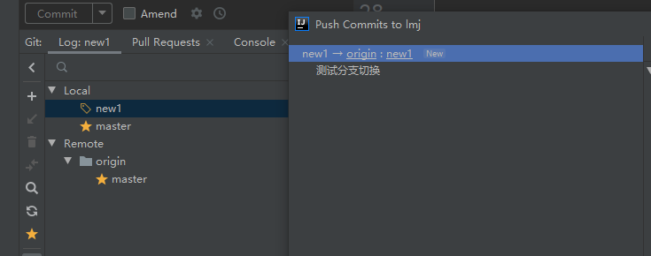


### 分支切换

要切换到一个已存在的分支，你需要使用 `git checkout` 命令。 我们现在切换到新创建的 `testing` 分支去：

```console
$ git checkout testing
```

#### idea中切换分支

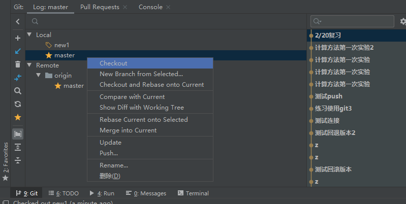


### ==分支合并==

#### 1、直接祖先


Figure 21. 基于 `master` 分支的紧急问题分支 `hotfix branch`

你可以运行你的测试，确保你的修改是正确的，然后将 `hotfix` 分支合并回你的 `master` 分支来部署到线上。 你可以使用 `git merge` 命令来达到上述目的：

```console
$ git checkout master
$ git merge hotfix
Updating f42c576..3a0874c
Fast-forward
 index.html | 2 ++
 1 file changed, 2 insertions(+)
```

在合并的时候，你应该注意到了“快进（fast-forward）”这个词。 由于你想要合并的分支 `hotfix` 所指向的提交 `C4` 是你所在的提交 `C2` 的直接后继， 因此 Git 会直接将指针向前移动。换句话说，当你试图合并两个分支时， 如果顺着一个分支走下去能够到达另一个分支，那么 Git 在合并两者的时候， ==只会简单的将指针向前推进==（指针右移），**==因为这种情况下的合并操作没有需要解决的分歧——这就叫做 “快进（fast-forward）”。==**


==思考：为什么不使用回退而是直接创建分支==

==因为修改时不一定直接写的就能一定运行正确，回退需要找正确的回退版本，这一点不好找==

现在，最新的修改已经在 `master` 分支所指向的提交快照中，你可以着手发布该修复了。


#### 2、非直接祖先


假设你已经修正了 #53 问题，并且打算将你的工作合并入 `master` 分支。 为此，你需要合并 `iss53` 分支到 `master` 分支，这和之前你合并 `hotfix` 分支所做的工作差不多。 你只需要检出到你想合并入的分支，然后运行 `git merge` 命令：

```console
$ git checkout master
Switched to branch 'master'
$ git merge iss53
Merge made by the 'recursive' strategy.
index.html |    1 +
1 file changed, 1 insertion(+)
```

这和你之前合并 `hotfix` 分支的时候看起来有一点不一样。 在这种情况下，你的开发历史从一个更早的地方开始分叉开来（diverged）。 因为，`master` 分支所在提交并不是 `iss53` 分支所在提交的直接祖先，Git 不得不做一些额外的工作。 出现这种情况的时候，Git 会使用两个分支的末端所指的快照（`C4` 和 `C5`）以及这两个分支的公共祖先（`C2`），做一个简单的三方合并。


Figure 24. 一次典型合并中所用到的三个快照

**和之前将分支指针向前推进所不同的是，Git 将此次三方合并的结果做了一个新的快照并且自动创建一个新的提交指向它。 这个被称作一次合并提交，它的特别之处在于他有不止一个父提交。**


Figure 25. 一个合并提交

既然你的修改已经合并进来了，就不再需要 `iss53` 分支了。 现在你可以在任务追踪系统中关闭此项任务，并删除这个分支。

```console
$ git branch -d iss53
```


### 分支删除

Figure 22. `master` 被快进到 `hotfix`

关于这个紧急问题的解决方案发布之后，你准备回到被打断之前时的工作中。 然而，你应该先删除 `hotfix` 分支，因为你已经不再需要它了 —— `master` 分支已经指向了同一个位置。 你可以使用带 `-d` 选项的 `git branch` 命令来删除分支：

```console
$ git branch -d hotfix
Deleted branch hotfix (3a0874c).
```

变基

在 Git 中整合来自不同分支的修改主要有两种方法：`merge` 以及 `rebase`。 在本节中我们将学习什么是“变基”，怎样使用“变基”，并将展示该操作的惊艳之处，以及指出在何种情况下你应避免使用它。

### ==分支变基==

https://git-scm.com/book/zh/v2/Git-%E5%88%86%E6%94%AF-%E5%8F%98%E5%9F%BA#ebasing-merging-example

请回顾之前在 [分支的合并](https://git-scm.com/book/zh/v2/ch00/_basic_merging) 中的一个例子，你会看到开发任务分叉到两个不同分支，又各自提交了更新。


Figure 35. 分叉的提交历史

之前介绍过，整合分支最容易的方法是 `merge` 命令。 它会把两个分支的最新快照（`C3` 和 `C4`）以及二者最近的共同祖先（`C2`）进行三方合并，合并的结果是生成一个新的快照（并提交）。


Figure 36. 通过合并操作来整合分叉的历史

其实，还有一种方法：你可以提取在 `C4` 中引入的补丁和修改，然后在 `C3` 的基础上应用一次。 在 Git 中，这种操作就叫做 **变基（rebase）**。 你可以使用 `rebase` 命令将提交到某一分支上的所有修改都移至另一分支上，就好像“重新播放”一样。

在这个例子中，你可以检出 `experiment` 分支，然后将它变基到 `master` 分支上：

```console
$ git checkout experiment
$ git rebase master
First, rewinding head to replay your work on top of it...
Applying: added staged command
```

它的原理是首先找到这两个分支（即当前分支 `experiment`、变基操作的目标基底分支 `master`） 的最近共同祖先 `C2`，然后对比当前分支相对于该祖先的历次提交，提取相应的修改并存为临时文件， 然后将当前分支指向目标基底 `C3`, 最后以此将之前另存为临时文件的修改依序应用。 （译注：写明了 commit id，以便理解，下同）


Figure 37. 将 `C4` 中的修改变基到 `C3` 上

现在回到 `master` 分支，进行一次快进合并。

```console
$ git checkout master
$ git merge experiment
```


Figure 38. `master` 分支的快进合并

此时，`C4'` 指向的快照就和 [the merge example](https://git-scm.com/book/zh/v2/ch00/ebasing-merging-example) 中 `C5` 指向的快照一模一样了。 这两种整合方法的最终结果没有任何区别，但是变基使得提交历史更加整洁。 你在查看一个经过变基的分支的历史记录时会发现，尽管实际的开发工作是并行的， 但它们看上去就像是串行的一样，提交历史是一条直线没有分叉。

一般我们这样做的目的是为了确保在向远程分支推送时能保持提交历史的整洁——例如向某个其他人维护的项目贡献代码时。 在这种情况下，你首先在自己的分支里进行开发，当开发完成时你需要先将你的代码变基到 `origin/master` 上，然后再向主项目提交修改。 这样的话，该项目的维护者就不再需要进行整合工作，只需要快进合并便可。

**请注意，无论是通过变基，还是通过三方合并，整合的最终结果所指向的快照始终是一样的，只不过提交历史不同罢了。 变基是将一系列提交按照原有次序依次应用到另一分支上，而合并是把最终结果合在一起。**


#### idea中变基

在当前分支中找一个版本创建新分支，然后点击另一个分支再rebase


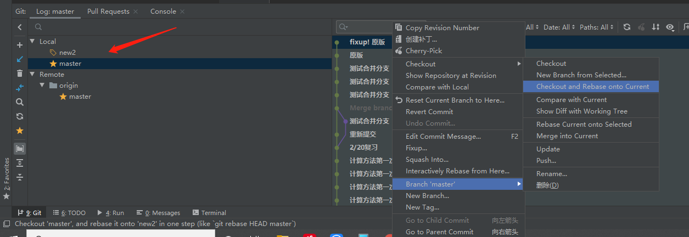

#### 更有趣的变基例子

在对两个分支进行变基时，所生成的“重放”并不一定要在目标分支上应用，你也可以指定另外的一个分支进行应用。 就像 [从一个主题分支里再分出一个主题分支的提交历史](https://git-scm.com/book/zh/v2/ch00/bdiag_e) 中的例子那样。 你创建了一个主题分支 `server`，为服务端添加了一些功能，提交了 `C3` 和 `C4`。 然后从 `C3` 上创建了主题分支 `client`，为客户端添加了一些功能，提交了 `C8` 和 `C9`。 最后，你回到 `server` 分支，又提交了 `C10`。


Figure 39. 从一个主题分支里再分出一个主题分支的提交历史

假设你希望将 `client` 中的修改合并到主分支并发布，但暂时并不想合并 `server` 中的修改， 因为它们还需要经过更全面的测试。这时，你就可以使用 `git rebase` 命令的 `--onto` 选项， 选中在 `client` 分支里但不在 `server` 分支里的修改（即 `C8` 和 `C9`），将它们在 `master` 分支上重放：

```console
$ git rebase --onto master server client
```

以上命令的意思是：“取出 `client` 分支，找出它从 `server` 分支分歧之后的补丁， 然后把这些补丁在 `master` 分支上重放一遍，让 `client` 看起来像直接基于 `master` 修改一样”。这理解起来有一点复杂，不过效果非常酷。


Figure 40. 截取主题分支上的另一个主题分支，然后变基到其他分支

现在可以快进合并 `master` 分支了。（如图 [快进合并 `master` 分支，使之包含来自 `client` 分支的修改](https://git-scm.com/book/zh/v2/ch00/bdiag_g)）：

```console
$ git checkout master
$ git merge client
```


Figure 41. 快进合并 `master` 分支，使之包含来自 `client` 分支的修改

接下来你决定将 `server` 分支中的修改也整合进来。 使用 `git rebase <basebranch> <topicbranch>` 命令可以直接将主题分支 （即本例中的 `server`）变基到目标分支（即 `master`）上。 这样做能省去你先切换到 `server` 分支，再对其执行变基命令的多个步骤。

```console
$ git rebase master server
```

如图 [将 `server` 中的修改变基到 `master` 上](https://git-scm.com/book/zh/v2/ch00/bdiag_h) 所示，`server` 中的代码被“续”到了 `master` 后面。


Figure 42. 将 `server` 中的修改变基到 `master` 上

然后就可以快进合并主分支 `master` 了：

```console
$ git checkout master
$ git merge server
```

至此，`client` 和 `server` 分支中的修改都已经整合到主分支里了， 你可以删除这两个分支，最终提交历史会变成图 [最终的提交历史](https://git-scm.com/book/zh/v2/ch00/bdiag_i) 中的样子：

```console
$ git branch -d client
$ git branch -d server
```


Figure 43. 最终的提交历史

### 变基VS合并

总的原则是，==只对尚未推送或分享给别人的本地修改执行变基操作清理历史， 从不对已推送至别处的提交执行变基操作，这样，你才能享受到两种方式带来的便利。==

### 版本开发原则


master主分支**应该非常稳定**，用来发布新版本，一般情况下不允许在上面工作，**工作一般情况下在新建的dev分支上工作**，工作完后，比如上要发布，或者说dev分支代码稳定后可以合并到主分支master上来。


### 恢复版本的两种方法

**Git恢复之前版本的两种方法reset（回退）、revert（反做）**

https://blog.csdn.net/yxlshk/article/details/79944535

详细介绍

https://blog.csdn.net/qq_33442844/article/details/80506041?utm_medium=distribute.pc_relevant.none-task-blog-searchFromBaidu-8.control&dist_request_id=3746b1f5-db3a-4b70-ba6f-7a2282b285d3&depth_1-utm_source=distribute.pc_relevant.none-task-blog-searchFromBaidu-8.control

#### **一、背景知识**

> #### **git的版本管理，及HEAD的理解**
>
> 使用git的每次提交，Git都会自动把它们串成一条时间线，这条时间线就是一个分支。如果没有新建分支，那么只有一条时间线，即只有一个分支，在Git里，这个分支叫主分支，即master分支。==有一个HEAD指针指向当前分支==（只有一个分支的情况下会指向master，==而master是指向最新提交==）。每个版本都会有自己的版本信息，如特有的版本号、版本名等。如下图，假设只有一个分支：
> 

#### **二、解决方法**

##### **方法一：git reset**

**原理：** git reset的作用是修改HEAD的位置，即将HEAD指向的位置改变为之前存在的某个版本，如下图所示，假设我们要回退到版本一：

**适用场景：** ==如果想恢复到之前某个提交的版本，且那个版本之后提交的版本我们都不要了，就可以用这种方法。==

`git reset` 是撤销某次提交，但是此次之后的修改都会被退回到暂存区。除了默认的 mixed 模式，还有 soft 和 hard 模式。

| 模式  | HEAD的位置 | 索引   | 工作树 |
| :---- | :--------- | :----- | :----- |
| soft  | 修改       | 不修改 | 不修改 |
| mixed | 修改       | 修改   | 不修改 |
| hard  | 修改       | 修改   | 修改   |


##### **==idea中==**

**推荐使用**

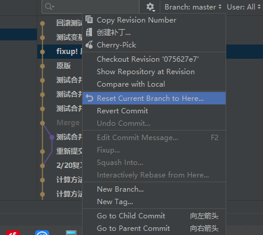

不推荐使用


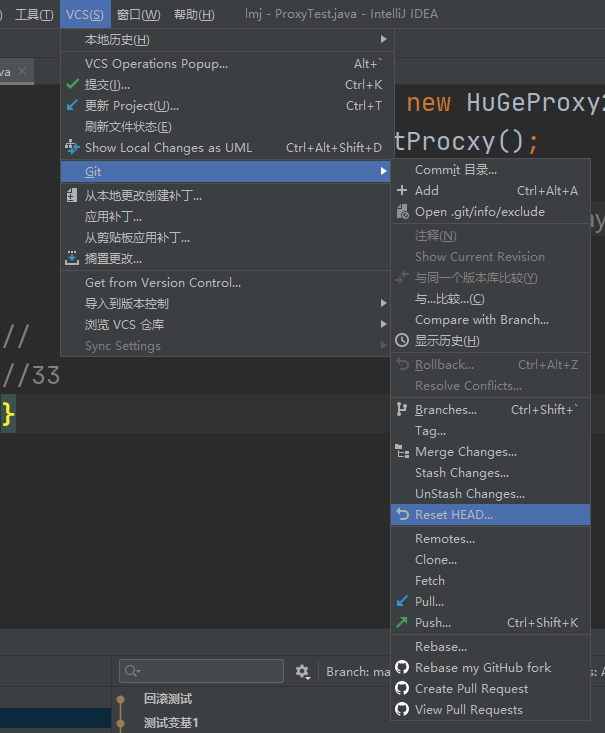

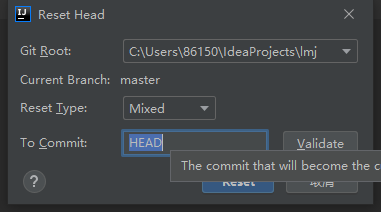

在To commit中输入版本号


##### **方法二：git revert**

`git revert` 撤销某次操作，==此次操作之前和之后的 commit 和 history 都会保留，并且把这次撤销作为一次最新的提交==。git revert是提交一个新的版本，将需要revert的版本的内容再反向修改回去，版本会递增，不影响之前提交的内容。


**原理：** git revert是用于“反做”某一个版本，以达到撤销该版本的修改的目的。比如，我们commit了三个版本（版本一、版本二、 版本三），突然发现版本二不行（如：有bug），想要撤销版本二，但又不想影响撤销版本三的提交，就可以用 git revert 命令来反做版本二，==生成新的版本四，这个版本四里会保留版本三的东西，但撤销了版本二的东西。如下图所示：==

**适用场景：** ==如果我们想撤销之前的某一版本，但是又想保留该目标版本后面的版本，记录下这整个版本变动流程，就可以用这种方法。==

==版本4是再版本2的基础上改的，不影响版本3==


##### ==**idea中**==

==revert之后需要解决冲突（此过程可以修改代码），然后commit（此过程不能修改代码、只能查看代码）==

解决冲突弹窗

左侧为自己的版本，右侧为服务器版本，==中间为最终结果（可以修改代码）==

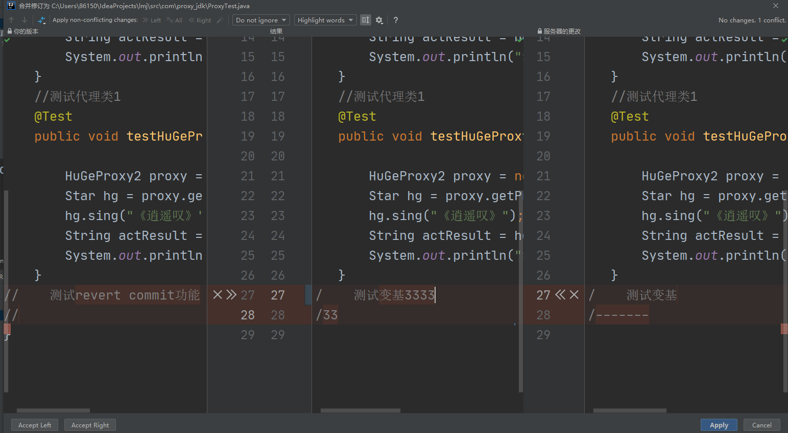

### 查看历史版本的改动

==点击某个版本，右侧显示更改的文件，再次点击就可对比查看==


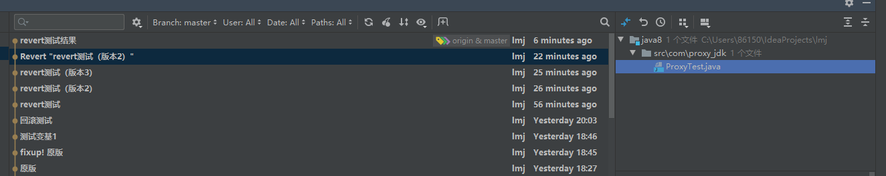

关于改动：右边是当前版本，左边是上一版本。==显示的并不是与当前版本的差异==

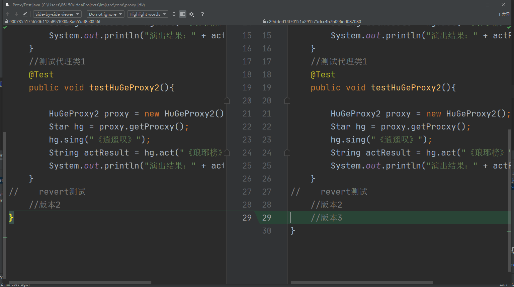

### 小技巧

推送拒绝
1、可以打开项目所在目录，使用gui强制推送

2、在idea中，可以在终端中输入强制推送命令

      git push -f



添加远程仓库


看不懂弹窗
有时候弹窗英文无法看懂也不能复制可以点击“？”在网页中用自动翻译查看

idea的使用
idea详细使用
https://blog.csdn.net/qq_31655965/article/details/52788374?spm=100

#### 推送拒绝

1、可以打开项目所在目录，使用gui强制推送

2、在idea中，可以在终端中输入强制推送命令

​      git push -f

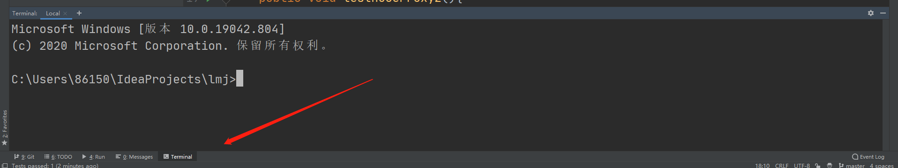


### 添加远程仓库

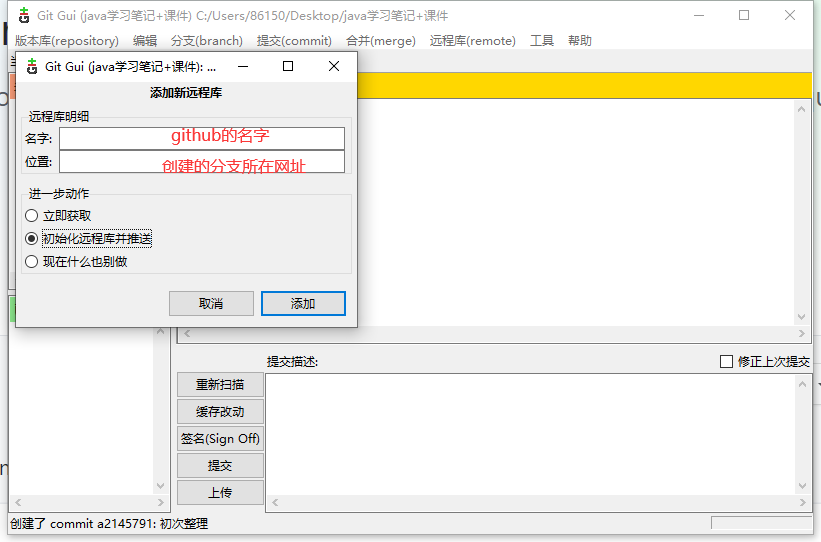

#### 看不懂弹窗

有时候弹窗英文无法看懂也不能复制可以==点击“？”在网页中用自动翻译查看==

## idea的使用

### idea详细使用

https://blog.csdn.net/qq_31655965/article/details/52788374?spm=1001.2014.3001.5501

#### 最智能的IDE

IDEA相对于eclipse来说最大的优点就是它比eclipse聪明。聪明到什么程度呢？我们先来看几个简单的例子。

#### 智能提示重构代码

如果你写的代码过于复杂，或者有更好的方式来替代你写的代码，那么IDEA会给你一个提示，告诉你还可以有更好的方式。如下图：


这个是说你使用了没有必要的装箱操作（什么是装箱和拆箱可以自行百度，也可以看我之前写的文章），对比两句add操作可以看出来，IDEA在帮我们优化代码。

第二个例子：


我们学java的时候学过增强的for循环，其实它的学名叫做foreach语句，上面的代码我使用了普通的for循环，IDEA告诉我，使用foreach语句更好。

#### 更友好的代码提示功能

使用eclipse的都应该清楚，如果你想要输入StringBuffer，那么你必须得按着顺序输入，直接输sb是不行的，但是在IDEA里你可以这样输入。


不仅如此，看下一个例子


还可以这样提示。

这些只是一些很简单的例子，但是已经足够强大了。

#### 什么叫智能？

上面的其实都是很基础的功能，IDEA正真智能的 地方在于它会不断的分析你的代码，并且智能的进行反馈。我们 再看一个简单的例子。


这是一个普通的structs程序。在配置文件里定义了一个action并设置了两种不同的返回值。打开我们的action，我们可以看到，你可以直接从代码的左侧找到跳转到对应配置文件的快捷按钮。如果你的某一个方法是覆盖了父类方法，那么你也可以直接查看父类方法。更人性化的是，IDEA可以分析出你的action方法可以跳转到哪些界面？你是不是也有点心动了呢？

#### 强大的纠错能力

我们总是会犯一些低级错误，比如一不留神打错一个字母，可能找了好久都找不到错误所在，IDEA的纠错能力也许可以帮到你，再看一个例子。


我们只创建了两个jsp，当你的返回值中出现了你没创建的文件时，IDEA会提示错误，这样就可以避免你因为写错单词而造成的错误。

IDEA的强大之处还有很多，我没办法在一篇文章里全部讲出来，如果你对IDEA产生了一点兴趣，那么请往下看，我们从最基础的环节学起。


#### idea中强制推送

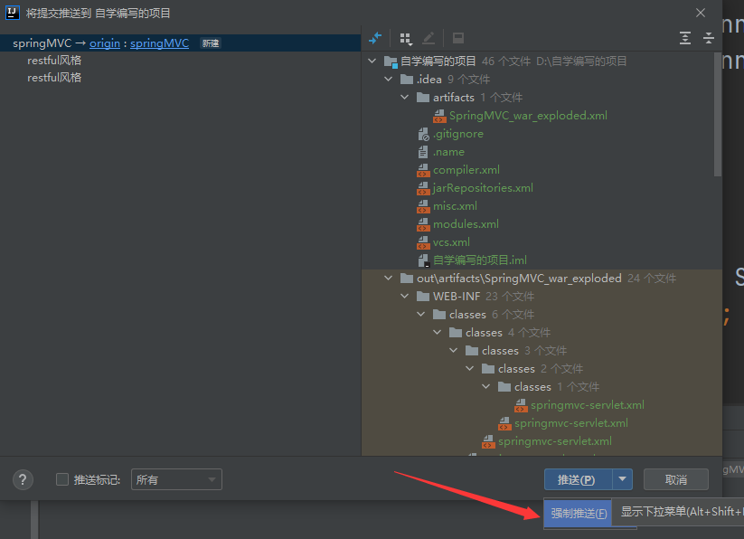


### idea一次性编辑多行

Ctrl+shift+alt+点击


### 从不同的分之获取代码。

https://blog.csdn.net/qq_38409944/article/details/90176986


